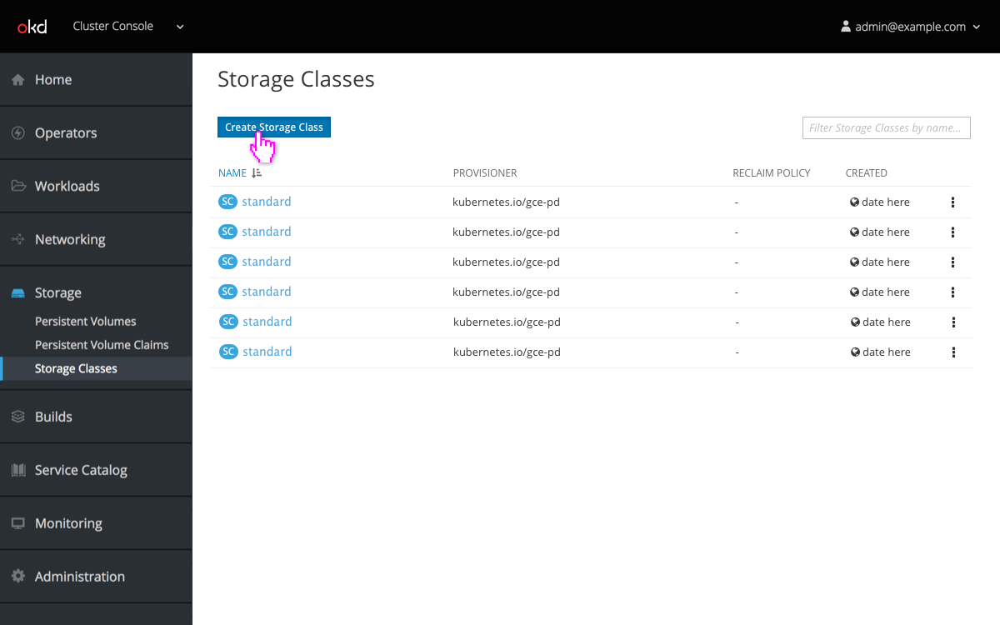
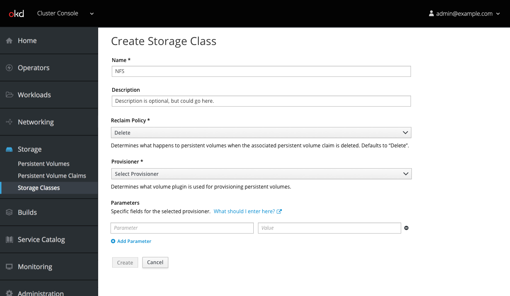
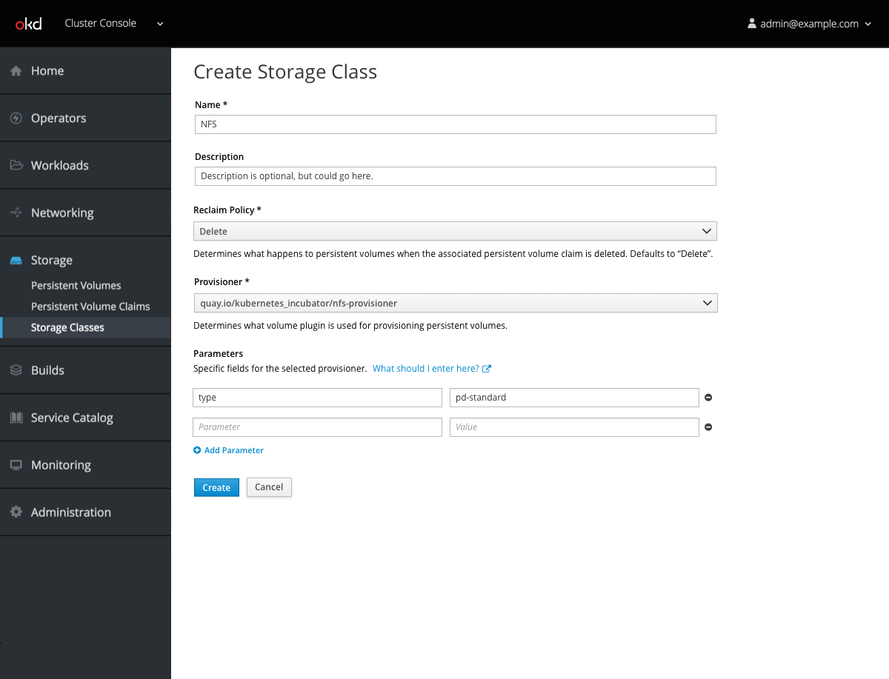
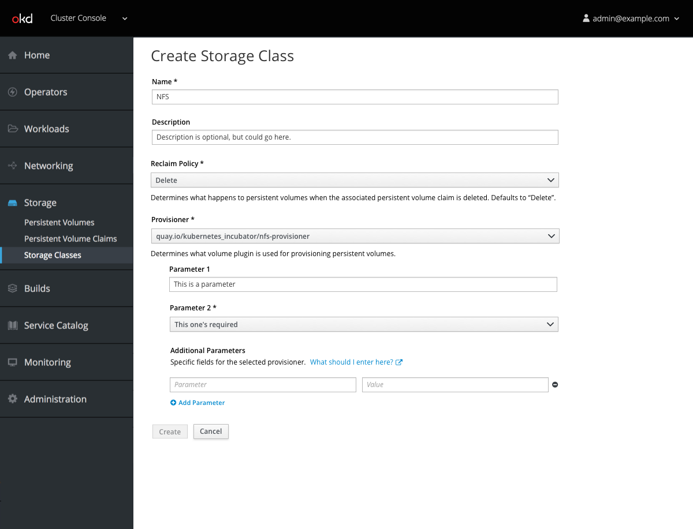
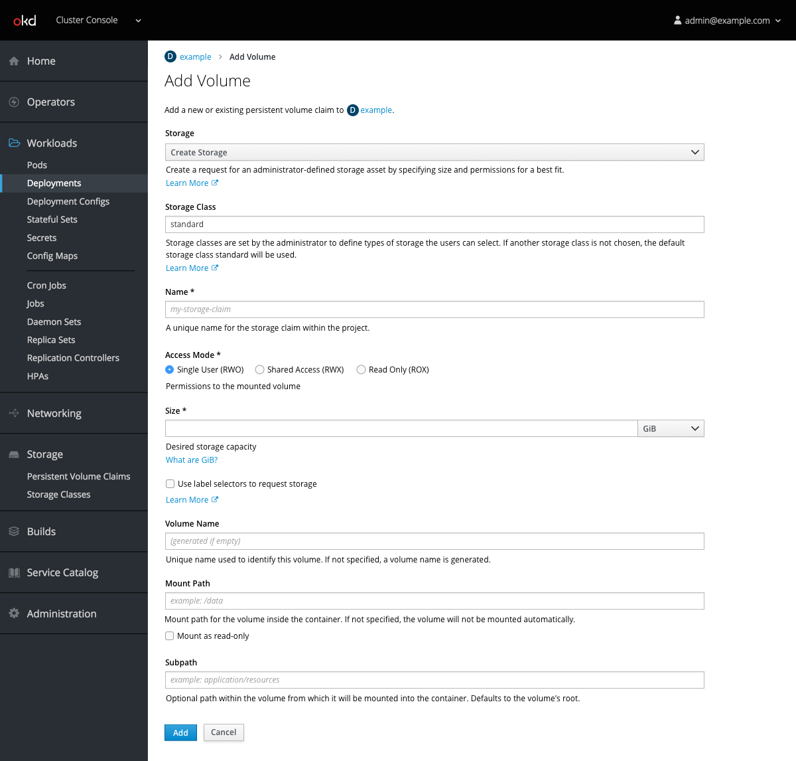
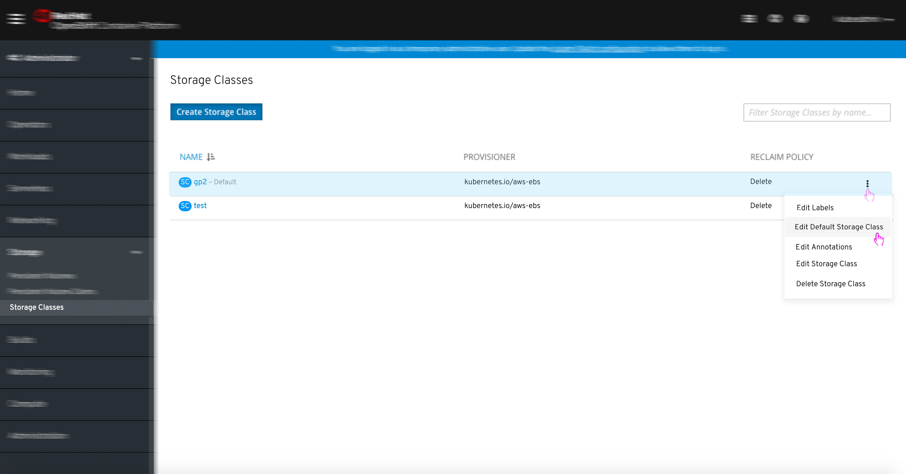
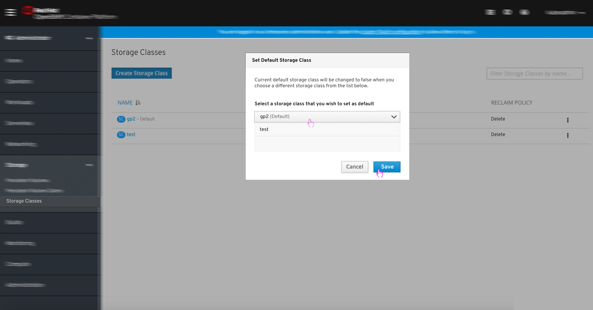
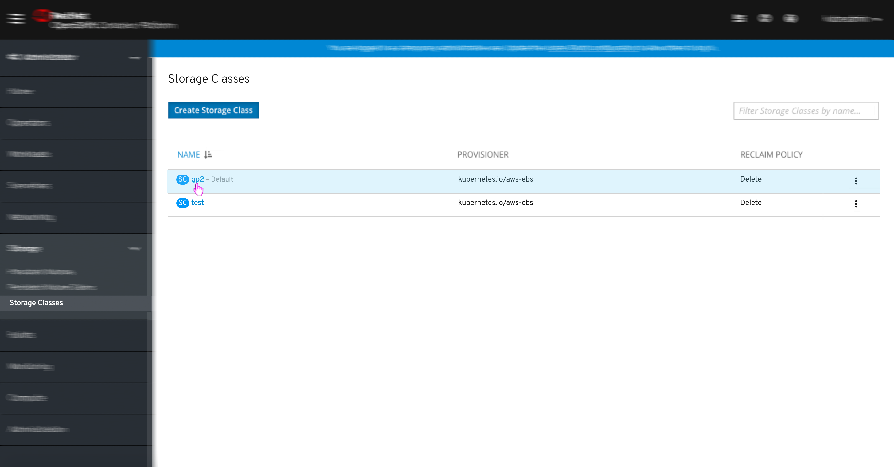
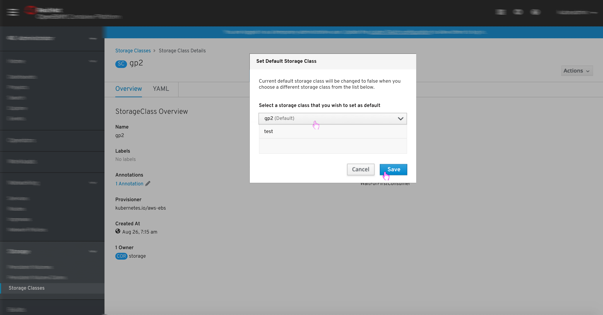

# Storage

## Create Storage Class

- Users with appropriate privileges can click to create a new Storage Class.

- They are presented with a form that enables them to define the name, description, type of storage, reclaim policy, and provisioner for this storage class.

- The `What should I enter here?` link should preferably direct the user to a list of parameters for the selected provisioner, but if that is not possible, linking to the Kubernetes documentation is acceptable.

- Parameter rows can be added by clicking the `Add Parameter` button and removed with the minus button.
- Rows are not draggable.

- If it is feasible, selecting a provisioner should dynamically create fields for parameters rather than requiring that users specify them. In this case, additional parameters could still be added as needed.

## Attach Storage

-  Deployment pages will contain a new `Add Volume` option within the actions dropdown.

- The user can either add existing storage or choose to `Create Storage` from within the dropdown.

- Selecting `Create Storage` exposes fields for Storage Class, Name, Access Mode, Size, and the label selector checkbox.
- Only access modes that are compatible should be available to select in this form.

## Set Default Storage Class
- Users with appropriate privileges can set a Default Storage Class.
- THERE ARE TWO WAY USER CAN SET A DEFAULT STORAGE CLASS:

### OPTION-1: Kebab menu option:

1. Login to Openshift > Admin > Storage (menu) > Storage classes (sub-menu)
2. User can see list of ‘Storage classes” [list view]
3. There will be a label which indicates which SC is a default one.
4. User selects the SC that he/she would like to make it as a ‘default class’
5. Click on the kebab menu > select “Edit Default Storage Class” as soon in the screen below:

6. Pop-up opens with a list of ‘SC’ and message shown below:
*Message:
Current default storage class will be changed to false when you
choose a different storage class from the list below.**

7. User can choose any SC as a default storage class and click on ‘Save’ button to confirm the change.

### OPTION-2: Change the ‘default’ option from ‘detail page’:

1. Login to Openshift > Admin > Storage (menu) > Storage classes (sub-menu)
2. Click on SC name link (shown as link)

3. SC details are shown as below
4. Click on “pencil icon” near the ‘default class status’

5. Pop-up opens with a list of ‘SC’ and message shown below:
** Message:
Current default storage class will be changed to false when you
choose a different storage class from the list below.**

6. User can choose any SC as a default storage class and click on ‘Save’ button to confirm the change.

