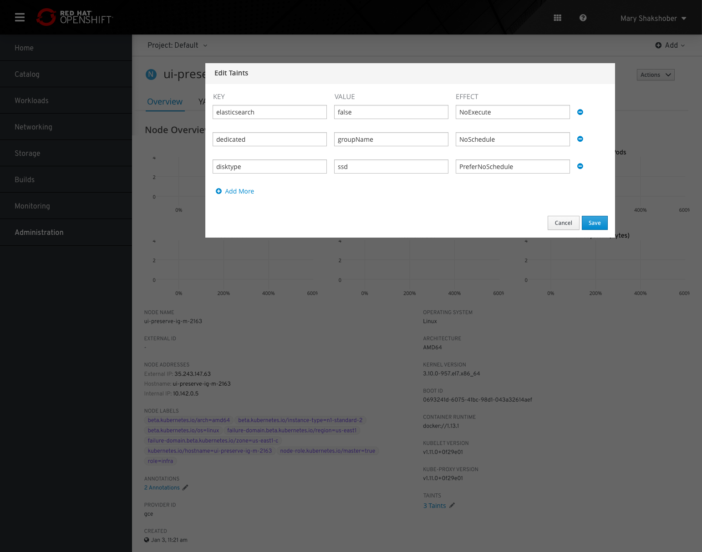
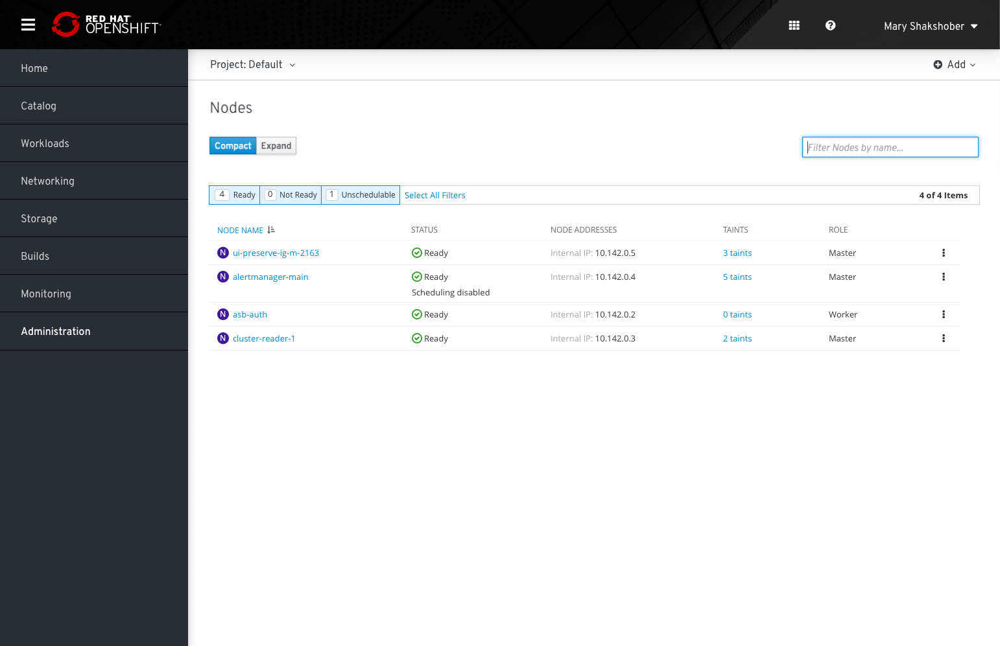
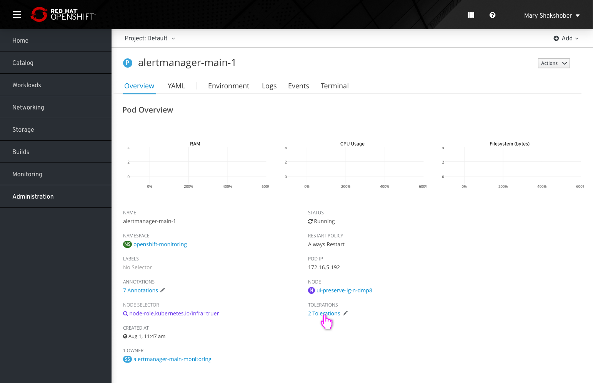
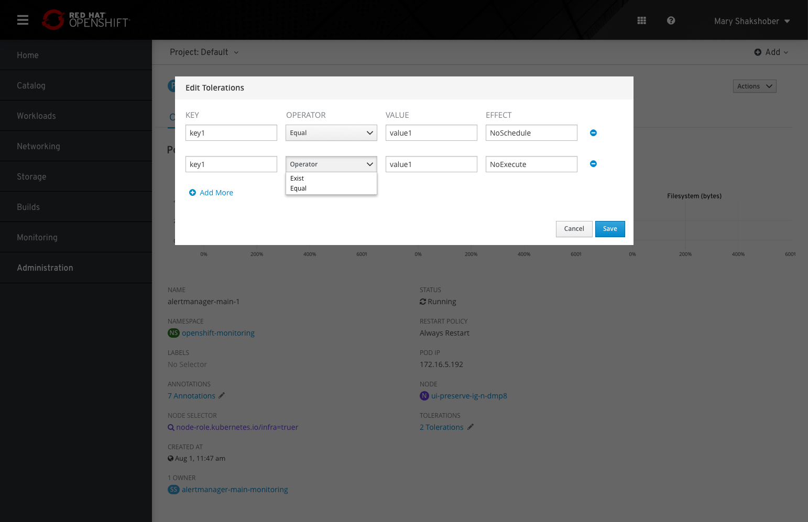

# Taints and Tolerations

## Taints

* Nodes details pages should include a section for `TAINTS`. The number of taints will be listed in this section and will be stylized as a link with a pencil icon to the right.
* Clicking the link or pencil will open a modal where users can add, remove, and edit taints.
* The modal will allow users to edit three variables: `KEY`, `VALUE`, and `EFFECT`.
* Clicking 'Add More' will add a row at the bottom of the list.
* Clicking the remove icon on the right side of a row will remove the row.
* After adding or removing or editing variables, users must click 'Save' at the bottom of the page to apply changes.

### Nodes list view

* Taints will also be shown in the nodes list view as its own column. Clicking on any of the taints will bring users to the details page for the associated node.

## Tolerations

* Pods details pages should include a section for `TOLERATIONS`. The number of tolerations will be listed in this section and will be stylized as a link with a pencil icon to the right.
* Clicking the link or pencil will open a modal where users can add, remove, and edit tolerations.
* The modal will allow users to edit four variables: `KEY`, `OPERATOR`, `VALUE`, and `EFFECT`.
* Clicking 'Add More' will add a row at the bottom of the list.
* Clicking the remove icon on the right side of a row will remove the row.
* After adding or removing or editing variables, users must click 'Save' at the bottom of the page to apply changes.
