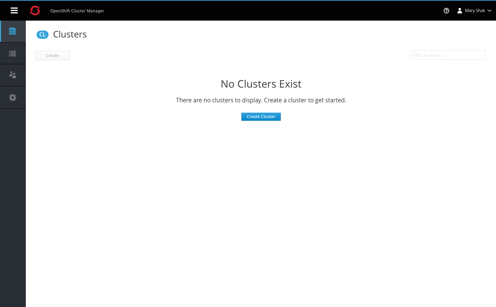
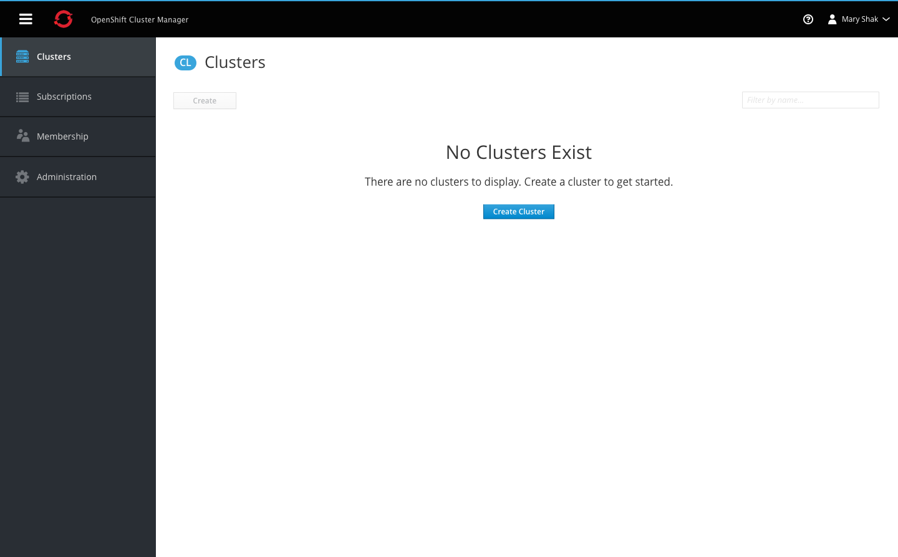
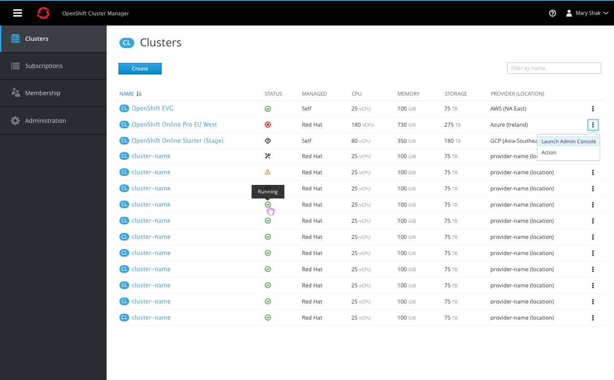
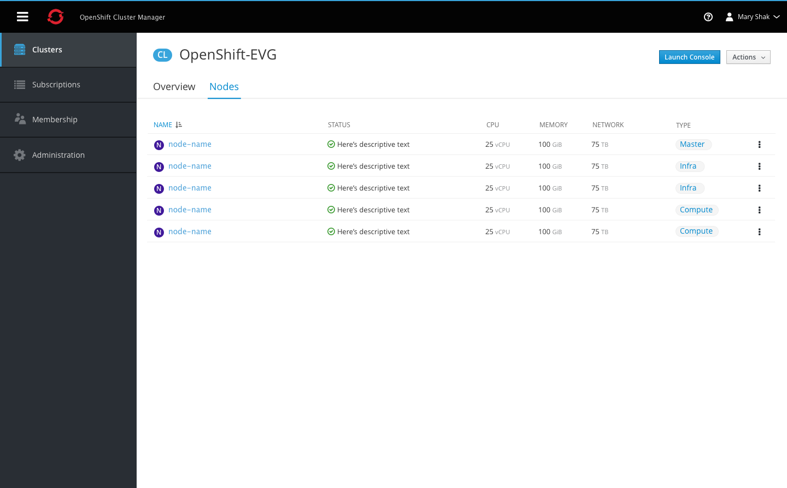

# Unified Hybrid Cloud (UHC)
Red Hat Unified Hybrid Cloud (UHC) provides the centralized set of services required for Red Hat to distribute, manage, and support OpenShift 4 as well as offerings that are built from, or run on top of, OpenShift Container Platform.

## Navigation

- Each navigation item must include an icon and label.
- The hamburger icon is always displayed in the top left corner of the masthead.
- The vertical navigation should be collapsible into an icon-only view, by clicking the hamburger icon on desktop. On mobile, this action would hide the vertical navigation entirely.
- Clicking the icon again will re-open the navigation displaying the labels.

## Cluster Summary View

### Empty State
- When there are no clusters to display for this view, am empty state should be shown with some text and a single primary action button, as displayed in the images above.
- Toolbar components are greyed out while in the empty state.
- The cluster badge should be used with the page title.

### Summary List

- The cluster badge should be used with the page title.
- The filter input field is aligned with the primary create action. Users can filter by cluster name and matching results will remain visible in the list.
- Columns include Name, Status, Managed, CPU, Memory, Storage, and Provider (plus location in parentheses).
- All column headers are clickable, allowing users to sort in either direction.
- The status column displays an icon only, with a tooltip shown on hover to display the full status label.
- Each row should include a kebab for actions, starting with the Launch Admin Console action.
- The summary list does not include paging, and should use infinite scroll for loading additional content.

## Cluster Detail View

### Overview

- Clicking on a cluster name from the summary view will bring the user to the cluster detail page.
- The badge should be shown with the page title at the top.
- A primary action should be available at the top to launch the admin console.
- The top section of the overview tab should display three donut charts with the CPU, Memory, and Storage utilization.
- A horizontal separator should divide the graphs from the next section of details, showing all remaining fields in a two-column format.

### Nodes

- The Nodes tab should follow the same list-view format used on the cluster summary page.
- The Name column should include the node badge to the left of each name.
- Remaining columns should include the status, utilization metrics, and type.

**Note** This tab may not be implemented for phase 1.
