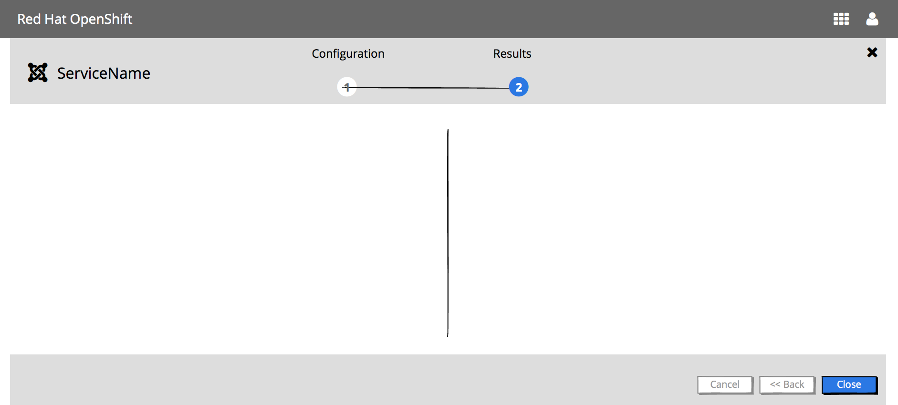
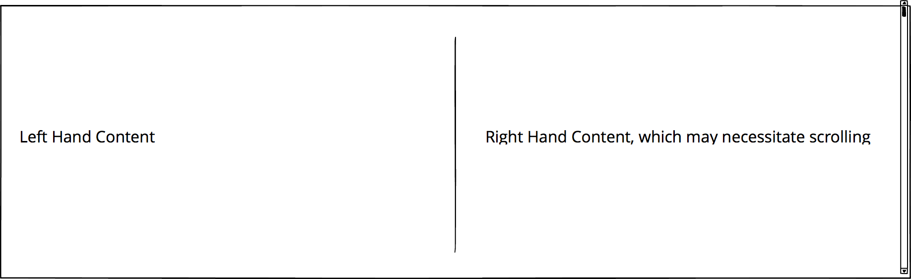
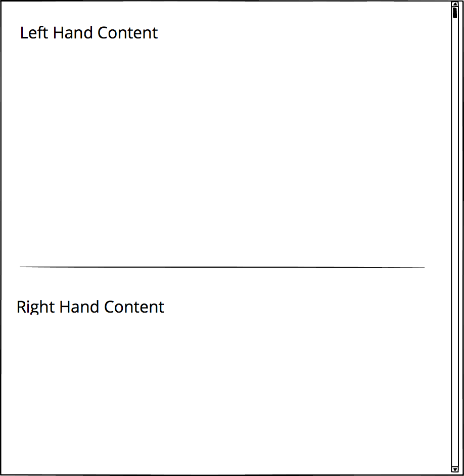
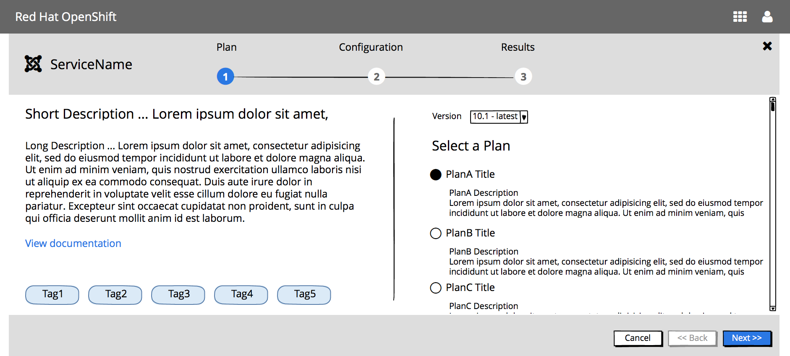
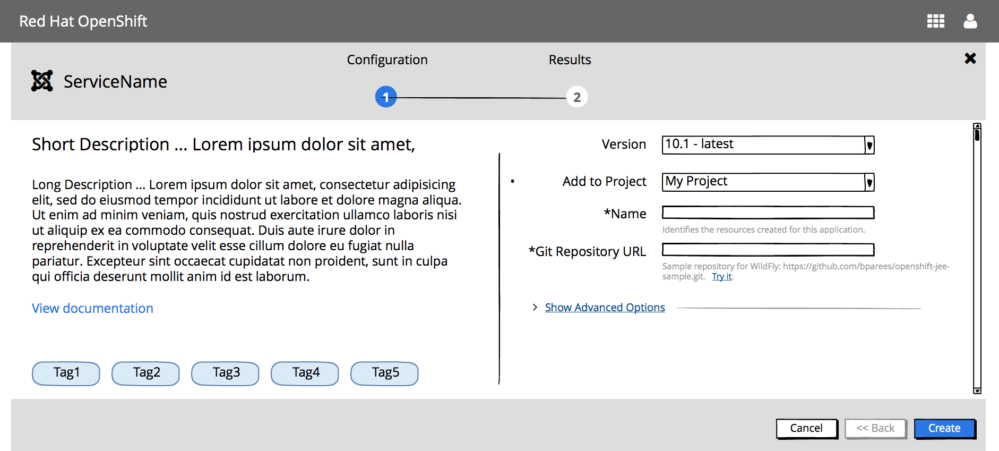
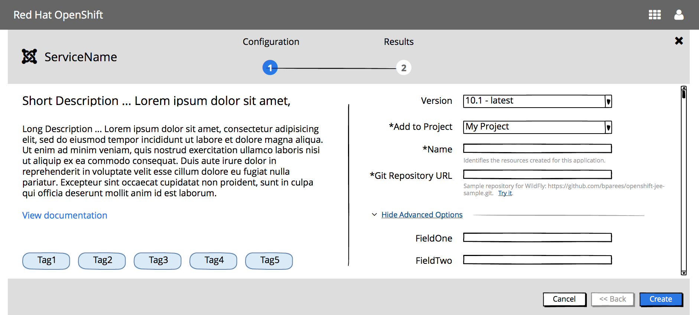
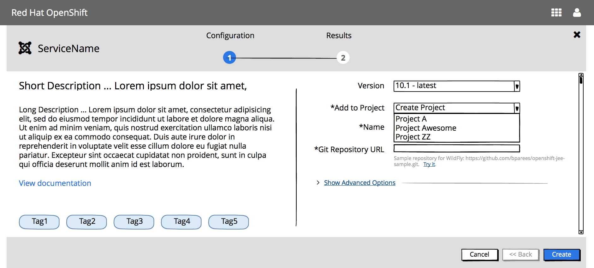
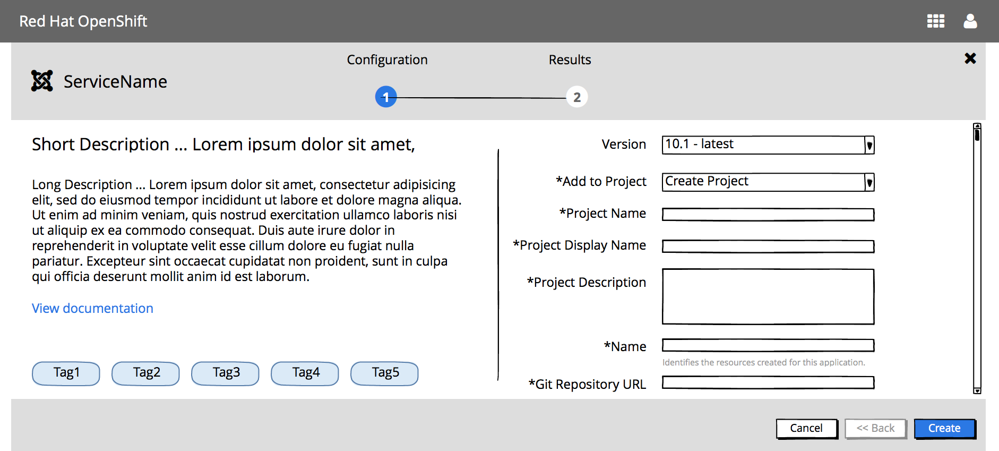

# Ordering Experience

The catalog will include both builder images and items from the Catalog API.  This experience allows the user to remain in context, by using the overlay panel.

##  Open Questions / To Be Determined
- Terminology - Should the action button be Create for both builder images & items from the catalog?
- Results Panel - finalize the content and associated links
- High Fidelity Mocks

## Design
- Upon clicking a service, the Overlay Panel Component will be used to generate a guided experience.  
- The guided overlay panel has 3 main areas: top panel, content panel & button panel

### Top Panel
- The main steps of the wizard are shown in the bar along the top of the screen.
- User can always see all of the primary steps in the flow at all times.  
- This panel “sticky”, and also includes the item icon and item name.

- From a responsive perspective, the following information should be vertically stacked:
	- Icon & Name
	- Step Visualization
	- Step Name (only the current step name is shown)

### Content Panel

The content panel is used to show the Plan, Configuration and Results steps.

This panel is organized in two columns and may have a vertical scroll bar on the right portion.  A vertical separator separates the left & right content areas.

From a responsive perspective, the right column will fall below the left and use a single vertical scroll bar.

The left column content remains consistent, regardless of the step being displayed.  It includes:
- Short description
- Long description
- “View documentation” linking to Documentation URL
- List of tags

### Button Panel

The button panel includes navigation buttons: Cancel, Back and Next/Create/Close.  
- The Back button should always be enabled except for the first step.
- The Next button should become enabled once all required information has been entered for the current step and/or sub-step. The Next button will move the user through any sub-steps before it moves the user to the next main step. The Back button will also behave the same way.  

## Possible Steps
There are 3 possible steps in this process: Plan, Configuration and Results.

Post 3.6, an additional Bind Step will be implemented.

### Step 1 - Plan

### User selects a plan

#### Catalog item has a single version

#### Catalog item has a multiple versions

#### Implementation Details
- This step is optional
- Right column of the content panel includes:
	- If there are > 1 plans, this step should be added
	- If multiple versions exist, include version selection on this panel
		- Version is associated with Builder Images not catalog items
		- The first version should be selected by default
	- Each plan should be presented as a radio button option, by the plan title.  
		- If the plan has a description, it should be listed under the title
		- The first plan should be selected by default.
- Buttons associated with this step
	- Cancel, Back & Next buttons should be displayed
	- Cancel & Next should always be enabled
	- Back should be disabled

### Step 2 - Configuration

#### Catalog item has multiple versions and version was not included on the plan step

#### Catalog item has single versions OR version was included on the plan step

#### Catalog item shows advanced options

#### User views available projects in context of this flow

#### User creates a new project in context of this flow

#### Implementation Details
- This step is mandatory
- Right column of the content panel includes:
	- Optional version selection
		- If there aren’t more than one plan, and there are more than one version available, include a Version list.
		- If >1 plan, Version is not included.
	- “Add to Project” selection
		- “Add to Project” list includes the existing projects the user has access to
		- “Create Project”
			- "Create Project" should be added to the top of the list, unless it has been turned off on prem
			- Clicking “Create Project” will add additional input widgets to gather necessary information to create the project in context
	- Configuration options
		- Field level validation
			- Should be available for builder images
			- Will not be supported for items from the catalog API
		- Mandatory fields should be indicated with an asterisk
	- Optional "Show Advanced Options" link
		- Available for some builder images
	- Vertical scroll bar is displayed as needed, this scrolls the right side of the content
- Buttons associated with this step
	- Cancel, Back & Create buttons should be displayed
	- Cancel should always be enabled
	- Back should be enabled IF there is a previous Plan step
	- Create should be disabled until all mandatory fields have been input

### Step 4 - Results

#### Request has been submitted, and is in progress
	** Mock needs to be updated **

#### User views build logs
	** Missing mock **

#### Completed with errors
	** Missing mock **

#### Completed successfully
	** Mock needs to be updated **

#### Implementation Details
- This step is mandatory
- Right column of the content panel includes:
	- Results In Progress or Completed
	- Link to View build logs
	- If completed, include View Project action
- Buttons associated with this step
	- Cancel, Back & Create buttons should be displayed
	- Cancel should always be enabled
	- Back should be enabled IF there is a previous Plan step
	- Create should be enabled IF all mandatory fields have been input

## Future

### Review Panel
Should we have a Review panel which then has the action button and then the content will turn to the Results & Create turns to Close?
### Field Level Help versus Field Hints
- For now, we will leave the same as currently implemented (field hints)
- Question as to whether we go with Option A (less cluttered & cleaner) or Option B (user sees field level hints up front).

#### OptionA

- Upside: Less cluttered, cleaner.  
- Downside: More work for the user if they need to get help on multiple fields

#### OptionB

- Upside: User sees field level hints upfront
- Downside: More cluttered, distracting.  We (UX) doesn’t control this help information, it’ll be returned from the API so hard to control what is here.

### Step 3 - Bind (post Tech Preview)
This step is only valid if the selected project is not new / has items that can be bound too
Automatically show this step if the service/image is bindable, but user can bypass the step
