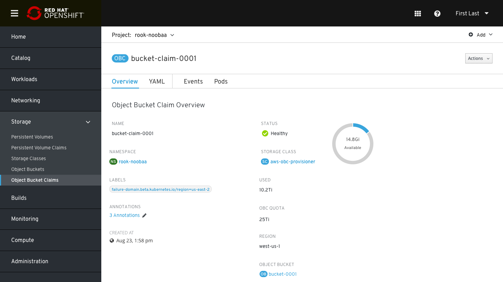
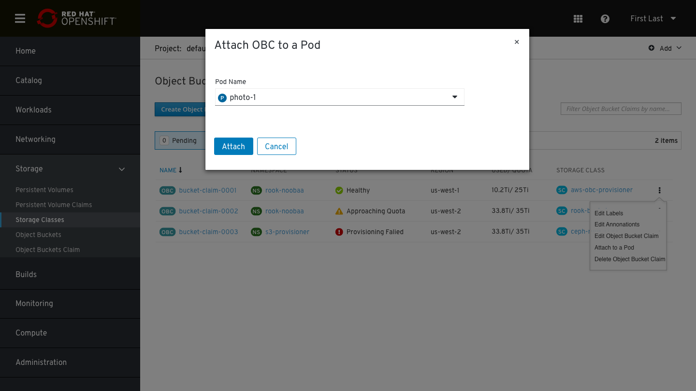
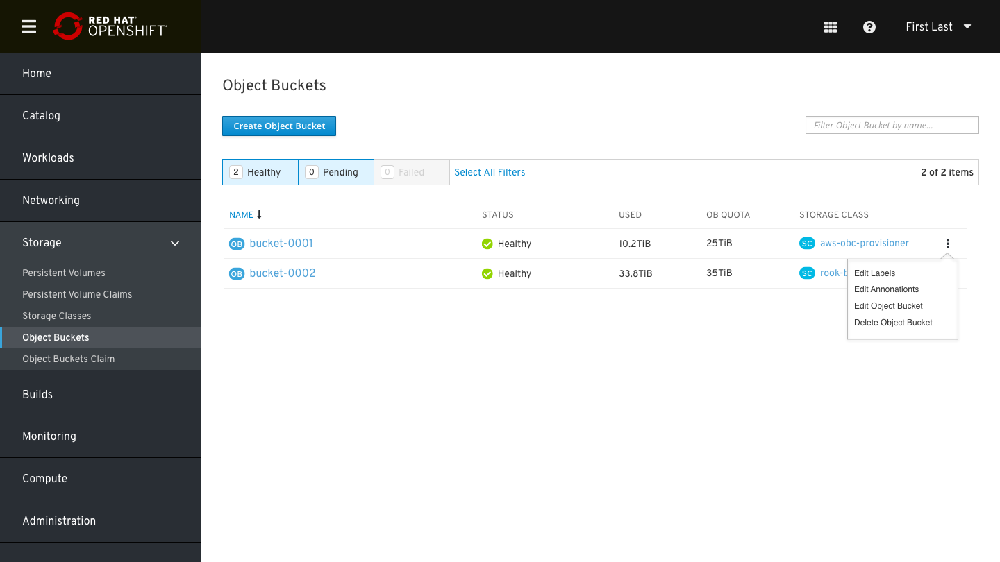
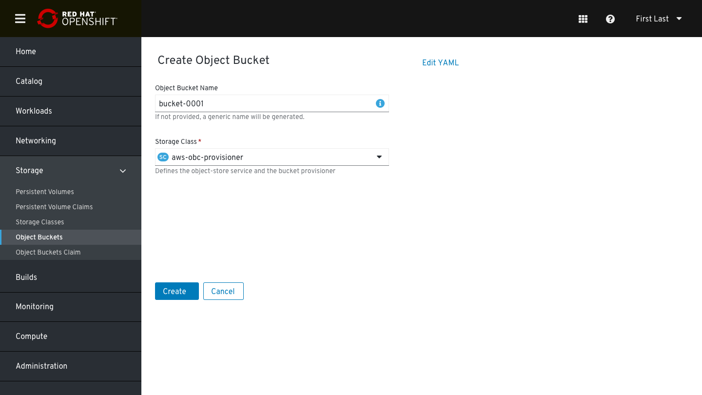
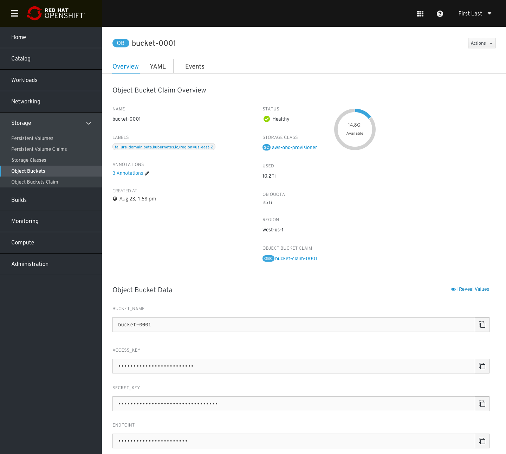
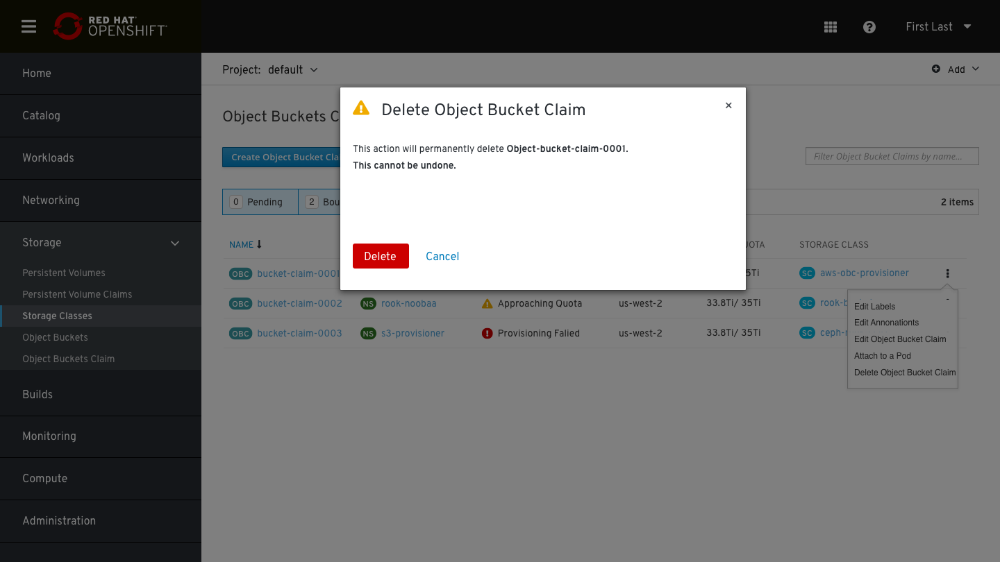

# OB/OBC Lifecycle Management Design
Support object bucket (OB) and object bucket (OBC) CRUD

## OBC

### OBCs List
The OBC list contains the following details: 
* OBC name
* Namespace
* Status
* Used
* OBC Quota
* Storage class

The kabab menu contains the following options:
* Edit labels
* Edit Annotations
* Edit OBC
* Attach to a pod
* Delete OBC

### Create OBC
To create an OBC the user will need to provide the following details:
* OBC name (not mandatory, a generic name will be generated if not provided)
* Namespace
* Storage class 
* OBC Quota- not mandatory. This option is currently supported by MCG. (Can be shown only if the selected provisioner is relevant)

### OBC Details Page

In the OBC overview page there are 4 tabs: Overview, YAML, Events & Pods.
In the Overview tab:
* OBC name
* Namespace
* Labels
* Annotations
* Creation time
* Status
* Storage class
* Capacity data: Usage/ OBC quota/ pie chart for available
* Bucket region
* Object Bucket that was created by this claim

### Attach OBC to a pod

Clicking on the Kabab menu-> Attach to a pod will open a modal window which the user need to choose which pod he wants to attach to.

## OB

### OBs List
The OB list contains the following details: 
* OB name
* Status
* Used
* OB Quota- Inherited from the object bucket claim 
* Storage class

The kabab menu contains the following options:
* Edit labels
* Edit Annotations
* Edit OB
* Delete OB

### Create OB
To create an OB the user will need to provide the following details:
* OB name (not mandatory, a generic name will be generated if not provided)
* Storage class 

Other values such as region and quota inherits the OBC config 

### OB Details Page
OB page contains 3 tabs: Overview, YAML & Events
Overview tab:
* OB name
* Labels
* Annotations
* Creation time
* Status
* Storage class
* Capacity data: Usage/ OB quota/ pie chart for available
* Object Bucket claim that created this claim

Object bucket data (for application consumption):
* Bucket name 
* Access Key
* Secret Key
* Endpoint
*all data is masked and can be revealed by clicking on “Reveal Values”

### Delete OB/ OBC

Same deletion modal for both OB/ OBC, the terminology should be changed accordingly.  

