# OCS Install Workflow

### OperatorHub

There will be 2 OCS operator entries in OperatorHub covering each of the following modes. 
* Converged Mode -- Local Cluster / Hyperconverged 
* Independent Mode -- External Cluster (Ceph Cluster is deployed externally)

### Converged Mode Design

OperatorHub
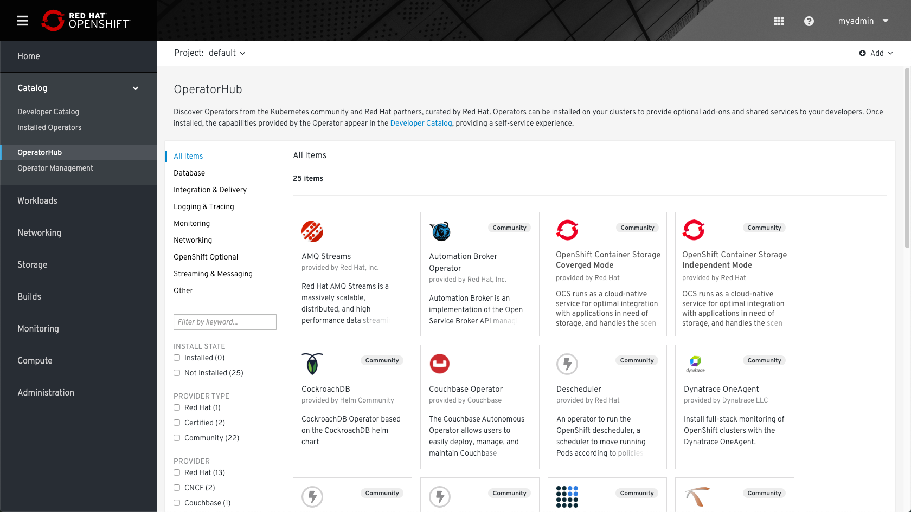

Installation

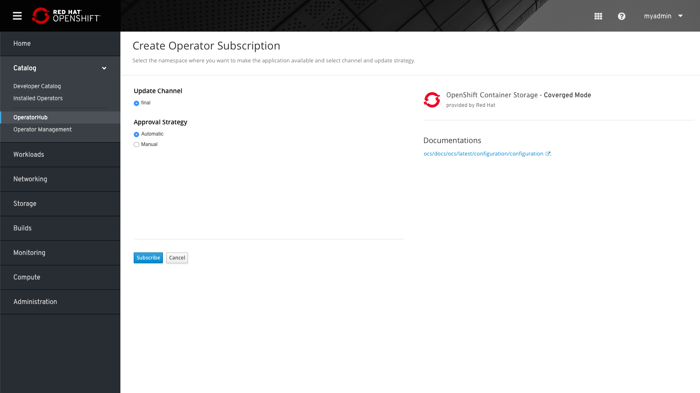

After the subscription process, the user will see the subscribed operator page. 

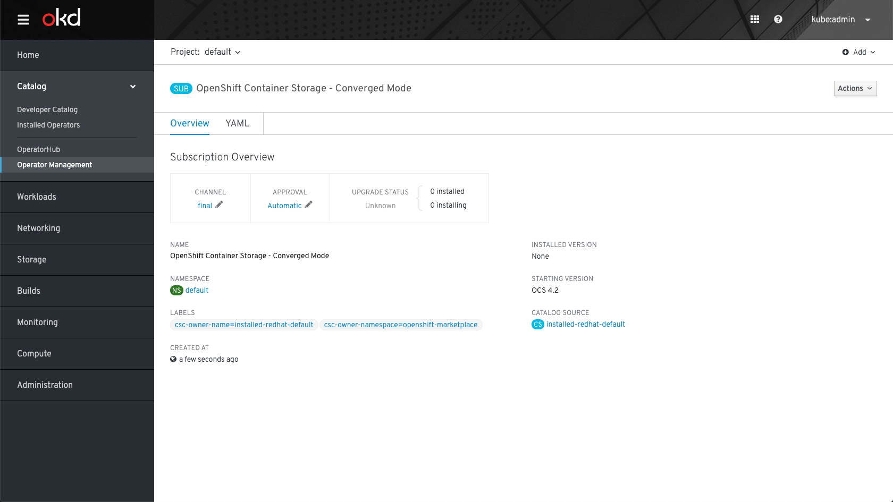 

In the installed operator view the user can see the OCS operator installed. 

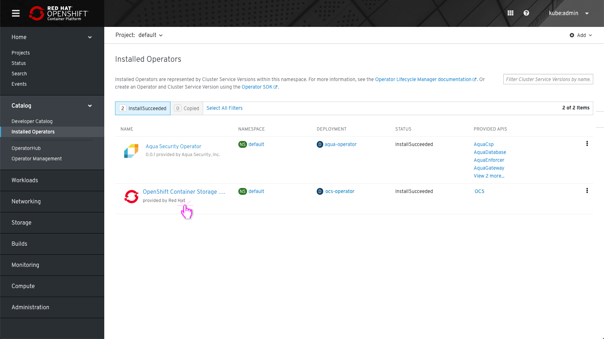

# The OCS installation process
OCS Overview page
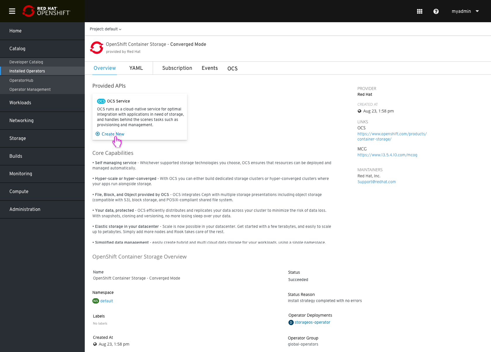

Clicking on "create new" (OCS Service) Will start the following installation flow: 

Same flow will be available by clicking on the OCS tab and "Create new" button. 

### Select Nodes
* Admin needs to select 3 nodes to label with “name.ocs.openshift.io/<cluster-name>=true” (note label is subject to change as this will be automatically configured by the OCS operator) to be used for the OCS cluster.
* Admin may need to filter the list of nodes in order to make the selection (i.e. nodes that contain storage already), e.g.
Select/unselect all nodes, and exclude master nodes (e.g. based on roles)
    * Non-master nodes of a certain flavor (CPU and memory)
    * Non-master nodes’ capacity n TiB or greater (e.g. >= 10 TiB)
    * Nodes with a certain name prefix or string within the node name
* Admin will also specify the capacity for the cluster and the storage class to use.
Capacity will default to 6 TiB, but user can modify the value but it cannot be less than 1 GiB.  MiB should not be permitted in the selection.
* Storage class will default to the default storage class, but user can overwrite the selection.  Note: The storage classes shown will be pre-filtered to the storage classes backed by the infrastructure supported provisioner(s).

Storage Class “Info tip” -- The Storage Class will be used to request storage from the underlying infrastructure to create the backing persistent volumes that will be used to provide the OpenShift Container Storage (OCS) service.

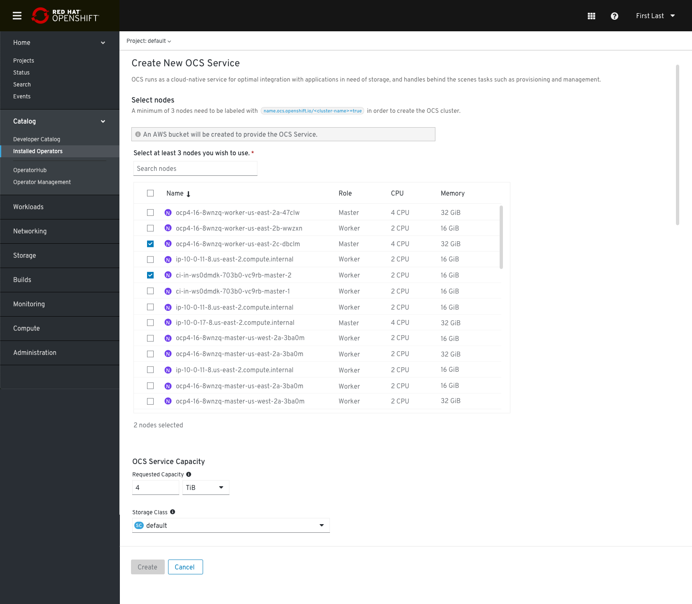

In case the user selects a lower number than 1 GiB an error message should appear 
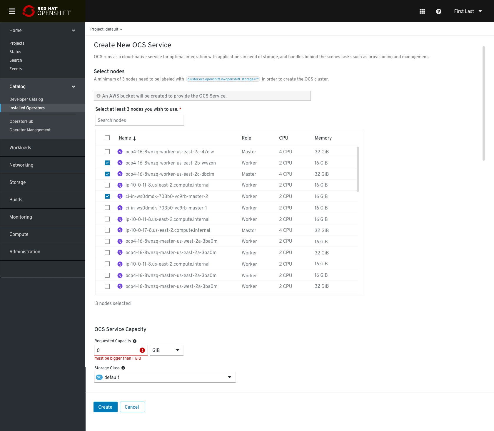

For AWS deployment: A new bucket will be created automatically in AWS S3 connected cloud, in the same region as the OpenShift. 

This info note should be added in cloud deployment:

The provider name should be modified according to the Cloud Credentials operator.

At any point, Admin can switch to YAML by clicking on the “Edit YAML” link in the top right corner of the second radio button.
After switching to YAML, the Admin cannot switch back to the form entry.

The "Create" button is only enabled once all mandatory fields have been filled with valid input.

## For Non-Cloud Deployments, e.g. VMware or Baremetal
In The case of on-premise the flow remains the same, the info message for creating a bucket in the cloud would be omitted.

# After Installation
* OCS Overview
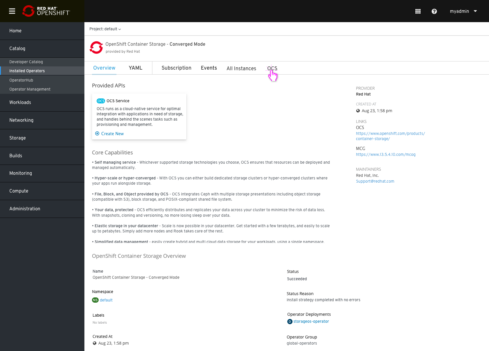

When the creation process starts new rows for “OCS” and “MCG” will be presented. If the deployment process runs for a while, the status “deploying” will be presented (the link is not linkable during the process).
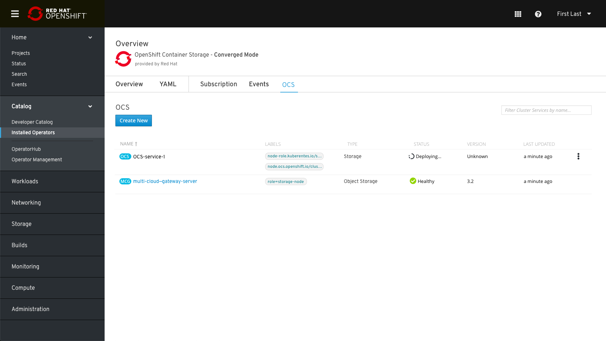
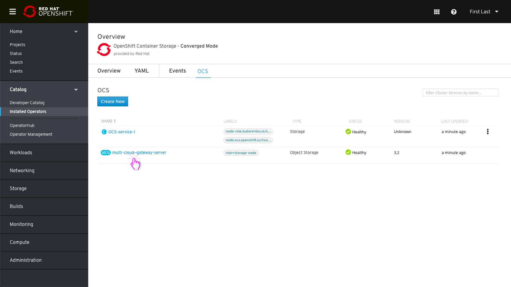

* Clicking on the “Multi Cloud Object Gateway” name will take you to the MCG Overview:
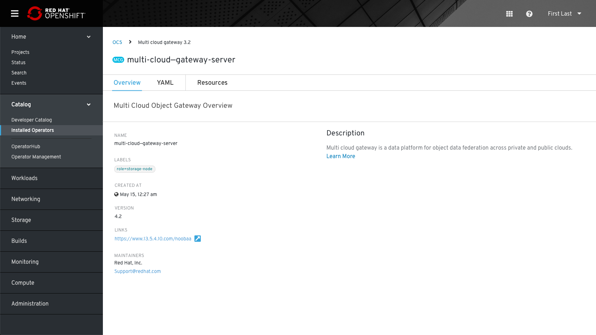
* Clicking on the “OCS-service-1” name will take you to the details:
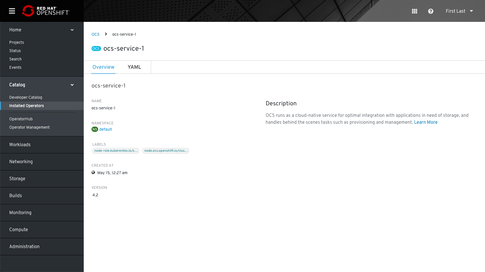