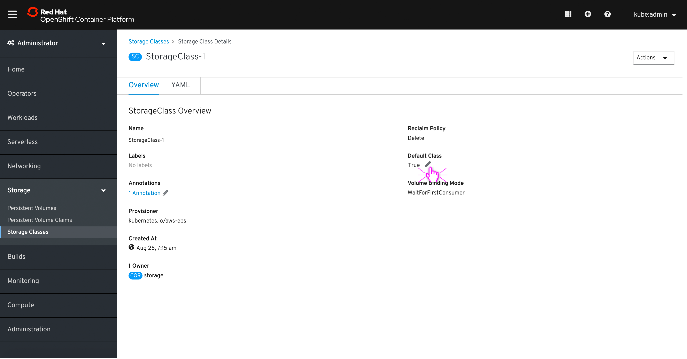

# Set Default Storage Class
- Users with appropriate privileges can set a Default Storage Class and this is part of Storage section.
- THERE ARE TWO WAY USER CAN SET A DEFAULT STORAGE CLASS

### OPTION-1: Kebab menu option:

1. Login to OpenShift > Admin > Storage (menu) > Storage classes (sub-menu)
2. User can see list of ‘Storage classes' [list view] & there will be a label that indicates `default` storage class

3. Click on the kebab menu > select `Set as Default Storage Class`

 

4. Pop-up opens with confirmation message.
5. User clicks on 'Confirm' button to make the change

 

6. Successfully modified ‘Default Storage class” [list view]
 
 

- NOTE: If user clicks on the kebab menu of the existing `default` then the menu in kebab `Set as Default Storage Class` will be disabled

 

### OPTION-2: Change the ‘default’ option from storage class detail page:

1. Login to OpenShift > Admin > Storage (menu) > Storage classes (sub-menu)
2. Click on a storage class name link and view details of the storage

 

3. SC details are shown as below
4. Click on 'pencil icon' near the ‘default class status’

 

5. Pop-up opens with a list of ‘SC’ and message shown below

 

 **Message:**
`Current default storage class will be changed to false when you
choose a different storage class from the list below.`

6. User can choose any SC as a default storage class and click on `Confirm` button.

 

7. Successfully modified ‘Default Storage class” [list view]

 
