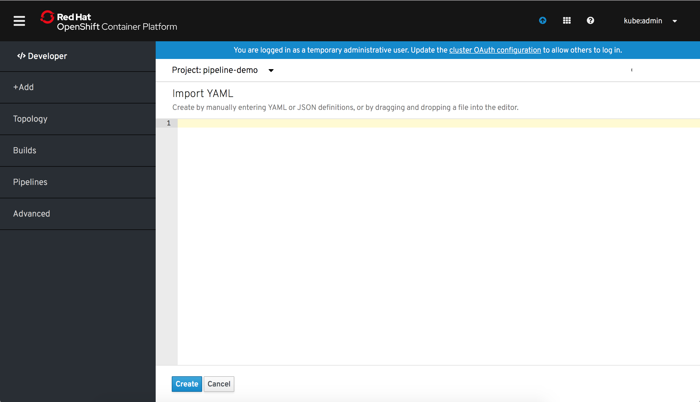

# Add
Add is a primary navigation item in the OpenShift Developer perspective.

The Add page is a card view with a number of cards enables the user to add to their project in different ways.  

## From Git
Design documentation for the From Git scenario when creating a source secret can be found [here](https://docs.google.com/document/d/1_yJE6abBYMKiCRBH9cr3NiDh-MtQs74_tW3cmHqko-s/edit?usp=sharing)

## Container Image
Design documentation for the Container Image git can be found [here](https://docs.google.com/document/d/1kqKQxw55GBt6V4jBnF8uh22A_BimcoAvr4wOMSDX-e4/edit?usp=sharing)

## From Catalog
Design documentation for the items From Catalog can be found [here](https://docs.google.com/document/d/1BaNbcNkrqmX0c-5e9E2um282PwwUCAhntUJHg-K7LYM/edit?usp=sharing)

## From Dockerfile
Design documentation for the From Dockerfile is still tbd

## YAML
When clicking on YAML, Add remains selected in the navigation.  The secondary masthead is shown with the selected project, and the YAML editor is displayed.

## Database
Design documentation for the Database is still tbd

## Note
Links to google documents are temporary until the documentation is converted to markdown files and added to this design repository.