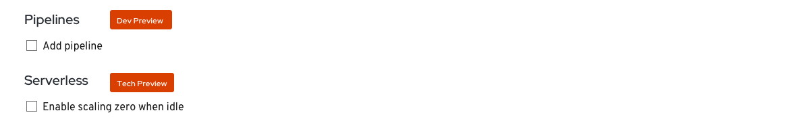

# Pipelines
The Pipelines section is available from the Import from Git, Container Image, and From Dockerfile Add Flows when the Pipelines operator is installed.

The Pipelines section allows the user to enable a pipeline template for their application, component or service.
