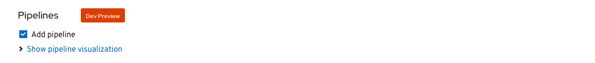
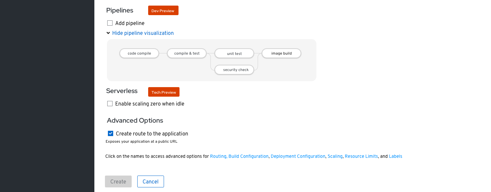
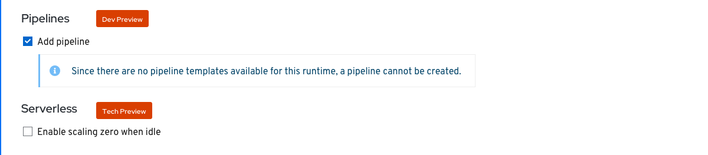

# Pipelines
The Pipelines section allows the user to enable a pipeline template for their application, component or service.

## Default state
A Pipelines section appears in +Add flows (for Import from Git,  Container Image, and From Dockerfile) when the Pipelines operator is installed.
* When the Pipelines operator is not installed, this section is not displayed
* The Pipelines section has a “Dev Preview” badge
* Under this Pipelines section, there is a checkbox control labeled “Add pipeline”
* The default state of the Add pipeline checkbox is OFF

## Checked state
When the “Add pipeline” checkbox is checked a "Show pipeline visualization" expandable is displayed.
* The Expandable control is contracted by default

## Expanded state
When the “Show pipeline visualization” control is expanded, a pipeline visualization is displayed below the expandable control.
* The expandable's text changes to “Hide pipeline visualization”

## Alert
When no pipeline template is available, show an inline alert. The alert type shall be Info.

