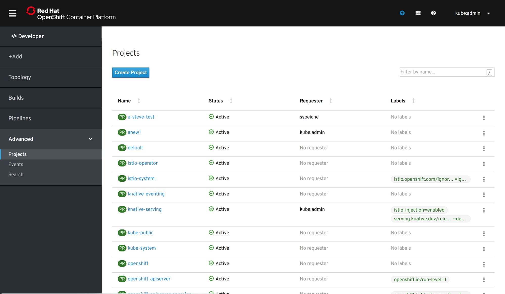
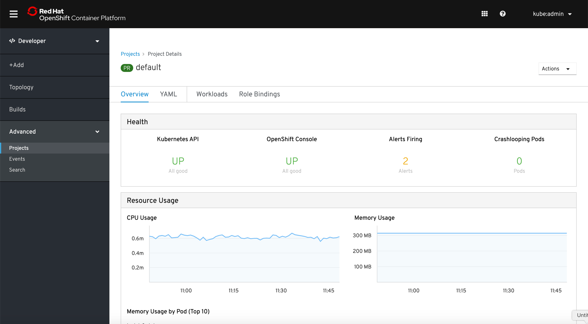
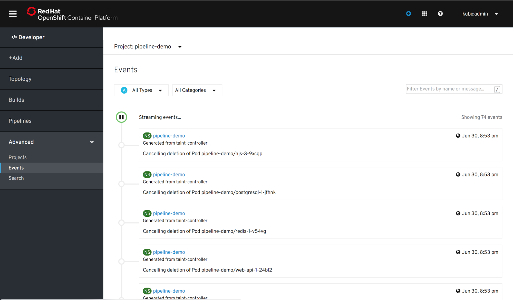
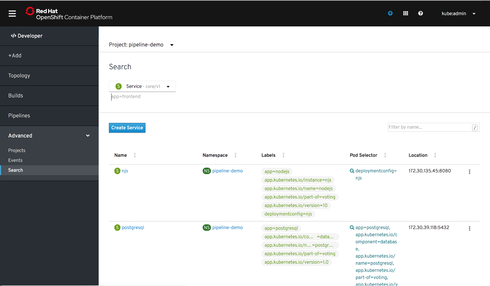

# Advanced
Advanced is a primary navigation item in the OpenShift Developer perspective.

Clicking “Advanced” will open/close the advanced secondary navigation items

## Projects
The Projects page is the same page as displayed in the Administrator perspective.

When clicking on a specific project, Projects remains selected in the navigation under Advanced. The project details of the selected project are displayed.

## Events
The Events page is the same page as displayed in the Administrator perspective.

## Search 
The Search page is the same page as displayed in the Administrator perspective.

