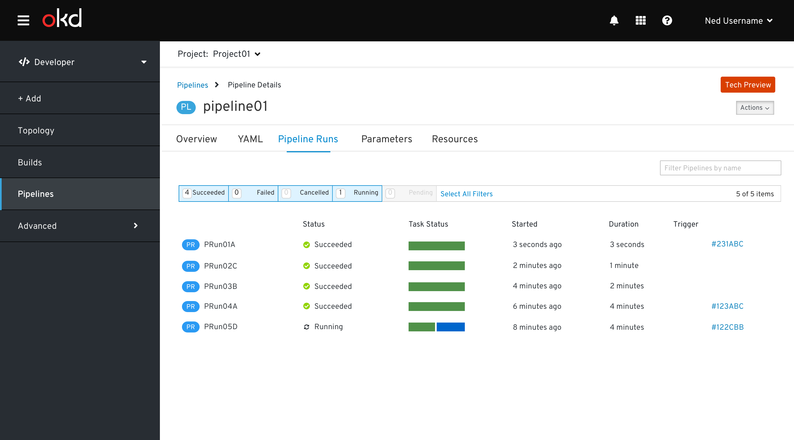

# Pipelines
The Pipelines page is a primary navigation item in the OpenShift Developer perspective.  Pipelines is only shown when the operator is installed.

## Pipelines Resource Table

### No projects exist
When no project exist, clicking Pipelines will show an empty state:

### All Projects in project selector
When a project is not in context, clicking Pipelines will prompt the user to select from a list of projects:

Dev Perspective - Pipelines

Overview
The Pipelines navigation item is only shown in the developer perspective.
When no projects exist, clicking Pipelines will show an empty state:
When a project is not in context, clicking Pipelines will prompt the user to select from a list of projects:
Pipelines Resources
When a project is in context, clicking “Pipelines” will display the Pipelines Resources in that project.
Pipeline Details
Overview
YAML
Pipeline Runs
Parameters
Resources
Pipeline Actions
Start last run
Start
Delete Pipeline
Pipeline Run Details
Overview
Logs
Pipeline Run Actions
Delete Pipeline Run
Status Labels, Icons & Colors
Task Status Component
Examples
Behavior
Status Colors and Icons
Pipeline Visualization
Specs
Pipeline Run Visualization
Specs

Overview
The Pipelines navigation item is only shown in the developer perspective.  
When no projects exist, clicking Pipelines will show an empty state:
When a project is not in context, clicking Pipelines will prompt the user to select from a list of projects:

Pipelines Resources
Navigation item: Pipelines  
Secondary masthead is visible and includes the project selector 
Page title is Pipelines
Actions
There are no page level actions
There are no pipeline actions, thus no kebabs are in the list view
Filters
OpenShift filter toggle component is present
OpenShift filter by name component is present
Columns

Column Name
Details
Sortable
Filterable
Name
Resource badge + pipeline name are presented as a link.  Clicking on the link navigates to the Pipeline Details View
Yes
No
Last Pipeline Run
Resource badge + name of last pipeline run

Clicking on the link navigates to the Pipeline Run Details View
Yes
No
Last Run Status
Running (use fa-refresh)
Succeeded (use pficon-ok)
Failed (use pficon-error-circle-o)
Pending (fa-hourglass-half)
Cancelled (fa-ban)

Follow these guidelines when displaying status
Yes
Yes
Last Task Status
Follow these guidelines when displaying the task status

Last Run Started
Follow these guidelines when displaying time
Yes
No

When a project is in context, clicking “Pipelines” will display the Pipelines Resources in that project.

## Pipelines Resource Details
### Pipelines - Overview tab

### Pipelines - YAML tab

### Pipelines - Pipeline Runs tab

### Pipelines - Parameters tab

### Pipelines - Resources tab

There are 2 columns in the Pipelines resource tab:
Name - resource name
Resource Type - a dropdown including git, image, cluster & storage

Adding a Resource
The general behavior of adding a resource is consistent with the Environments tab of many workloads pages.  

When the user clicks Add Resource
a new row is added
hints are shown in the input fields
An info inline notification is shown 

When the user clicks Save
An success inline notification is shown 

Removing a Resource
When the user hovers over the Remove Resource icon
A Remove Resource tooltip should be displayed

When the user clicks the Remove Resource icon
The row is removed
An info inline notification is shown 

When the user clicks Save
An success inline notification is shown 

## Pipeline Actions

Pipeline actions can be accessed from the kebab menu in the Pipeline resources view.  Supported pipeline actions are: 
Restart last run
Start
Delete Pipeline

Actions can be access from the kebab menu in the Pipelines Resource view

Pipeline actions can be accessed from the Actions menu on the Pipeline details view.

### Restart last run
No dialog is needed to start the last run.

### Start
A modal is displayed for the Start action.

The modal is built dynamically based on associated parameters & resources.  All parameter and resource fields are required.
Modal title - Start Pipeline
Parameters section
Parameters associated with the Pipeline are added to this section
Default values are provided
Cluster Resources section 
This section exists if there is at least one resource of type cluster associated with the Pipeline
Cluster resources associated with the Pipeline are added to this section in a two column format
Should we default to a value?
Git Resources section
This section exists if there is at least one resource of type git associated with the Pipeline
Git resources associated with the Pipeline are added to this section in a two column format
Should we default to a value?
Image Resources section
This section exists if there is at least one resource of type image associated with the Pipeline
Image resources associated with the Pipeline are added to this section in a two column format
Should we default to a value?
Storage Resources section
This section exists if there is at least one resource of type storage associated with the Pipeline
Storage resources associated with the Pipeline are added to this section in a two column format
Should we default to a value?

Notes: the name of the Pipeline Run is generated, the user does not input it
Adding Resources on the fly ( WIP )
Create option exists in the dropdown.

Clicking on the Create option in the dropdown reveals associated fields needed to create a resource of that type.
Clicking the check will (1) create the resource (2) remove that panel (3) select it in the associated dropdown 
Clicking the x will remove the panel and nothing will be added to the dropdown

### Delete Pipeline 

## Pipeline Run Resource Details

### Pipeline Run - Overview tab
The Overviews tab includes:
Pipeline Run Status
Includes an icon & label for pipeline run status
Task Status
Task Status component is explained here
Pipeline Run Visualization
Pipeline run visualization is explained here

### Pipeline Run - Logs tab

When navigating to the logs tab, the most recently started task will be selected, and the UI will auto-update, selecting the most recently started task as the pipeline run executes.

Clicking on a task will move to the Logs tab of the Pipeline Run with the task selected, showing the logs of all associated steps.

A Download link is to download the step logs.

## Pipeline Run Actions

Pipeline Run actions can be accessed from the kebab menu in the Pipeline Runs resources tab of the Pipeline Detail

Pipeline actions can be accessed from the Actions menu on the Pipeline details view.

### Delete Pipeline Run

Status Labels, Icons & Colors
Icon
Icon Name
Label
Chart Color

fa-refresh
Running

pficon-ok
Succeeded

pficon-error-circle-o
Failed

fa-hourglass-half
Pending

fa-ban
Cancelled

Task Status Component
Examples

Behavior
Task status is be a 100% stacked bar chart (Implementation note: use PF4/Victory to remain aligned with OpenShift console strategy). 
Last status represents the tasks of the last pipeline run.
Each segment of the chart represents the group of tasks which are the same status.
Task segments are in the following order: 
Succeeded
Failed
Cancelled
Skipped
Running
Pending
Hovering over the widget will show a tooltip indicating the number of tasks in each of the task statuses
The height of the task status component should remain constant and similar in height to associated text.
Clicking on any part of the task status widget will navigate to the Log Tab of the pipeline run details view.
Use a 3 px separator between segments

Status Colors and Icons

Pipeline Visualization
Specs

Pipeline Run Visualization
Step status inside of the task bubbles

Specs

Design documentation for the Pipelines section can be found [here](https://docs.google.com/document/d/1L5doS4doZiG5QfCsyaiH6osiJkV9KNnPkzofPwp_W6c/edit?usp=sharing)

## Note
Links to google documents are temporary until the documentation is converted to markdown files and added to this design repository.