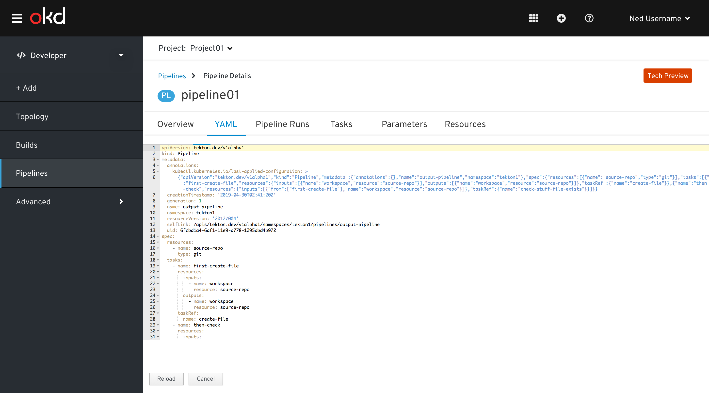

# Pipeline experiences when user has view only access of a project#

If the user is assigned to a project with `view` access, then user will be restricted from the following actions of the project:
 - add
 - edit and
 - delete

_i.e. user cannot add, edit and delete any annotations, labels, parameter, and resources & user cannot start, stop, restart, edit and delete any pipeline tasks._

### Pipelines List View ###
For view access users, the kebab and all associated actions will be disabled.

### Pipelines Details Page / Overview ###
`action` button will be hidden for view access users.

### Pipelines Details Page / YAML ### - Hide `action` and `save` button

*Pipelines Details Page / Pipeline Runs* - Hide `action` button and disable menu items of the kebab and all associated actions

*Pipelines Details Page / Parameters tab* - Hide `action`, `save` buttons, `add/remove` options of parameters & `input fields` are disabled.

*Pipelines Details Page / Resources tab* - Hide `action`, `save` buttons, `add/remove` options of parameters & `input fields` are disabled.

*Pipeline Runs Details view*- Hide action button.
*Note:* _No action allowed in YAML and logs taps_

