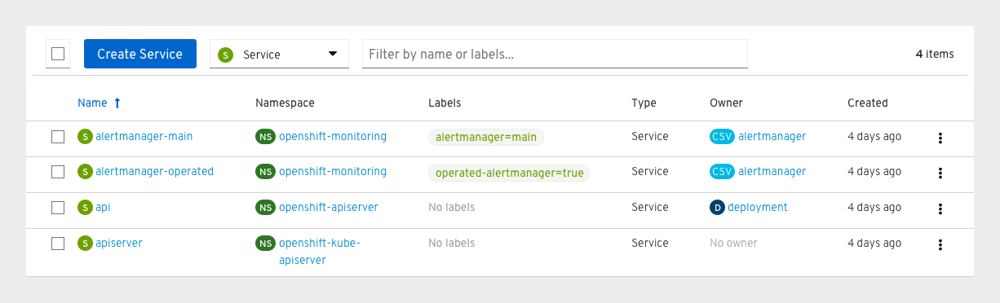
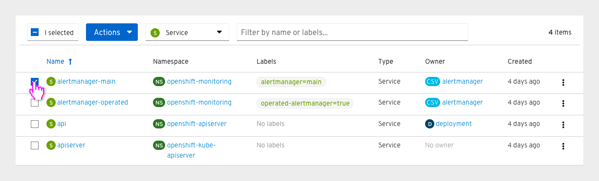
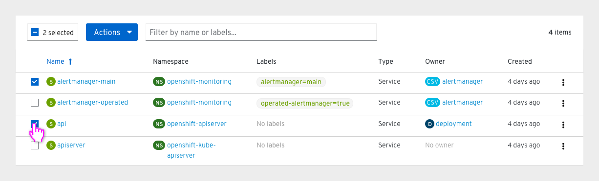
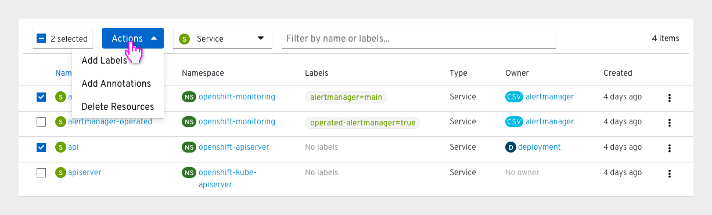
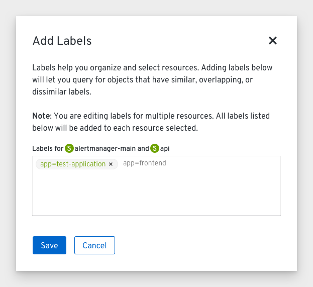

# Bulk actions

Bulk actions will be added to a number of pages in the OpenShift console.

## Behavior
* The bulk selector will be the first component in the toolbar on pages where bulk actions are available.
* Users can click the checkbox in the bulk selector to select all items in the list. If all items are selected, the bulk selector checkbox will be filled with a check and the bulk selector will read 'All items selected'.
* Users can also choose to select a group of items by clicking the associated checkboxes next to them. The bulk selector checkbox will be filled in with a '-' to indicate that some items are selected, and the bulk selector will display the number of items selected (e.g. '2 selected').
* Clicking the bulk selector checkbox will deselect all items.
* If any of the items in the list are selected, the primary action button will be replaced by the actions dropdown.

## Actions
* Only specific actions will be available to take on multiple resources. The default bulk actions are 'Add labels', 'Add annotations', and 'Delete Resources'.
  * Any labels or annotations added will NOT overwrite existing labels or annotations. They will simply be added to the selected resources.
* Additional actions may be added in future depending on the resource type.

