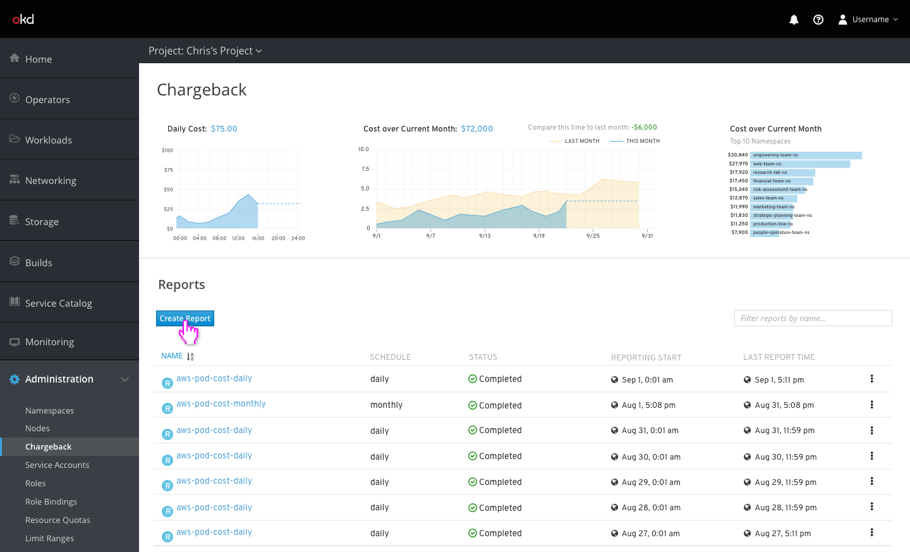
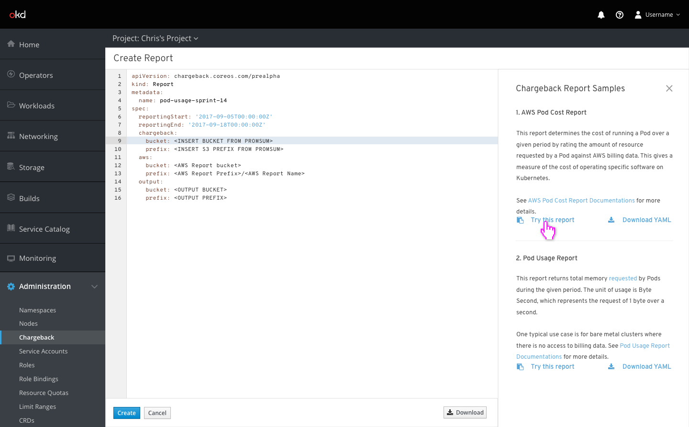

# Chargeback

## Reports

- The chargeback page contains charts showing several cost metrics as well as a list of all chargeback reports

## Creating a Report

- Similar to other pages, a dismissible sidebar enables users to select from several sample reports that will be filled into the editor

- One-off reports should not have a value filled in for the schedule column

## Report Details

- Each report page contains information about the report and its scheduling as well as a table that contains the actual report itself.

- Clicking on different tabs changes the report breakdown into different categories
- Small charts showing relative size of each category are displayed for the currently sorted column
- Clicking on the `Download Report` action will download a RAW version of the report displayed below using the currently selected display and sort options.
