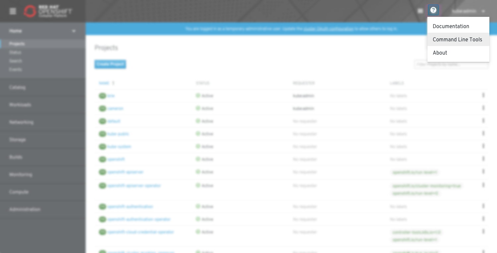
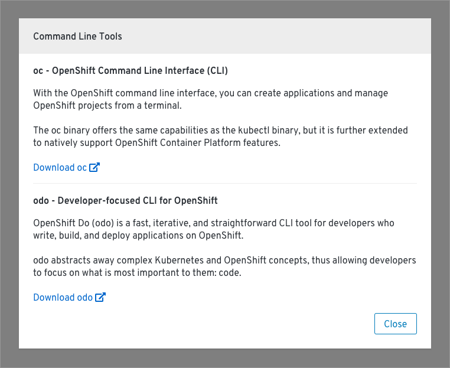
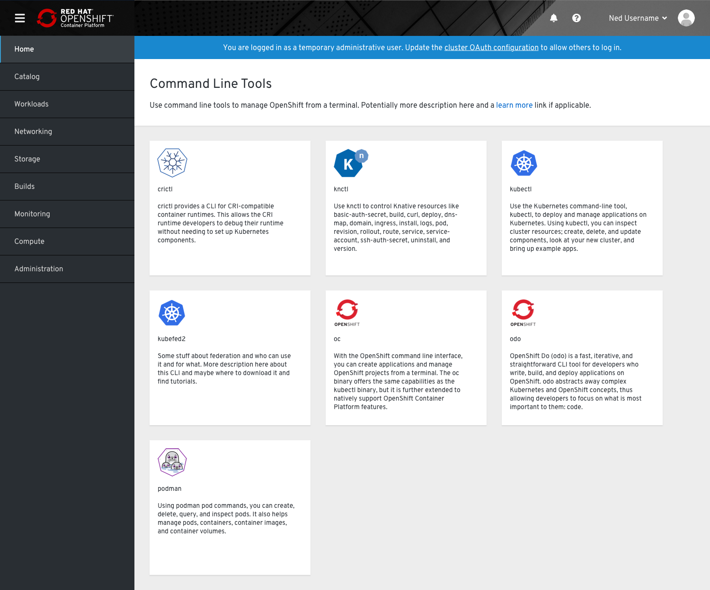
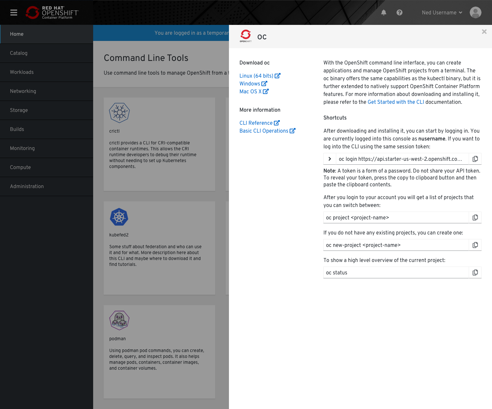

# Command Line Tools

If users do not already have the `oc` command line tool, they can download the version corresponding to the OpenShift cluster they are using from the Command Line Tools page. They can also download OpenShift do (`odo`) from this page. More command line tools will be added to this page over time.

## Help Menu

* The command line tools page will be accessible from the help menu.

## Modal

* Currently, users can only download `oc` or `odo`. For the time being, the command line tools will be displayed in a modal, with descriptions and download links for each tool.

## Card view

* When more tools are added, the command line tools page will be a full page card view. Each card will have the tool name, associated logo, and description.
* **Note**: These descriptions are placeholder and will be reviewed and updated if and when the tools are added in future.

* Users can click on a card to open the side panel and view more details about the command line tool.
* Details include download links, help links, and shortcuts for the user to copy and paste.
