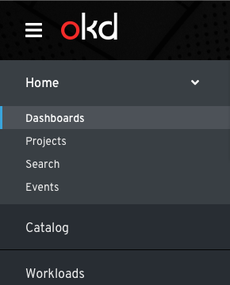

# Dashboards

## Dashboard Organization

### Dashboard-related navigation changes

- The `Status` navigation item will be removed and replaced with `Dashboards`.
- If technically feasible, `Dashboards` should be the landing page of OpenShift and should be the first navigation item, followed by `Projects`. If not, the order should remain unchanged.
- The status page for "All Projects" will be removed and replaced with the new cluster scoped overview dashboard
- Project specific status pages will become tabs of a detail view for each project. See "Object scoped dashboards" below.

### Cluster scoped dashboards

#### Overview dashboard
- The `Overview` dashboard is the primary tab on the dashboards page and should provide high-level information about the cluster and its components. Specific notes on the content of this dashboard are found elsewhere.

#### Specialized dashboards
- Additional dashboard tabs may be added for specific parts of OpenShift or potentially by Operators. These should be placed to the right of the `Overview` dashboard tab and can be organized as necessary for the relevant information

### Object scoped dashboards
- The `Overview` tab on object details pages should primarily be used to illustrate the YAML of the object in a visual way. If applicable, a few select charts with important metrics may be included on the page.
- If the metrics charts would take up more than a full row on a desktop-sized screen, a separate `Dashboard` tab should be added and any charts should be placed there instead of on the `Overview` tab.

#### Projects

- The `Resources` and `Dashboard` sections of project-specific status pages should become tabs of the project details view.
- The project details view should be accessible by clicking on a project in the project list.

### Future considerations
- As the capabilities of dashboards in OpenShift are improved and more types of dashboards appear, we will need to consider methods for switching between many options and possibly saving common options.
