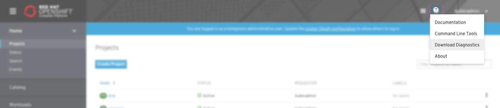
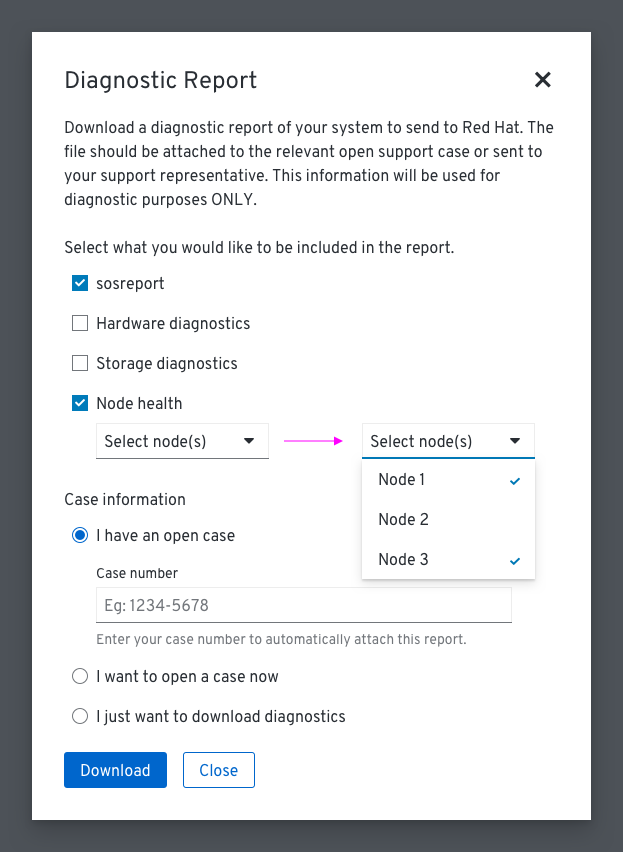
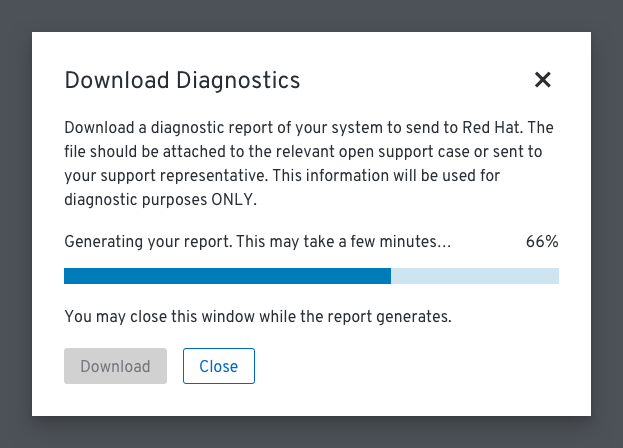
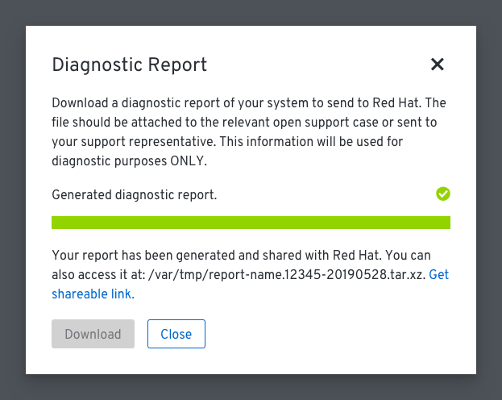
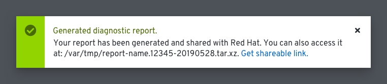
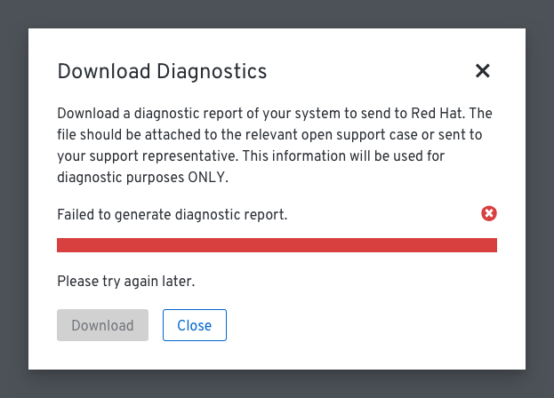
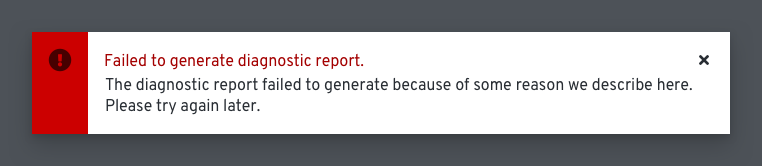

# Downloading Diagnostics

Users can download a diagnostic report of their system and send it to Red Hat from the console.

## Help menu

* The "Download Diagnostics" option is available from the help menu.

## Modal

* A modal will open with a description of how the diagnostic report will be used.
* Users can indicate what they would like to include in the diagnostic report and whether or not they have an open support case already.
  * If users have a case number they can enter it into the "Case number" field.
  * If users do not have an open case they may choose to open one. If they choose this option, a link to the case will be included in the success screen.
  * Users may also choose to just download the diagnostic report to their machine and send it to Red Hat at a later time.

## In progress

* Diagnostic reports may take a while to download. A progress bar is provided for users to track the download progress. Users may also close the modal during the download.
* The "Download" button is disabled to prevent users from generating a report multiple times.

## Success

* If the report successfully downloads, a message will appear informing users that the process is complete. It will also tell users where they can find the download on their machine. If technically possible, it will also provide users with a shareable link to the report.

* If users closed the modal during the download, a dismissible success toast will appear with the same information the modal would display.

## Failure

* If the report fails to download, a message will appear informing users and asking that they try again at a later time.

* If users closed the modal during the download, a dismissible failure toast will appear with the same information the modal would display.
