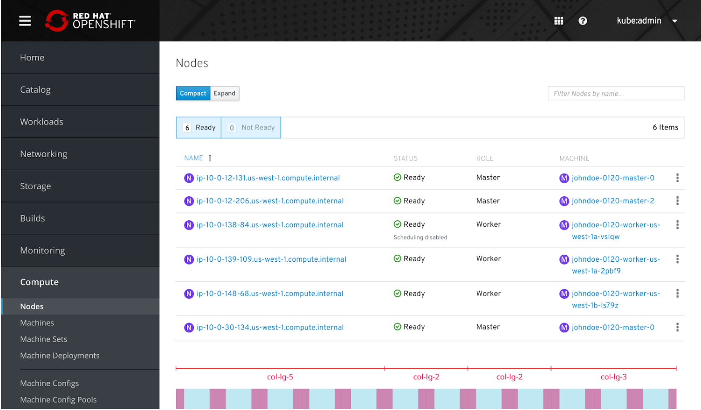
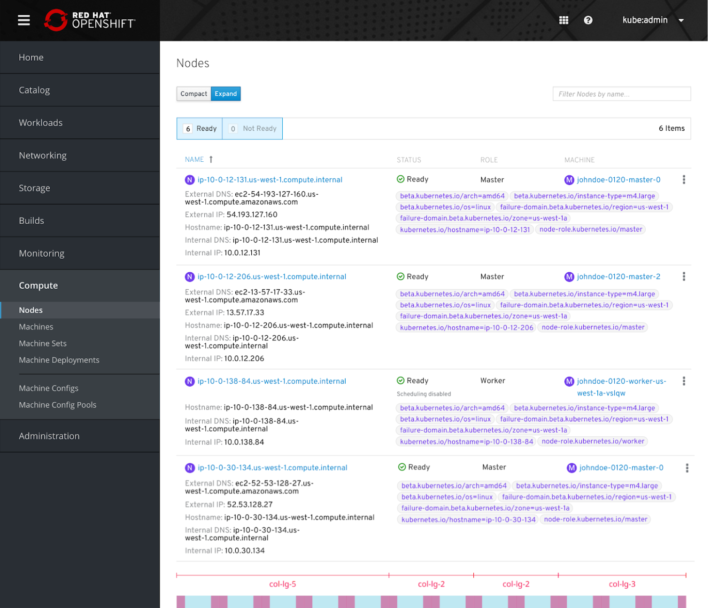

# Nodes

## Compact List View

- The compact list view should include Node Name, Status, Role, and Machine

## Expanded List View

- The node name spans the first 5 columns
  - In the expanded view, the IP address details will go below the node name, also spanning 5 columns
  - The status, role, and machine name together span 7 columns
    - In the expanded view, the labels will also span these 7 columns
