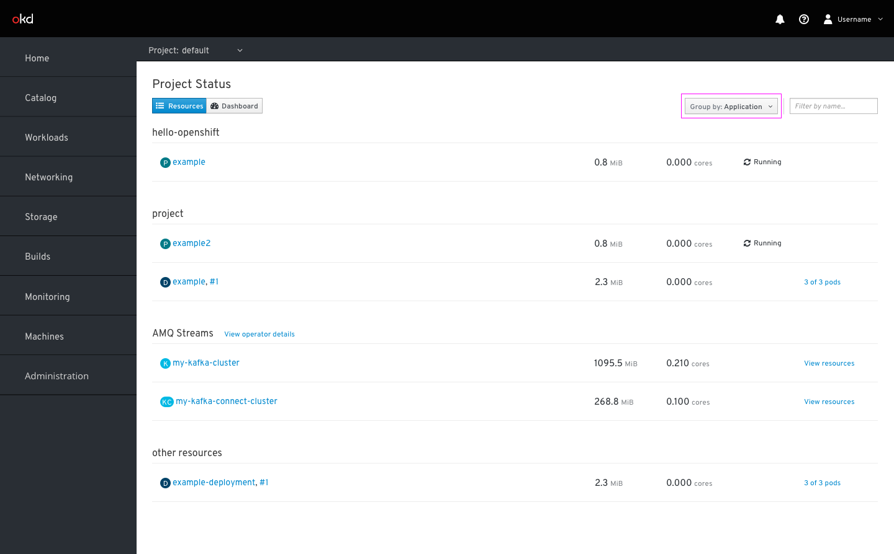

# Showing Operators on Overview

This documentation details how operators will be surfaced on the Status page. Rather than exposing CSV objects, the status page should now expose the CRs being managed by identified CSVs in designated groups.

## Group by: Application

* In the group by Application view, operator managed CRs will be grouped together with the CSV object name as the group header (AMQ Streams).
* In this example, the “View operator details” link will bring users to the Installed Operators > AMQ Streams > Overview tab. The “View resources” link will bring users to the Installed Operators > AMQ Streams > Kafka details > Resources tab.

## Group by: Resource

* In the group by Resource view, CRs will be grouped with other CRs of the same type, with the API type as the group header.

## Side panel

* The side panel will have one tab: Overview.
* Users can view the CRs resources by clicking the “View resources” link in the main list view or the operator details by clicking the “View operators details” link next to the section header.
* Users can drill down to see more of the resource's details by clicking the resource name in the panel header.
