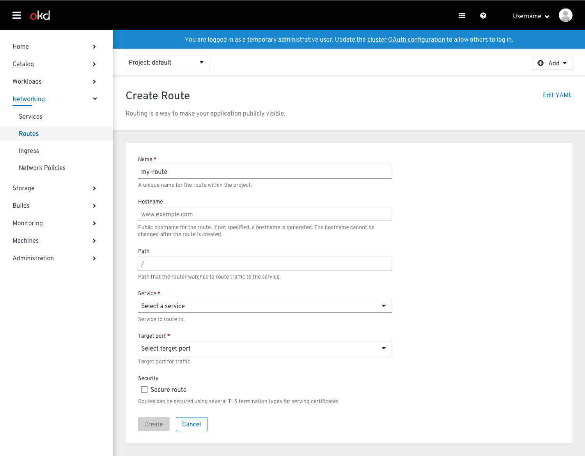
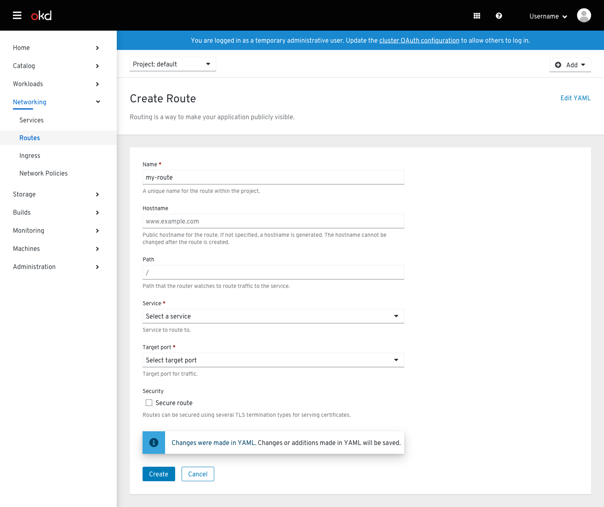
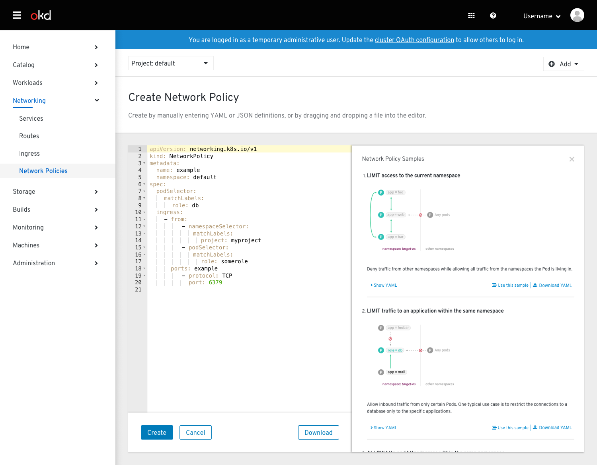
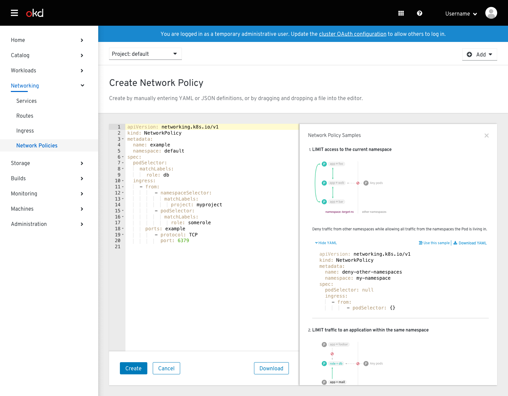
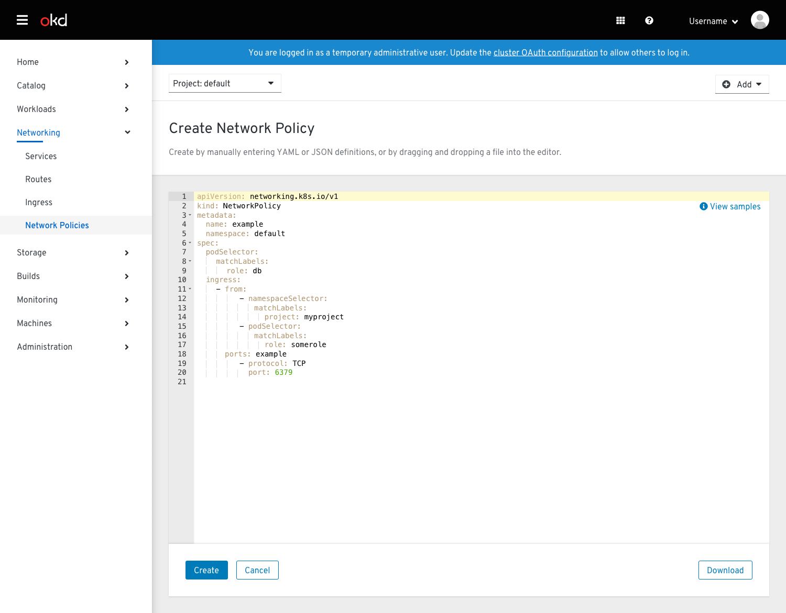
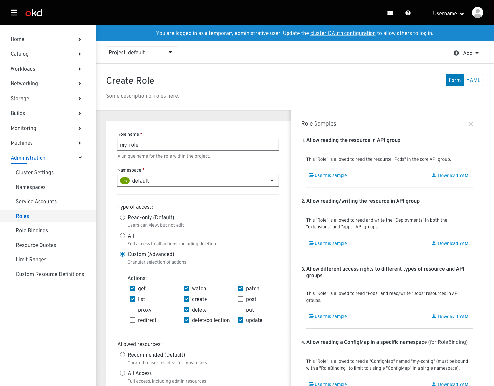
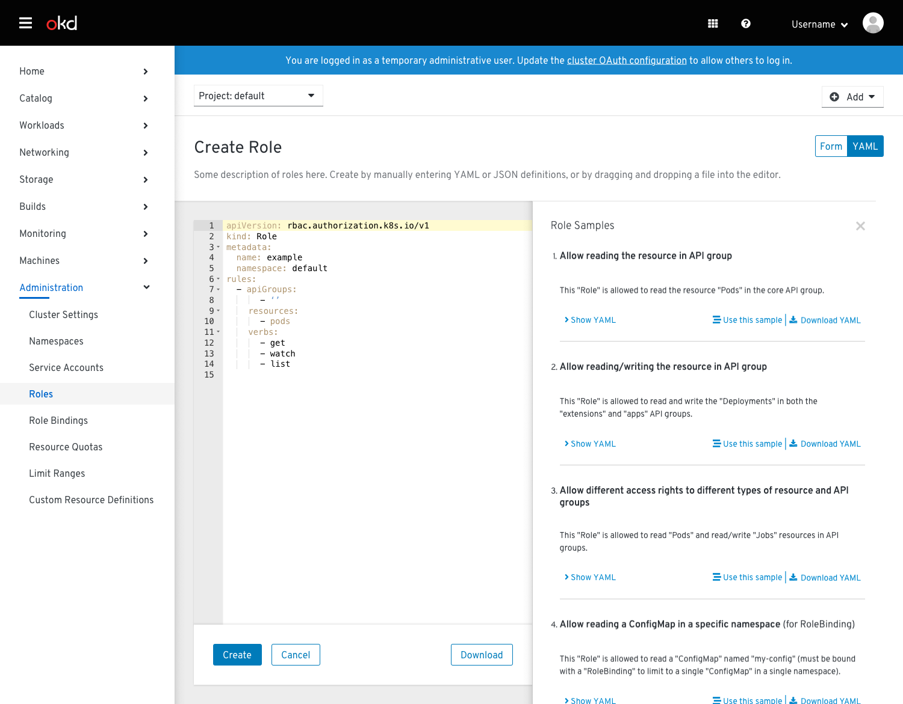
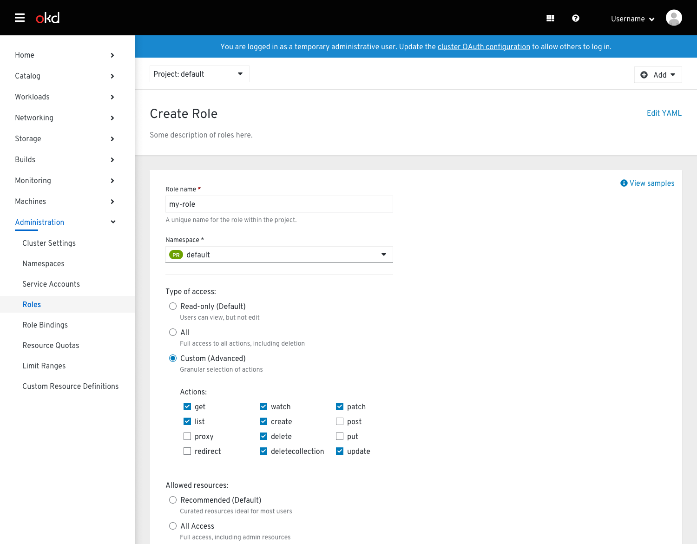

# Resource Creation

## Overview
* If a resource has a creation form (and YAML), the form will load on default.
  * After the resource is created, users can edit the resource in YAML only.
  * In the future, inline edit will be investigated as a way to allow users to edit fields in a form-like manner.
* Samples available in YAML editor will show YAML code to be copied and pasted as well as a "Use this sample" button that will overwrite the YAML with the sample.
* Samples available in form will show a "Use this sample" button and will fill in form fields.
* Changes made in YAML will be reflected when switching to form view, and vice versa.
  * An inline notification should appear on the form view notifying users that any additional fields they add in YAML will be saved.

## Pages
The follow documents which pages should have a YAML / form switcher and a samples panel. This list may be updated over time to reflect changes to our resource creation flows.

**YAML / form switcher**
* Create Key/Value Secret
* Create Image Pull Secret
* Create Source Secret
* Create Webhook Secret
* Create Route
* Create Persistent Volume Claim
* Create Storage Class

**Samples**
* Create Build Config
* Create Resource Quota

**Both switcher and samples**
* Create Network Policy
* Create Role
* Create Rule

## Switcher

* When a resource has a creation form, users can switch back and forth between the YAML editor and the form using the toggle in the upper right hand corner.
* Edits made in YAML will be reflected in form view and vice versa.
* Users can add extra fields in YAML that do not necessarily have a related form field.
  * An inline notification will be shown on the form view in these cases to inform users that their changes or additions to YAML will be saved.

## Samples

* YAML editors with samples will be loaded with the samples panel open.
* The samples panel will push content over rather than overlaying.
* Users can click “Show YAML” to view the sample’s code.
* Users can copy and paste any section of the sample into their YAML editor, or click "Use this sample" to automatically fill the YAML editor with the sample YAML.
* Users can click “Hide YAML” to hide the samples code.
* Users can download a copy of the sample YAML by clicking “Download YAML.”
* The panel can be closed by clicking the ‘x’ and reopened by clicking the floating “View samples” link.

## Switcher and Samples

* Behavior for both switcher and samples is the same as described above.
* If a form has both a switcher and samples panel, the form will load on default with the samples panel open.
* Samples in form view will show a “Use this sample” button.
  * Clicking “Use this sample” will overwrite the fields in the form with the sample data.
* When the sample panel is closed on form view, it will show the floating “View samples” link in the upper right hand corner.
