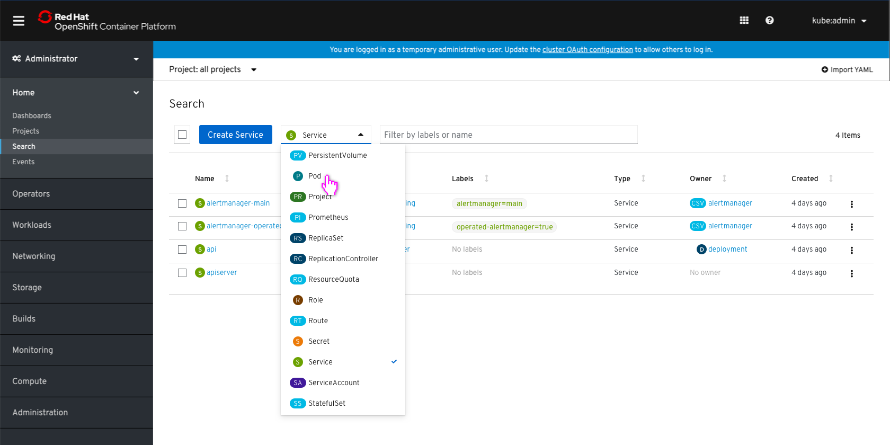
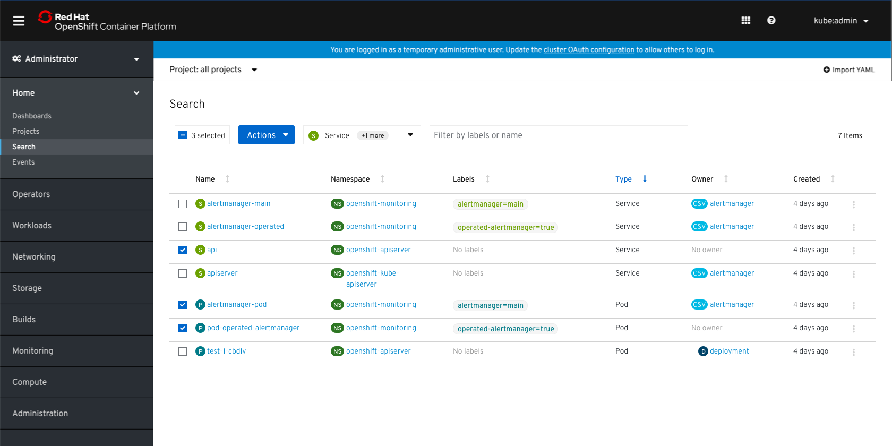
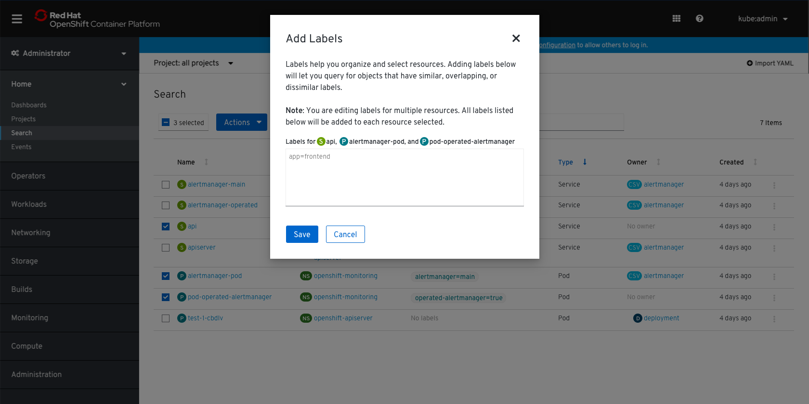
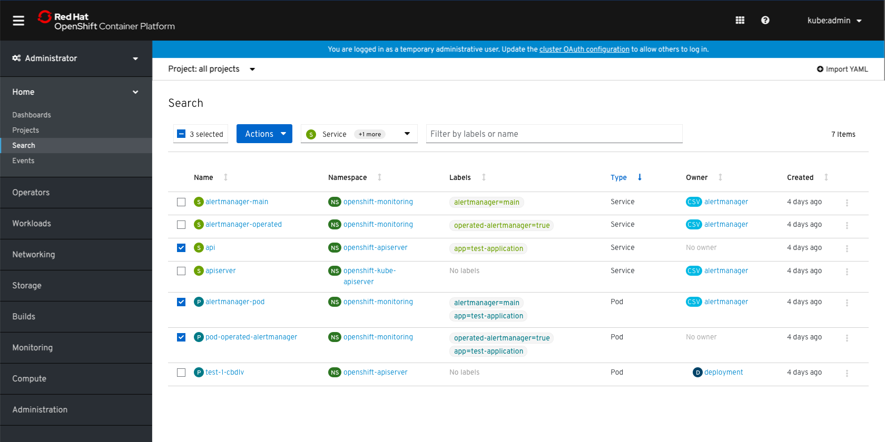
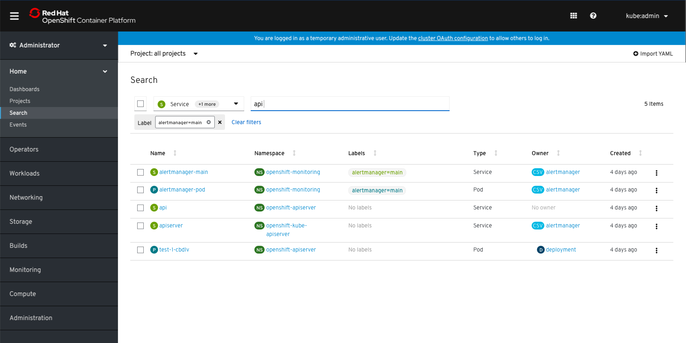
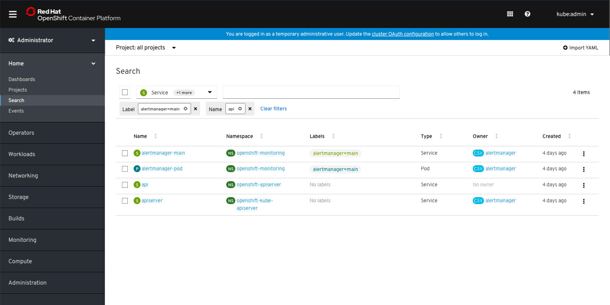
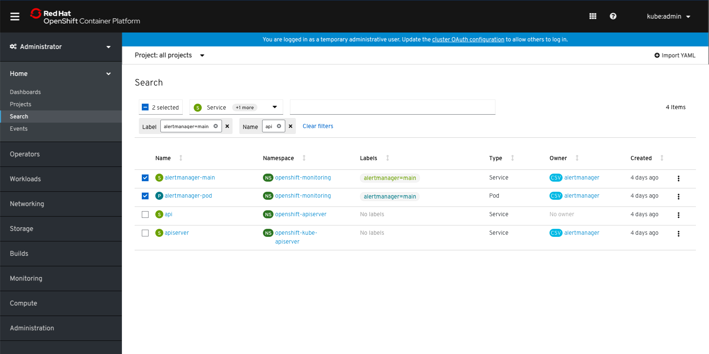

# Search page
The Search page will be updated to have a variety of new features.

## View multiple resources

* Users can view more than one type of resource by clicking the dropdown and selecting resource types from the list.
* There will be a max number of resources that users can select at a time, which is yet to be determined.

* The items will be sorted by name by default.
* The default columns in the list are `Name`, `Namespace`, `Labels`, `Type`, `Owner`, and `Created`.
* When multiple types of resources are selected, the primary 'Create' button will not be shown.

* Users can sort by Type to separate the different resources in the list.

## Bulk select resources

* Users will be able to multi select items in the list by clicking their associated checkboxes.
* To select all at once, users can use the bulk selector.

## Take bulk actions

* When any items in the list are selected, the actions dropdown will replace the primary action in the toolbar. If there is no primary action, the rest of the toolbar will shift to make room for the dropdown.
* The primary bulk actions will be `Add Labels`, `Add Annotations`, and `Delete Resources`. More actions may be added in future depending on the resource(s).

## Example: Adding Labels

* The `Add Labels` modal is the same as the `Edit Labels` modal, but notes that any changes will add labels rather than replace.
* Users can add labels in the textbox and click 'Save' to add the labels to the selected resources.

* The new labels will appear in the list and the items will remain selected.
* To bulk unselect items, users can click the '-' in the bulk selector.

## Filtering by name or labels

* The textbox filter will allows users to filter by name or label. The filter will filter on the list as users type. Upon hitting 'Enter', filter chips will be added to the second row of the toolbar.

* If the query has an equal sign in it, it will be grouped as a label. Other queries will automatically filter on name.

* The filter and bulk selector can also be used together.
