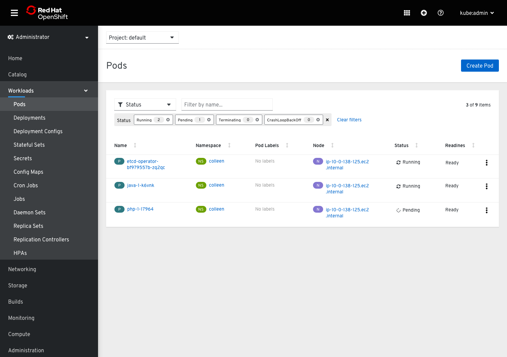
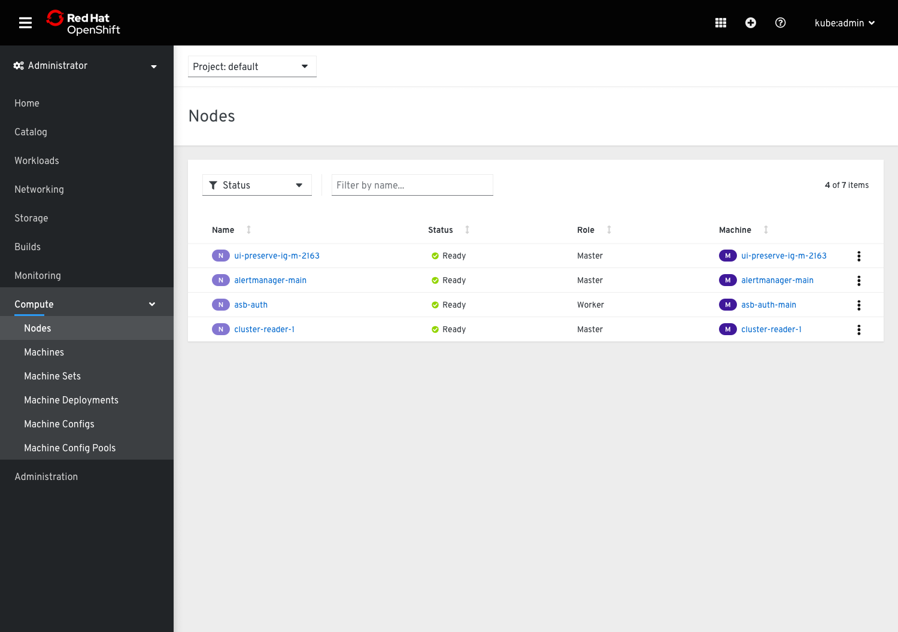
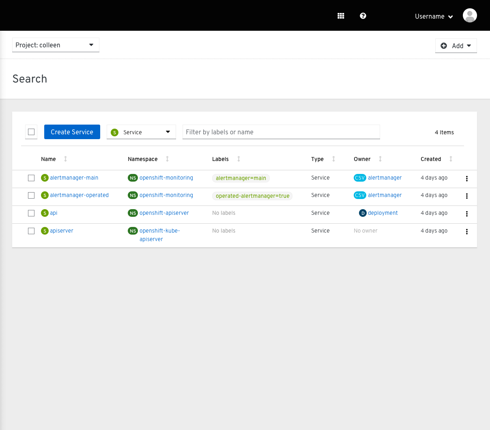
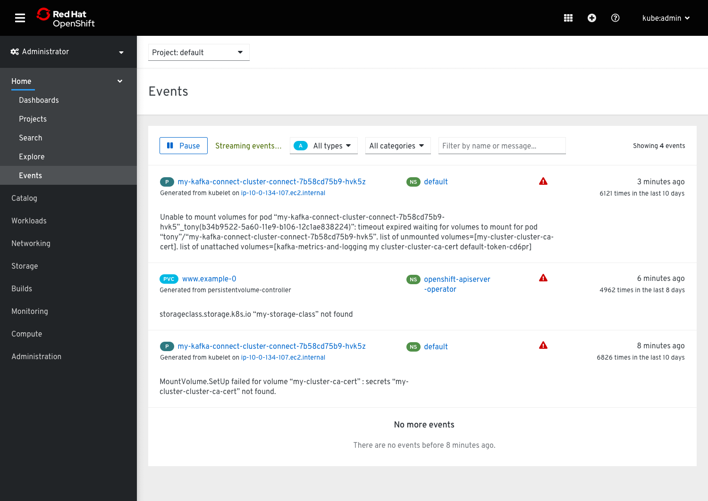
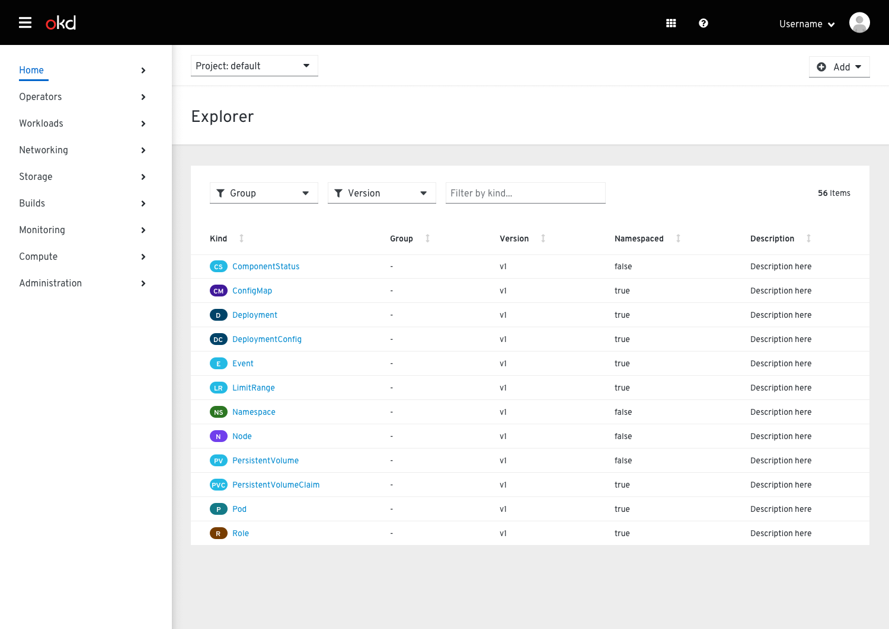
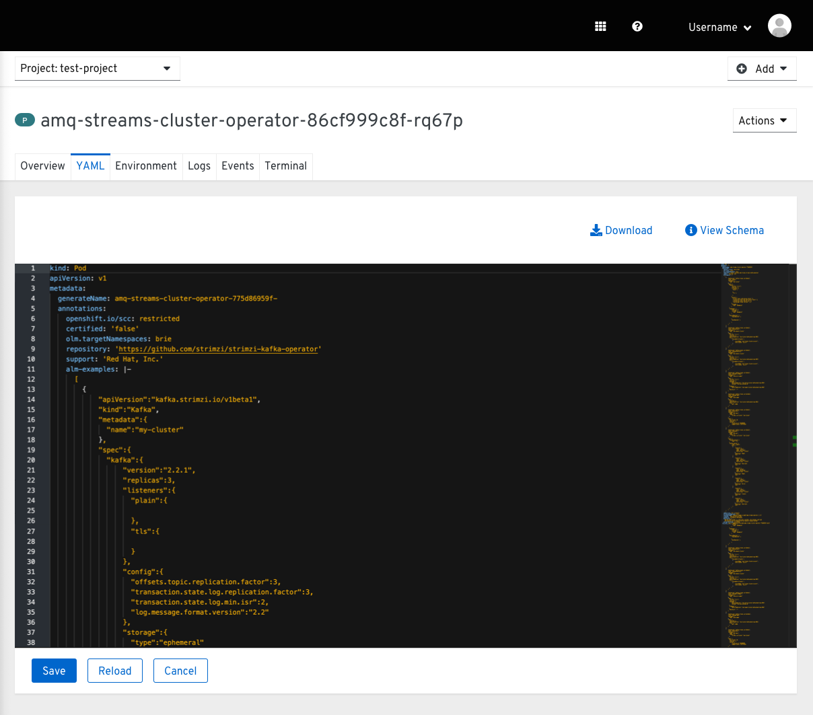
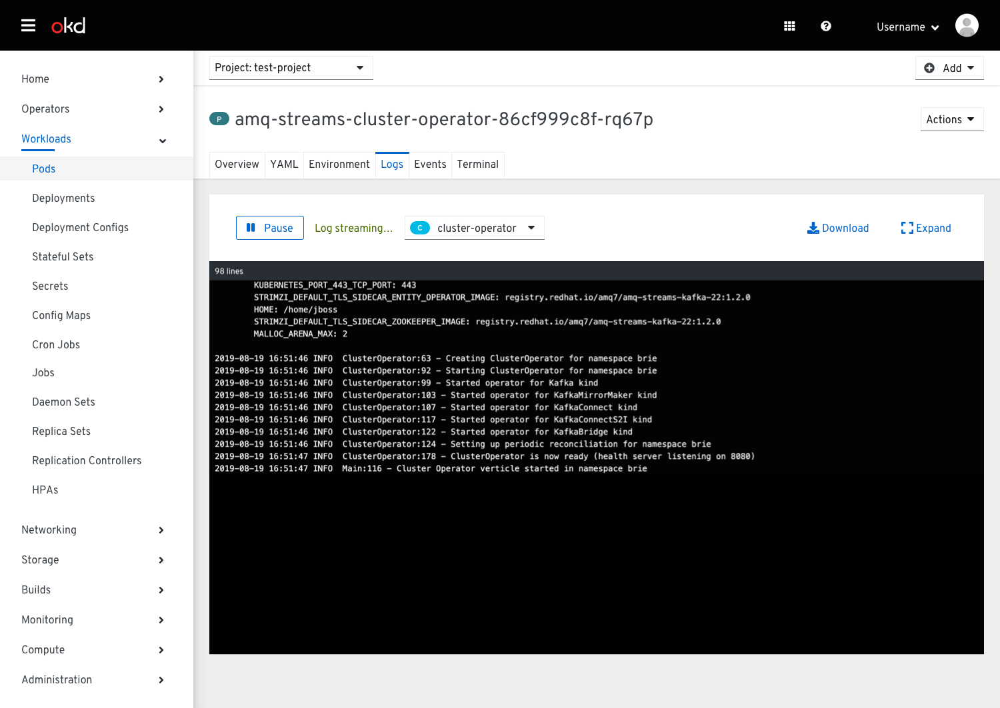

# Toolbars

There are various toolbars used across the OpenShift console.

## Basic toolbars
* The most basic toolbars in OpenShift have a 'Create' button, a textbox filter, and an item count.

Example

## Toolbars with faceted filters
* This type of toolbar is similar to the basic toolbar but adds faceted filters. When filters are applied, the toolbar increases in height to show filter chips on the second row.
* Toolbars with faceted filters may or may not have a 'Create' button.
* Toolbars with faceted filters may have opinionated views. In these cases, filters are already applied when a user navigates to that page, and the filter chips are visible to show what is being filtered.

Example with 'Create' button and opinionated view

Example without 'Create' button and no opinionated view

## Special toolbars
* There are a number of pages that have custom toolbars.

Search

Events

API Explorer

YAML tab

Logs tab

Terminal tab

