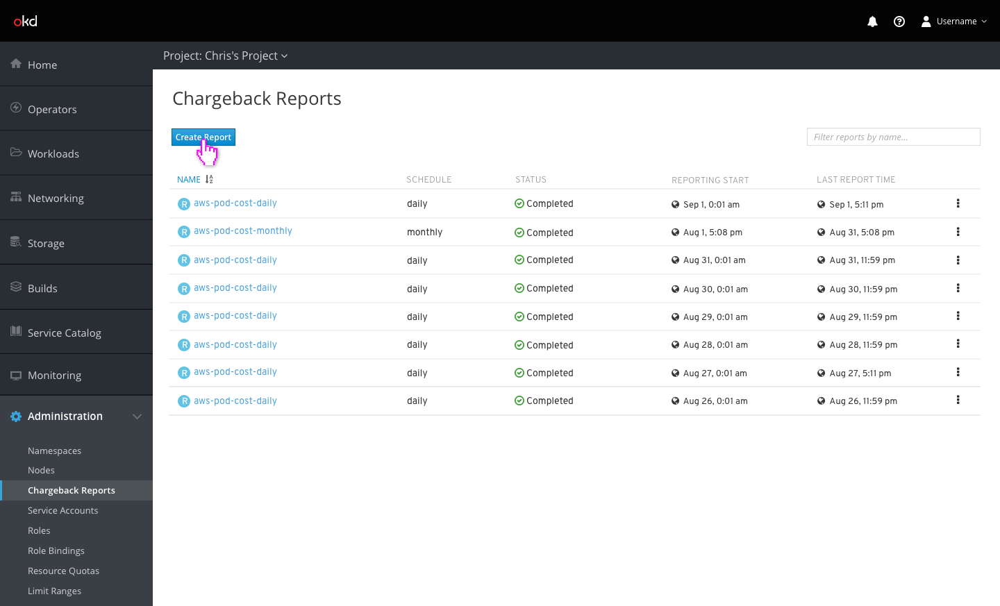
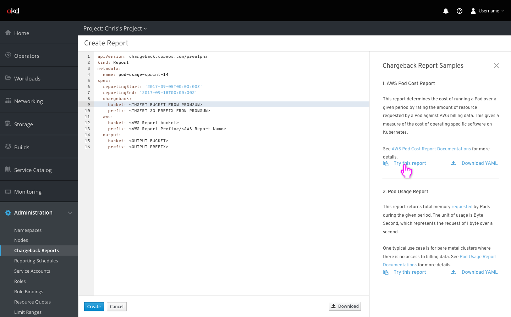
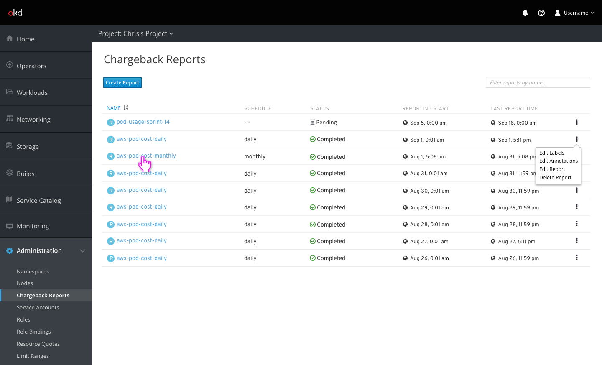
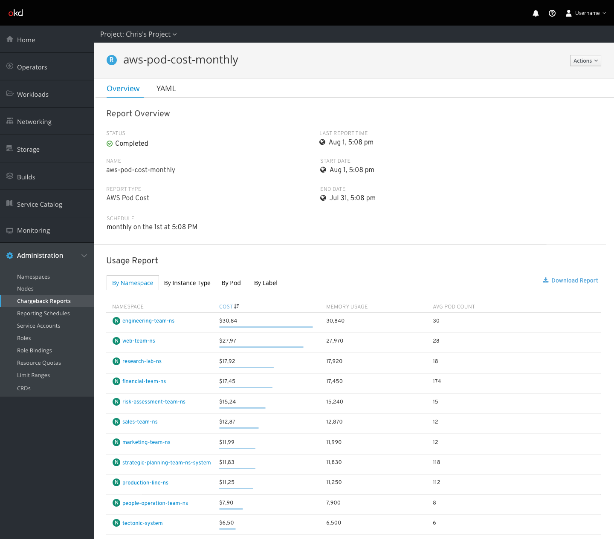
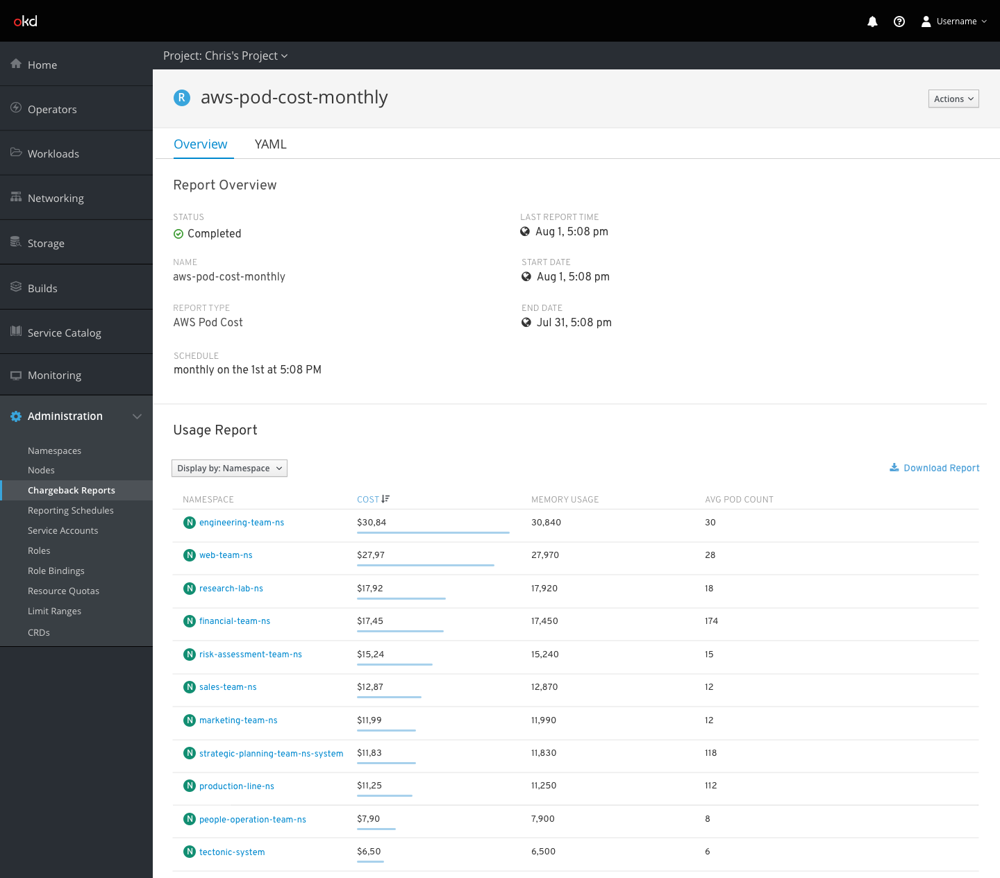

# Chargeback

## Reports

## Creating a Report

- Similar to other pages, a dismissible sidebar enables users to select from several sample reports that will be filled into the editor

- One-off reports should not have a value filled in for the schedule column

## Report Details

- Each report page contains information about the report and its scheduling as well as a table that contains the actual report itself.

- Clicking on different tabs changes the report breakdown into different categories
- Small charts showing relative size of each category are displayed for the currently sorted column

- A "display by:" selector could also be used in place of tabs to select the usage breakdown
