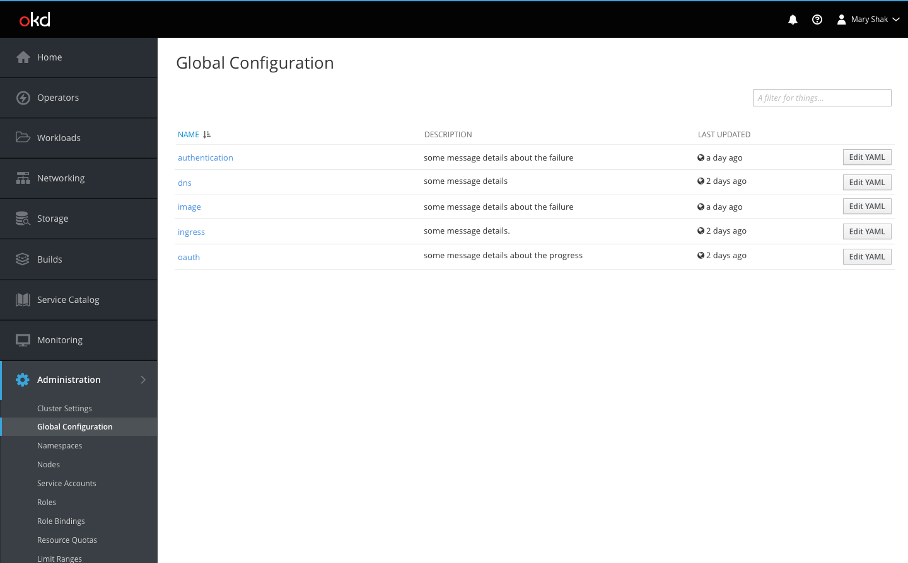
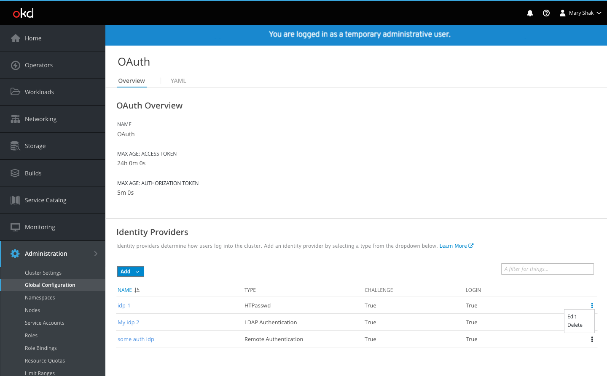
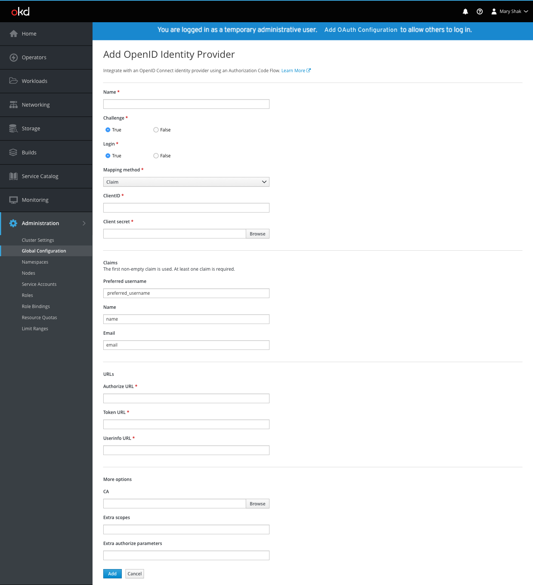

# OAuth Global Configuration

- The [Global Configuration](http://openshift.github.io/openshift-origin-design/web-console/4.0-designs/global-config/global-config) page can be found under the Administration section of the navigation.

- OAuth is one of the global configuration resources in the list.
- Users can either navigate to the OAuth detail page by clicking on the OAuth resource name from the cluster settings area or they can navigate directly from the link in the blue banner (when it appears for initial setup).

- Users may be logged in as temporary administrators until they set up identity providers.
- When this is the case, a blue banner will appear at the top of all pages with a link to the OAuth configuration page, where users can take the necessary action to add an identity provider.

- General OAuth details are displayed at the top of the Overview tab while the Identity Providers section is displayed underneath.
- If no identity providers (IDPs) exist, there is an empty state to define what they are and provide a link to documentation.
- The primary `Add` action button provides options to create one of the various IDP types.
- Selecting an IDP type will open a full page form for the user to provide the relevant configuration details.
- Each IDP type will have different fields in the form pertaining specifically to that type. See [IDP forms](/#IDP-Forms) below for details.

- Once complete, the IDP will be added to the details page in a list view.
- Users can create multiple IDPs of different or of the same type.
- Display name will be used to differentiate between IDPs of the same type.
- All IDPs will appear in the list with the name, type, challenge, and login columns displayed.
- When Edit and Delete actions become available, they will be displayed in the kebab menu on the right side of the list.
- Clicking edit from the kebab menu will open a full page form for users to update any editable fields and save changes.

## IDP Forms
- Each form will have a short description of the IDP the users have chosen to add.
- The four common parameters to all identity providers are `name`, `challenge`, `login`, and `mappingMethod`, and will be the first items in the list.
- Where appropriate, section headers may be used to divide the form into sub sections.

### HTPasswd

### OpenID

