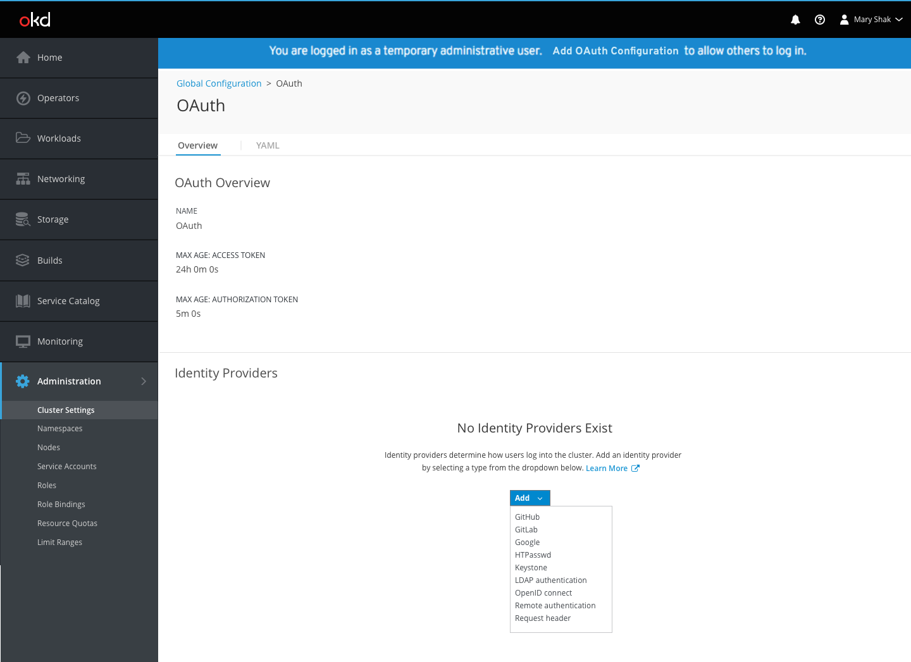
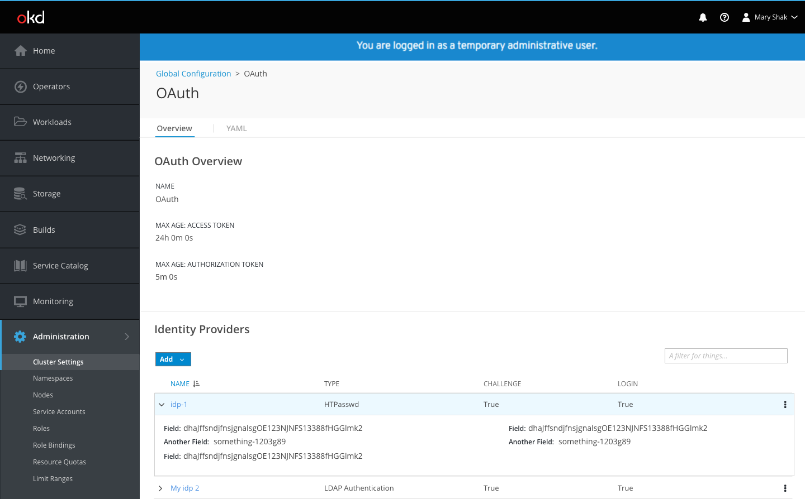

# OAuth Global Configuration

- The [Global Configuration](http://openshift.github.io/openshift-origin-design/web-console/4.0-designs/global-config/global-config) list is shown as a tab on the [Cluster Settings](http://openshift.github.io/openshift-origin-design/web-console/4.0-designs/cluster-settings/cluster-settings) page.

- OAuth is one of the global configuration resources in the list.
- Users can navigate to the OAuth detail page by clicking on the OAuth resource name from the cluster settings area.

- Users may be logged in as temporary administrators until they set up identity providers.
- When this is the case, a blue banner will appear at the top of all pages with a link to the OAuth configuration page, where users can take the necessary action to add an identity provider.

- General OAuth details are displayed at the top of the Overview tab while the Identity Providers section is displayed underneath.
- If no identity providers (IDPs) exist, there is an empty state defining what they are and providing a link to documentation.
- The primary Add action button provides options to create one of the various IDP types.

- Selecting an IDP type will open a modal for the user to provide the relevant configuration details.

- Once complete, the IDP will be added to the details page in a list view.

- Users can create multiple IDPs of different or of the same type.

- All IDPs will appear in the list with the name, type, challenge, and login columns displayed.
- When Edit and Delete actions become available, they will be displayed in the kebab menu on the right side of the list.
- The modal will re-open for users to edit the details.

- Users can expand rows in the list in order to see the full identity provider details.
