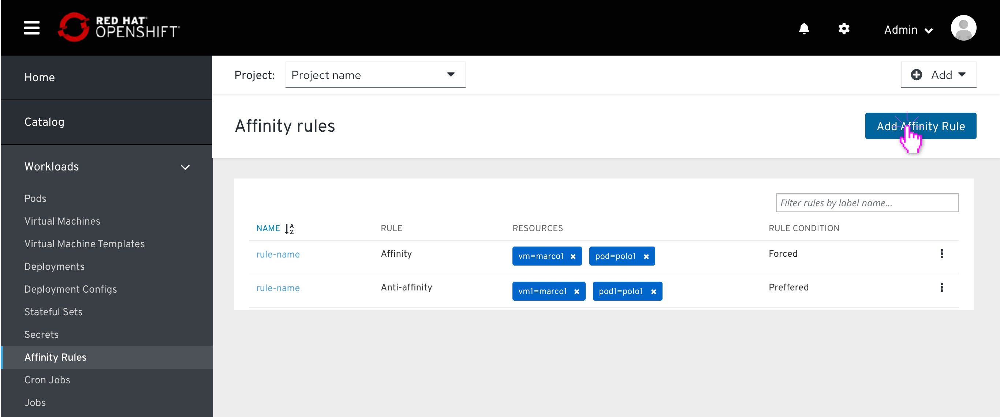
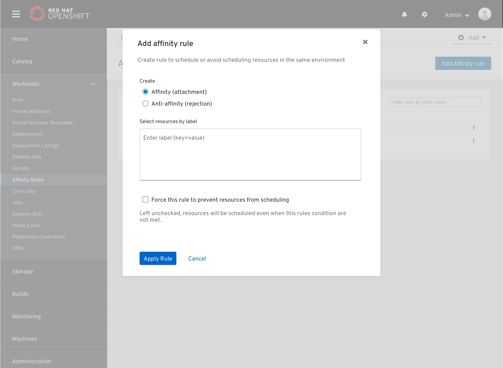
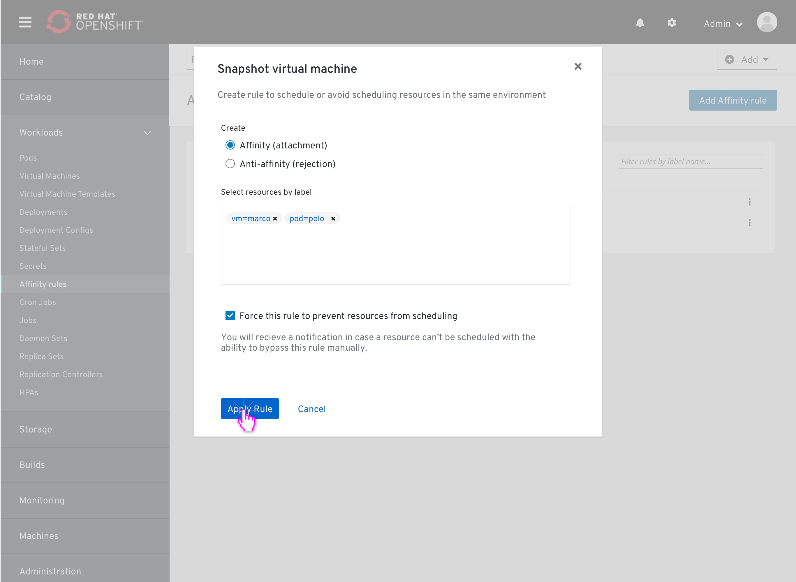
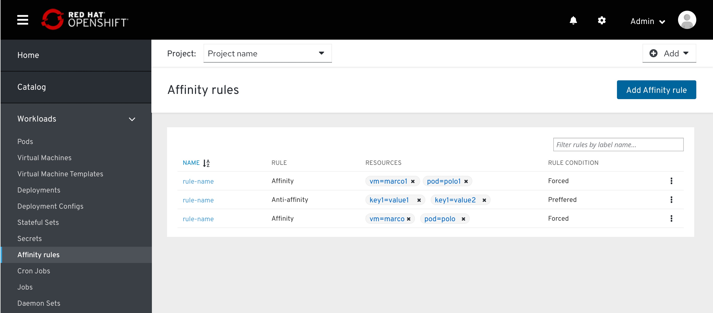
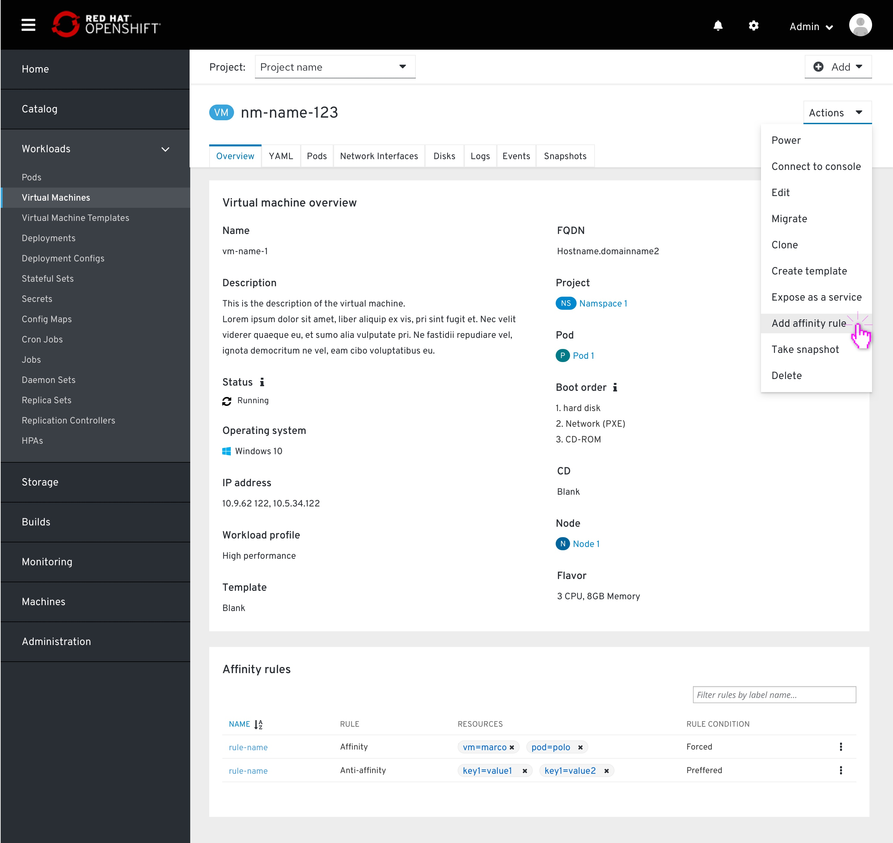
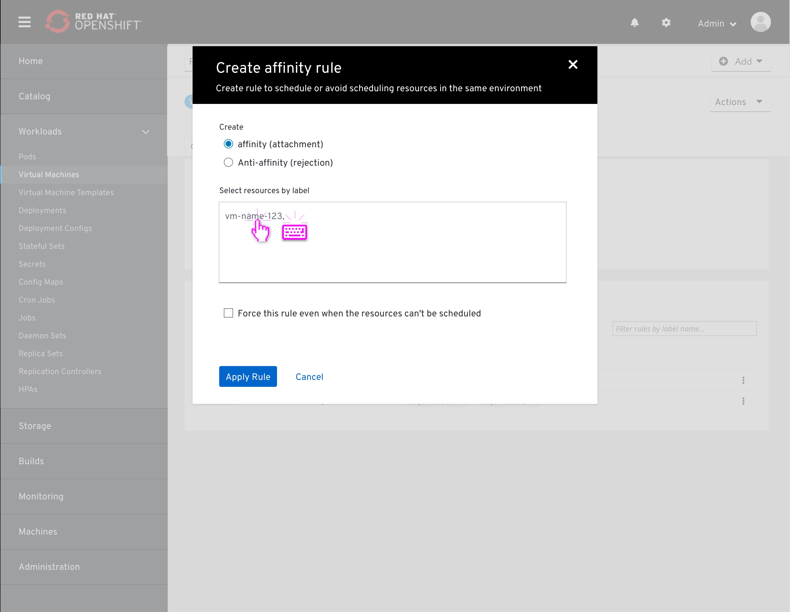
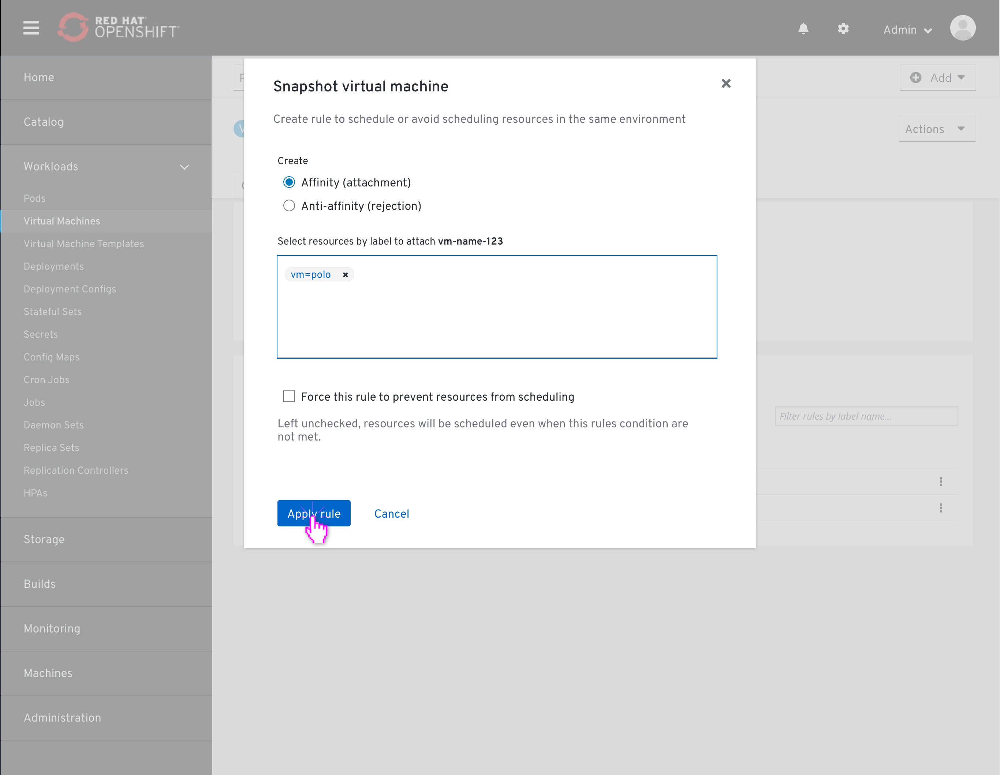
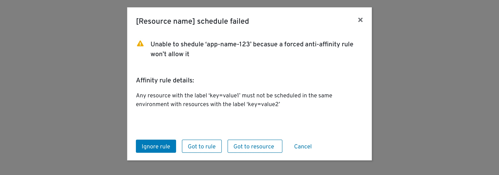

# Affinity

### About Affinity
Affinity allows the user to create a relationship between two resources when scheduling them on the cluster.
There are two high level relationship types:
Affinity - attaching a group of resources together, making them run together in the same environment.
Anti-affinity - creating a rejection relationship between a group of resources, thus avoiding scheduling any of them in the same environment.

Besides defining if we want to attach or reject resources to one another, we can choose to "force" this rule we are creating.
"Forcing" a rule means that the conditions of this rule must met, even if it means that some resources just won't be scheduled at all.

### a few techincal words
Affinity rules are Pod Properties, written in the pod deployment file. When a pod is scheduled, the deployment file states that there is an affinity rule condition which needs to be met.
Applying an affinity rule to a resources is done via labels. Objects in OpenShift are ephemeral, and the way to target the same object which keeps crashing and regenerating is by its label.

## Affinity rules - list page

All affinity rules within the system can be viewed and managed from this page. It is located in the main navigation, under 'Workloads' 

## Creating an Affinity rule from Affinity Rules page

Clicking on the "Add Affinity rule" button at the top of the affinity list will open up the "Add Affinty rule" modal.

Going top to bottom, the user will choose to create an affinity (attachment), which is pre-selected, or change to Anti-affinity (rejection).
Then, the user will select the resources he wishes to apply that rule to by adding their representative labels to the "Select resources by label" field.

Before applying, the user can check the "Force this rule" checkbox, making this rule a required condition when scheduling the resources targeted by the added labels above.

The user hit "Apply rule".

The user now returns to the Affinity rules list.

# Affinity rules list on a resource details page

Affinity rules can be viewed and managed per resource as well. The list is located in the resource details page, on the overview tab in Affinity rules section under 'Services' if those exist.

## Creating an Affinity rule from a resource details page

Clicking on the "Add affinity rule" button at the top of the affinity list will open up the "Add affinty rule" modal.
It is the same as the modal from the Affinity Rules list page except one thing: The resource itself is already added to the "Select resources by label" field.
The resource will be mentioned by it's name. 
Technically, this "direct selection" of this resource is not actually a direct selection. We already mentioned that selecting a resource directly is not the best way since that resource will crush and regenerate more than a few times. Instead, that selection will provide a new, unique label to the specified resource. We do not need to surface this to the user, at least not for now.

User enters a label. The resource name remains first in the field, even after adding labels. It will not be viewed as a label, but as a placeholder text.
The rule is ready to be applied. The user clicks 'Apply' and returns to the resource details page, where he left off.

## Bypassing a resource scheduling failure due to a forced Affinity rule

If a resource cannot be scheduled due to a forced affinity rule, the user will receive a notification in the same format as any other scheduling failure.
Expanding that notification will pop up this modal, which allows the user to bypass the rule manually
