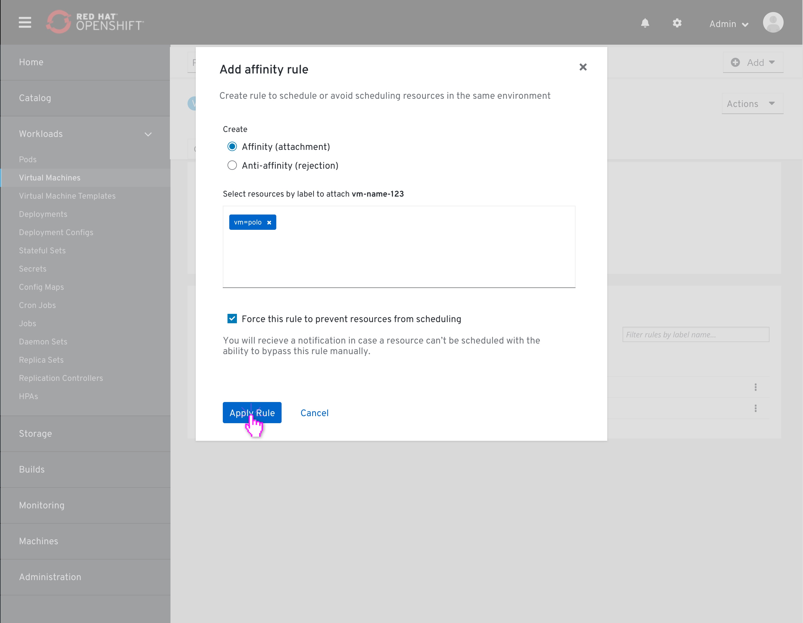

# Affinity

### About Affinity
Affinity allows the user to create a relationship between two resources when scheduling them on the cluster.
There are two high level relationship types:
Affinity - attaching a group of resources together, making them run together in the same environment.
Anti-affinity - creating a rejection relationship between a group of resources, thus avoiding scheduling any of them in the same environment.

Besides defining if we want to attach or reject resources to one another, we can choose to "force" this rule we are creating.
"Forcing" a rule means that the conditions of this rule must met, even if it means that some resources just won't be scheduled at all.

### Technical Definitions
Affinity rules are pod properties, written in the pod deployment file. When a pod is scheduled, the deployment file states that there is an affinity rule condition which needs to be met.
Applying an affinity rule to a resources is done via labels. Objects in OpenShift are ephemeral, and the way to target the same object which keeps crashing and regenerating is by its label.

## Affinity rules list on a resource details page

Affinity rules can be viewed and managed per resource. The list is located in the resource details page, on the overview tab in Affinity rules section under 'Services' if those exist.

## Creating an Affinity rule from a resource details page

Clicking on the "Add affinity rule" button at the top of the affinity list opens up the "Add affinty rule" modal.
Going top to bottom, the user leaves the "Create" field to default - "Affinity (attract)".
Then, the user selects the resources he wishes to apply that rule to by adding their representative labels to the "Select resources by label" field.
The resource itself which the user is applying the rule on is already added to the "Select resources by label" field.
The resource is mentioned by it's name, and not via label. Meaning, this rule will be added directly to this resources' YAML.

Before applying, the user can check the "Force this rule" checkbox, making this rule a required condition when scheduling the resources targeted by the added labels above. The support text below the field changes accordingly.

The user clicks 'Apply' and returns to the resource details page, where he left off.