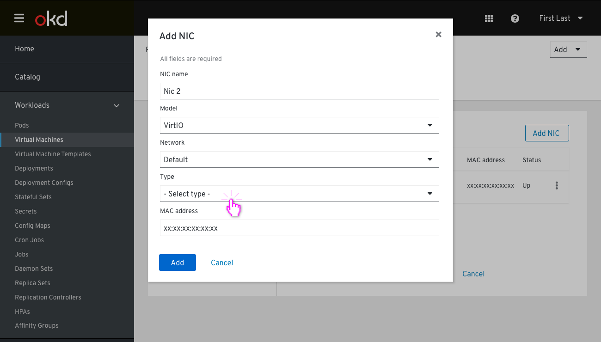
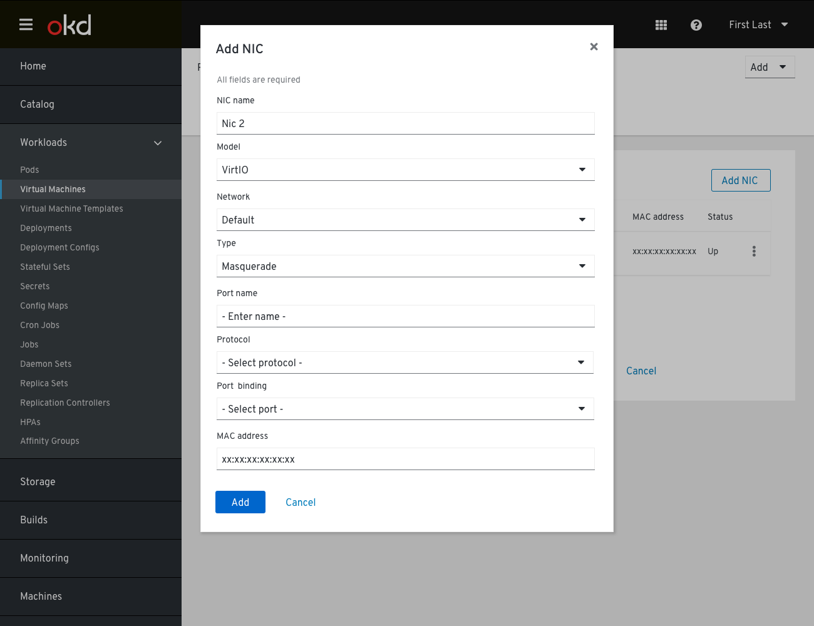
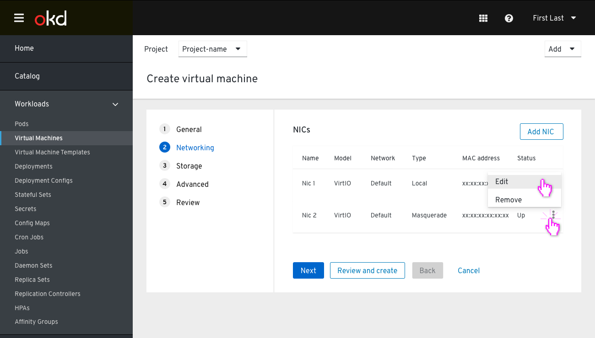
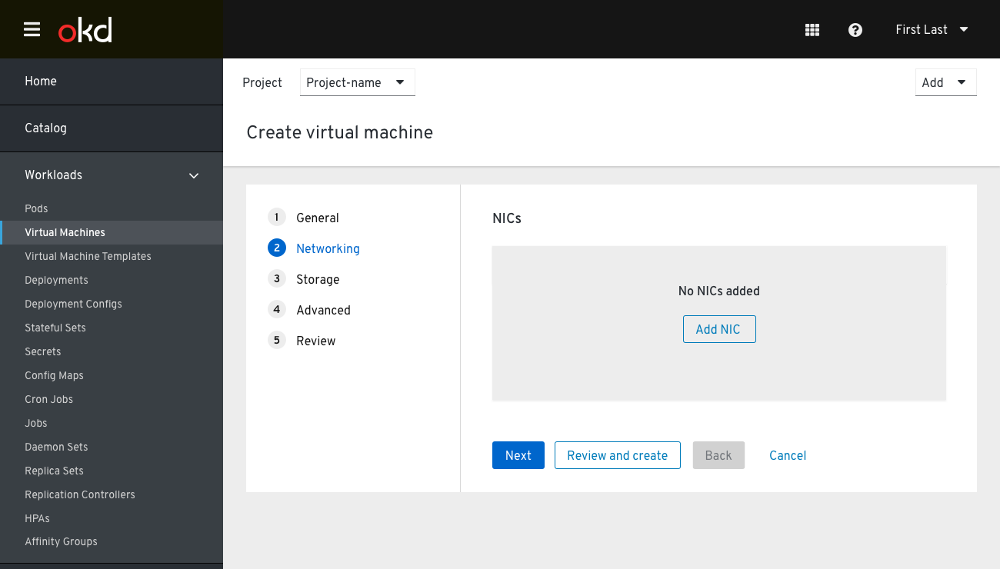

# Create A Virtual Machine

## Step 2: Networking

The user enters the Networking step with an existing NIC pre-defined, set to Type (local). In this step, the 'Review and Create' button is still available to skip the rest of the steps. At this point, the user can select to customize this NIC, add new ones, or remove any they wish.

Clicking on 'Add NIC' will pop up a "Create NIC" modal. The NIC name is prepopulated with a numeric count form of existing NICs on this flow. The user may change the NIC name. All the fields are preselected except Type. In order for the user to apply and add this NIC, the user must select one of the type options.

In case the user selects Masquerade on the Type field, new indented fields will appear.

When adding a new NIC we allow the user to add more than one port, so once the user enters the name for the first port we have another field popping up below where they can add another one.

The new NIC is added at the bottom of the list.
Now the user can edit or remove it.

On removing all NICs, the Networking step enters an empty state.
