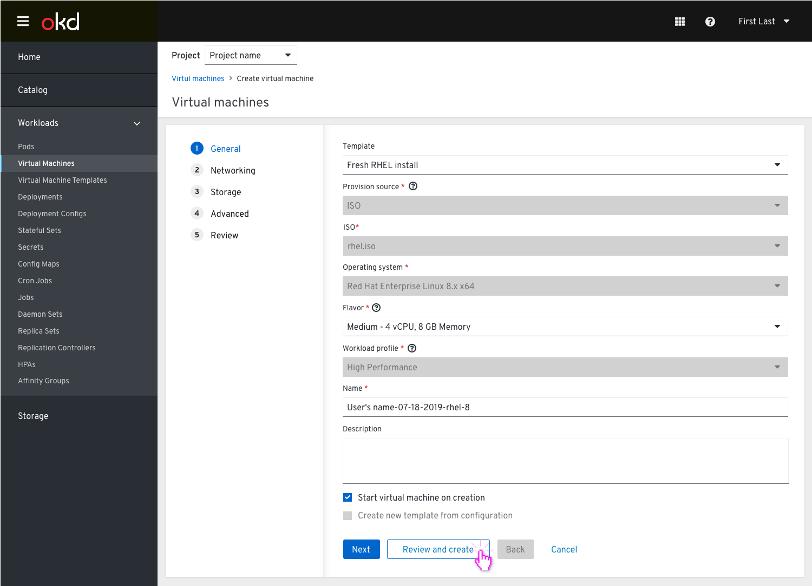
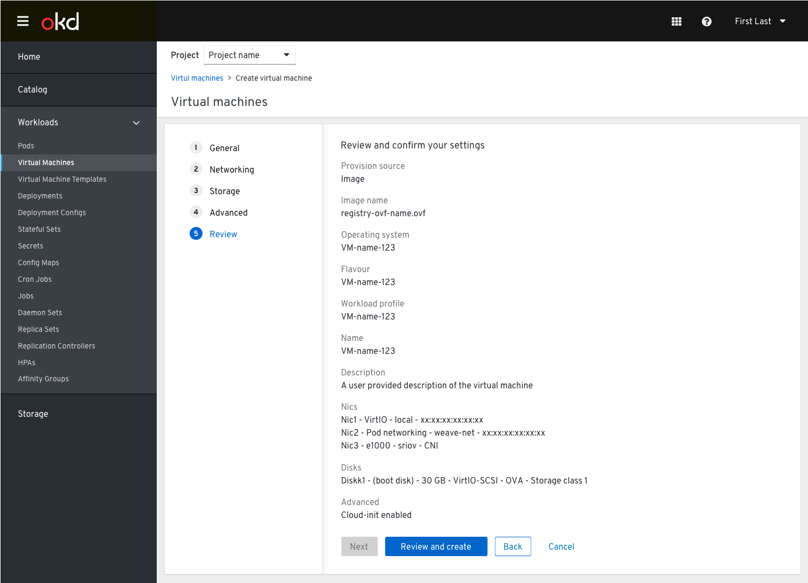
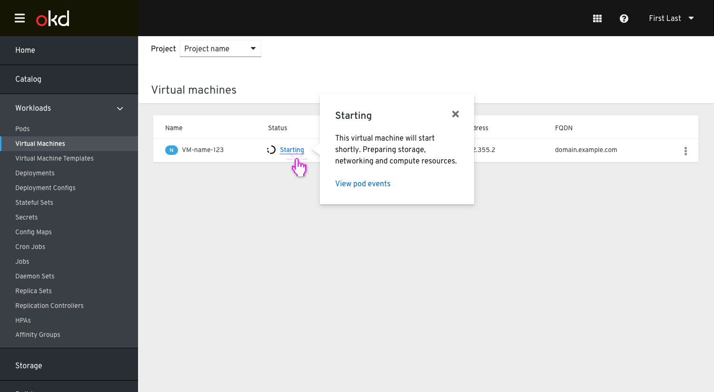
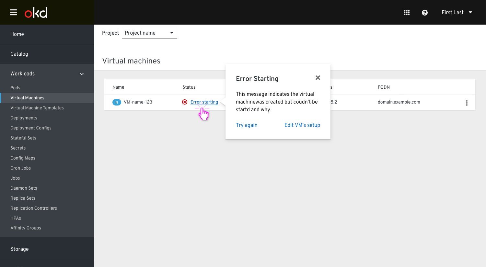
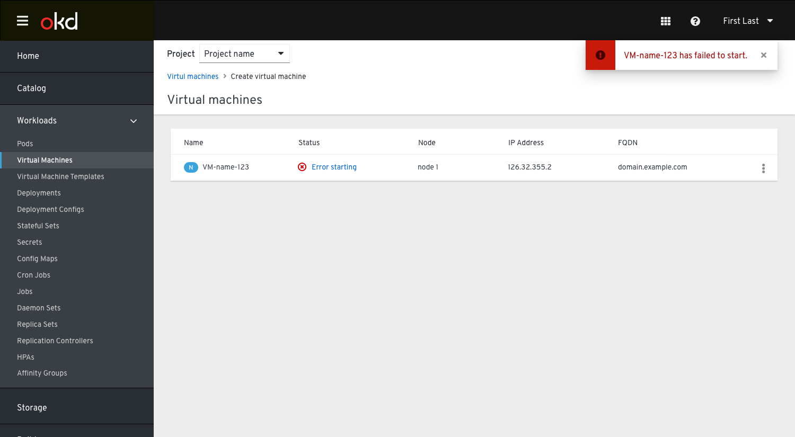

# Create Virtual Machine Wizard - Review Step

The purpose of this doc is to update the current create VM designs to align with OpenShift and Patternfly 4.

Some things to note:

The “Create virtual machine” action has been updated to “Review and create”.
Once the user has clicked this button they will taken to the Review screen to verify their settings.

The action “Create virtual machine” has been moved to the footer with the other actions.
This encourages the user to check their settings quickly before creating the VM.

When the user clicks “Create virtual machine” they will then be taken to the list view where they can see the VM being started.
This replaces the step where the modal is left opened and requires more clicks from the user. Leaving the modal open only allows them to watch the process in the list view, but they could not cancel it or go back.

If there is an error with the VM starting up they would see this in the list view with the option to look at the events or try again or go and edit the VM’s setup.

UC: If the creation of the VM fails on the backend (e.g. some validation the frontend did not catch), it caused an error state and we want to enable the user to fix it.

We need to distinguish between the "Try again" action that will resubmit whatever wasn’t successfully submitted (e.g. if start VM fails due to some scheduling constraints), and
the other action suggested “Edit VM’s setup” that will take the user to the Vm’s details view where they can change settings to fix whatever is needed.

If the creation of the VM fails on the backend, the VM will not be shown in a row of the table because it does not exist, so there is no need of an error message.

If the VM starts up the user will be notified in the list view to align with OpenShift. Otherwise there will be a toast notification to let them know something has failed with the VM.

