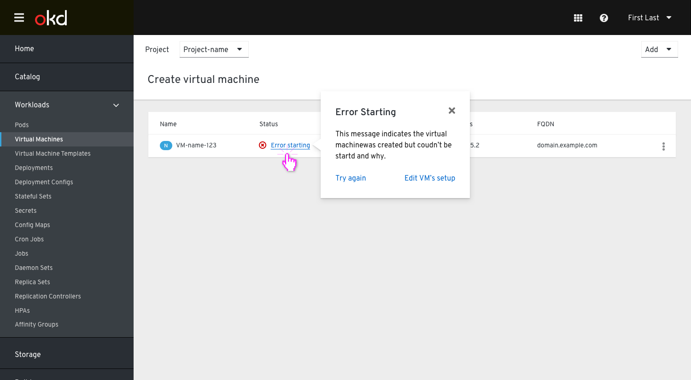

# Create Virtual Machine Wizard - Review Step

Some things to note:

The “Create virtual machine” action has been updated to “Review and create”.
Once the user has clicked this button they will be taken to the Review screen to verify their settings.

The action “Review and create” is located in the footer with the other actions.
This encourages the user to check their settings quickly before creating the VM.

# States

## creating State

When the user clicks “Create virtual machine” they will then be will see the "creating state" for the virtual machine.

Alternatively, The user could navigate away from this page, In that case they'd see the VM in the list in a starting state. This will rely on the VM successfully being created without issue.

## Success States

Upon success, they will see a success state with the option to either go to the details of the vm or go to the list view to see all vms. 

If they are looking at the list view they will see a status of `running` or `off` if the creation was successful. 

## Error States

Upon error, they will see and error state with guidance to go to the step that needs updating.

In that step that contains the error they would see the error state of the input they need to address.

Alternatively, The user could navigate away from this page, In that case they'd see the VM in the list in a error state. They would then be prompted in the status popover to edit the details and correct the issue. 

There is also the case where they could "try again" in a scenario where there was an issue with scheduling or something similar. 

This would rely on the VM being in state that it exists, otherwise it would not show in the list at all.

In case of an error, a toast notification will pop up to let the user know something has failed with the VM. This would depend on the user being outside the Create virtual machine flow. If they've left and are off doing something else this notification will alert them of the status of the vm. This toast would not be shown if they wait for the vm to be created in the wizard.

This toast would either state the VM needs to be updated if there was an issue with it or it wasn't created at all.

