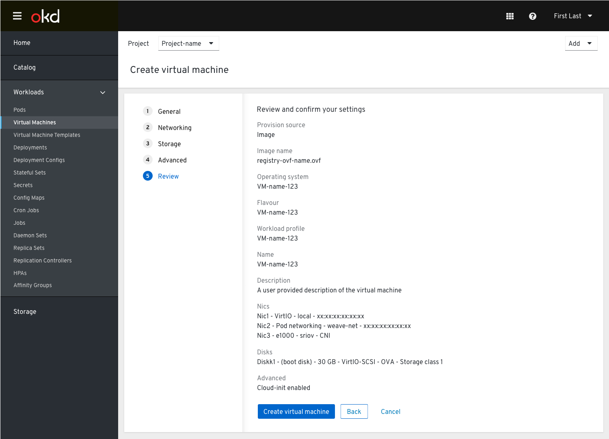

# Create Virtual Machine Wizard - Review Step

Some things to note:

The “Create virtual machine” action has been updated to “Review and create”.
Once the user has clicked this button they will be taken to the Review screen to verify their settings.

The action “Review and create” is located in the footer with the other actions.
This encourages the user to check their settings quickly before creating the VM.

When the user clicks “Create virtual machine” they will then be taken to the list view where they can see the VM being started and the state of the VM as "Starting".

If there is an error with the VM starting up the user would see this in the list view (status column) with the option to look at the events or try again or go and edit the VM’s setup.

UC: If the creation of the VM fails on the backend (e.g. some validation the frontend did not catch), it caused an error state and we want to enable the user to fix it.

We need to distinguish between the "Try again" action that will resubmit whatever wasn’t successfully submitted (e.g. if start VM fails due to some scheduling constraints), and
the other action suggested “Edit VM’s setup” that will take the user to the Vm’s details view where they can change settings to fix whatever is needed.

If the creation of the VM fails on the backend, the VM will not be shown in a row of the table because it does not exist, so there is no need of an error message.

If the VM starts up successfully it will be reflected in the status in the list view. If there is an error there will be a toast notification to let them know something has failed with the VM.

After the user is done with re-editing the VM details, the status of VM in the list view will be updated and shown as 'creating'.

