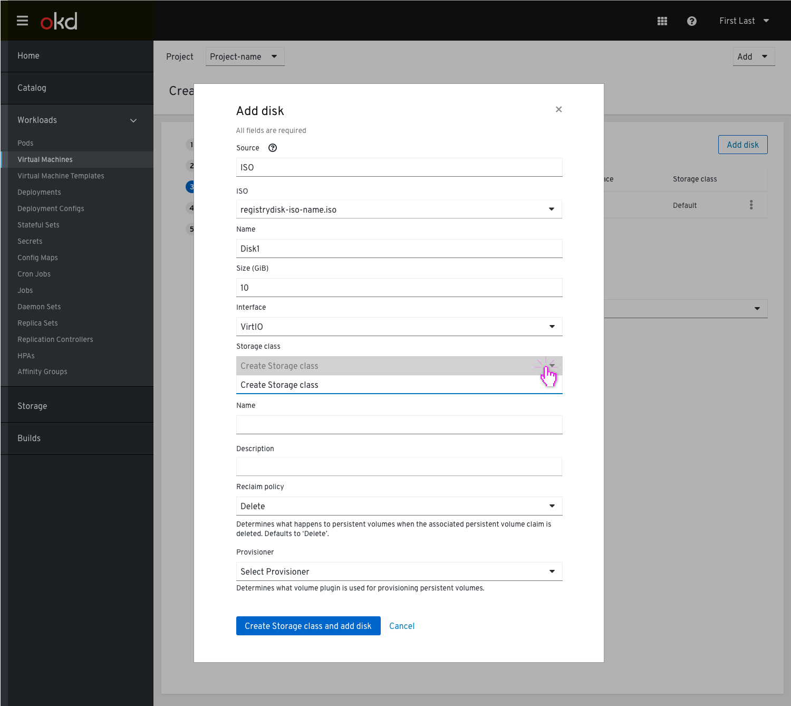
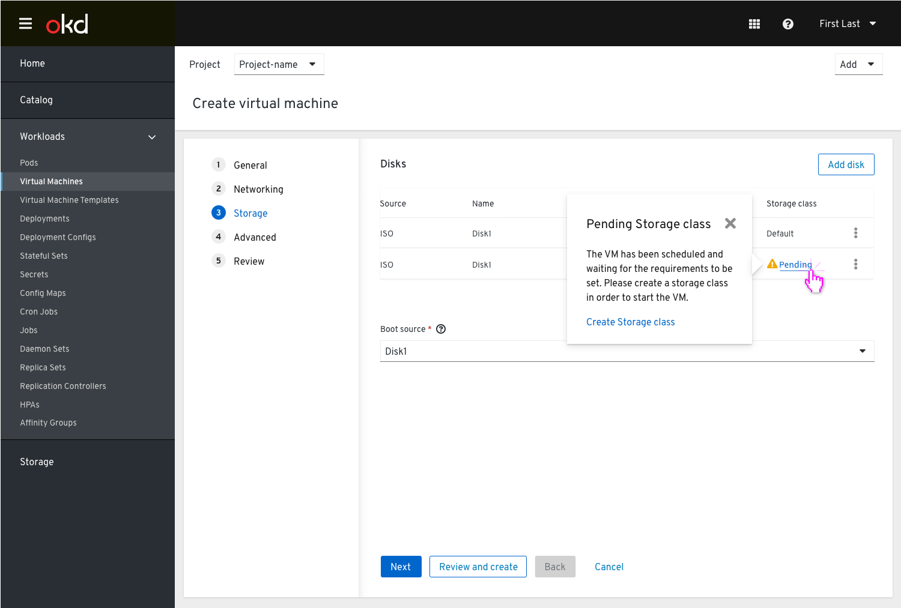

# Storage class isn’t defined

https://github.com/openshift/openshift-origin-design/issues/249
https://jira.coreos.com/browse/CNV-2842

Currently in our designs we have a default storage class used when a disk is added in the Create VM flow, but we do not cover the absence of a default storage class.
This PR should cover the state of no storage class selected and determine if/how the user should be notified.

During the process of creating the VM, in the Storage step, the user needs to add a disk.

Clicking the ‘Add disk’ button will open a modal, where the user is asked to fill in the disk’s details.
Since the Storage class isn’t available, and also no PVC that matches their requirements, the user will be notified with a red note below the Storage class dropdown that no storage class is available and they need to create one.

We want to allow the user to set the Storage class within the wizard, with no need to be taken out of it.

Clicking the ‘Create Storage class and add disk’ button at the bottom will add the disk to the list view.
In cases when the user didn’t define any Storage class, the Storage class will be shown in the table view as ‘Pending’ with a warning icon.
Clicking on the ‘Pending’ Storage class will show a popover with more info and an action link which will take the user to the ‘Create Storage class’ modal.

'Create Storage class’ modal

Once the user creates the Storage class, it will be reflected in the list view and will no longer show pending status and warning icon.

UC
Even when a user didn’t define a storage class, or doesn't have one available, they can still create a VM. The VM status will be in a pending state (with a warning to the user), waiting for a Storage class to be assigned as the default, bind to it and then the storage class will be created successfully and the VM  will spin up.
