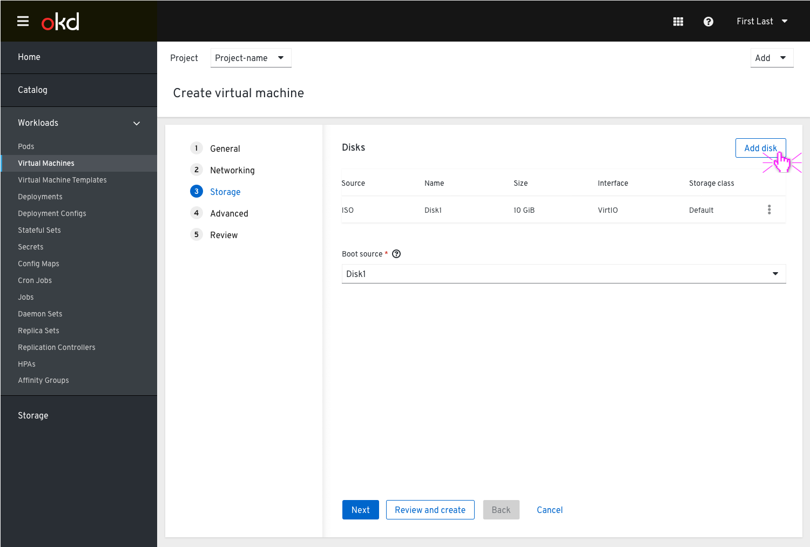
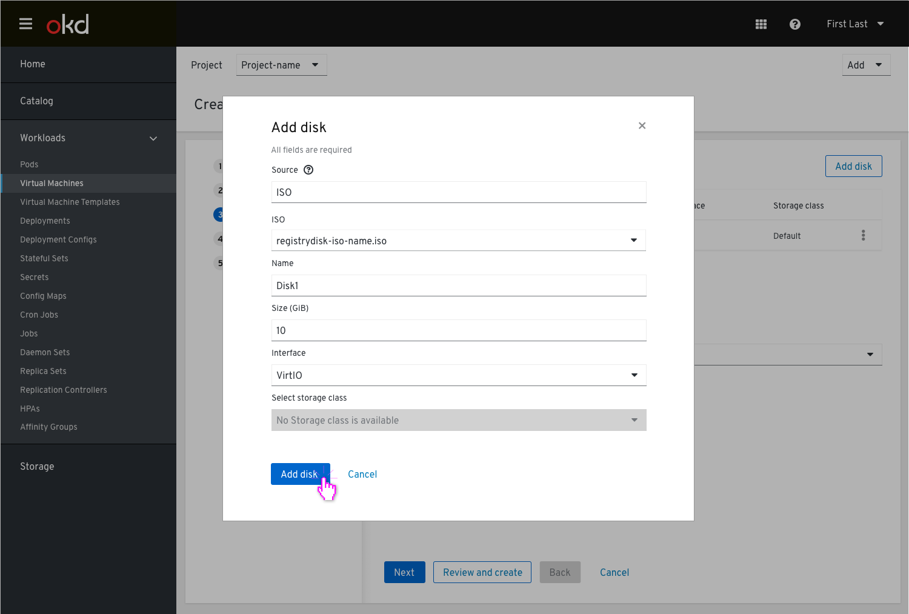
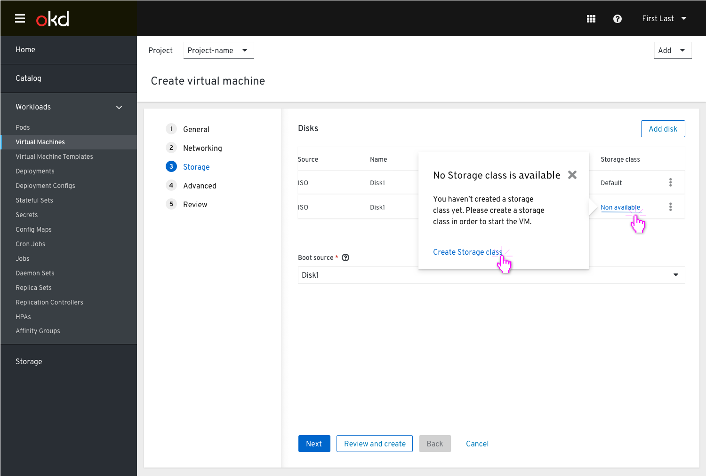
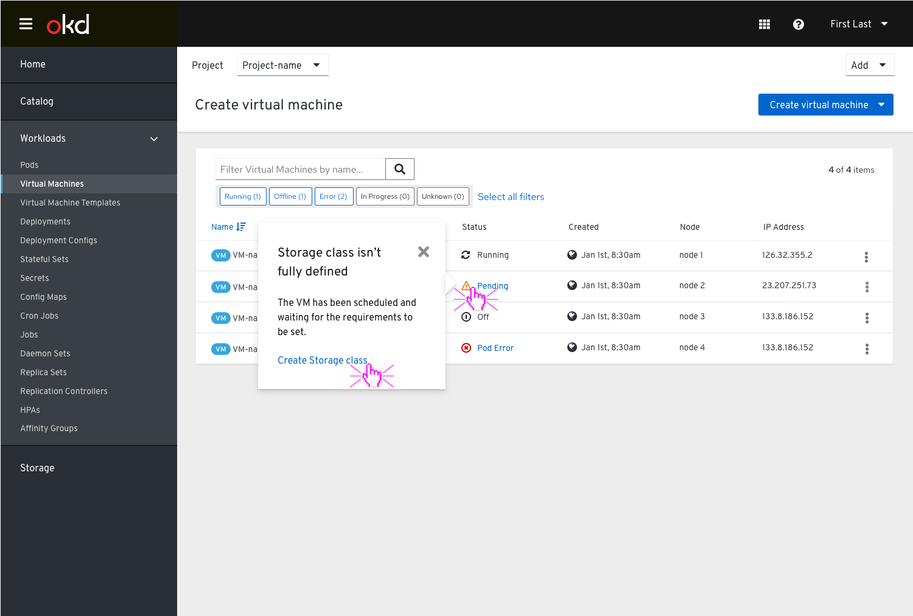
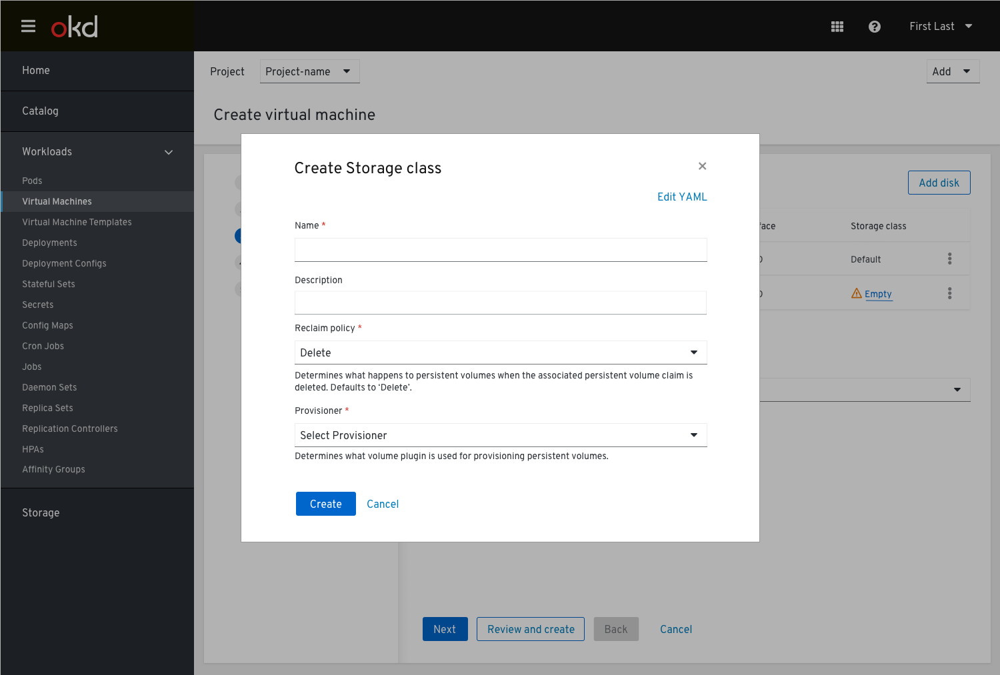

# Storage class isn’t defined

Currently in our designs we have a default storage class used when a disk is added in the Create VM flow, but we do not cover the absence of a default storage class.
This design covers the state of no storage class selected and determines how the user should be notified.

During the process of creating the VM, in the Storage step, the user needs to add a disk.

Clicking the ‘Add disk’ button will open a modal, where the user is asked to fill in the disk’s details.

We want to allow the user to set the Storage class within the wizard, with no need to be taken out of it.

Clicking the ‘Add disk’ button at the bottom will add the disk to the list view, but the Storage class will be shown in the disks table as ‘Non available’.

Clicking on the ‘non available’ Storage class will show a popover with more info and an action link which will take the user to the ‘Create Storage class’ modal.

In the VM list view, the status of the VM would still be pending untill the user would create a storage class and mark it as default.

Clicking on the ‘pending’ status of the VM will show a popover with more info and an action link which will take the user to the ‘Create Storage class’ modal.

'Create Storage class’ modal

After the storage class is created successfully, the VM will spin up.
