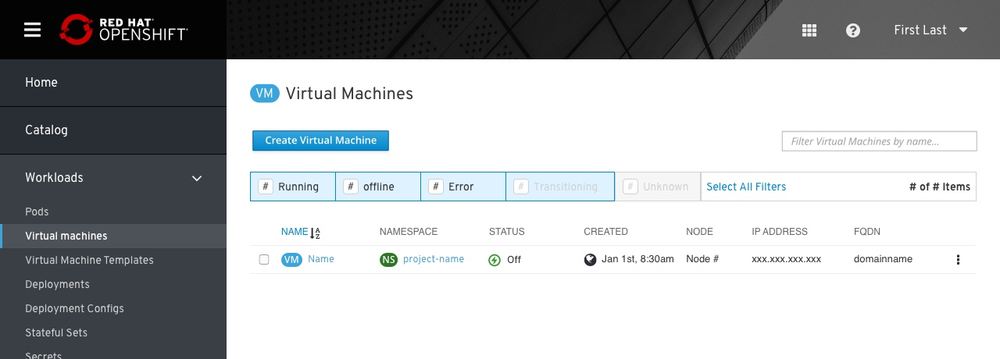
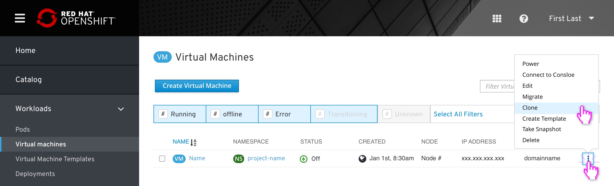
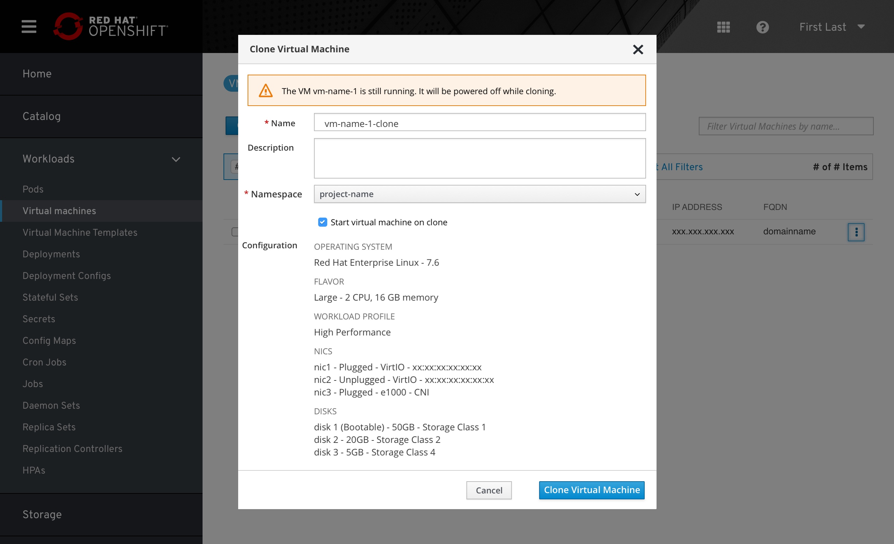
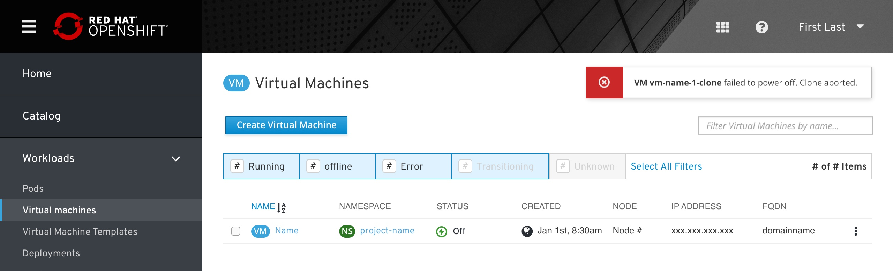
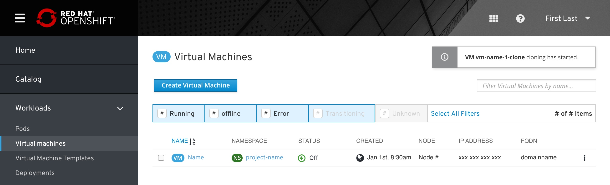
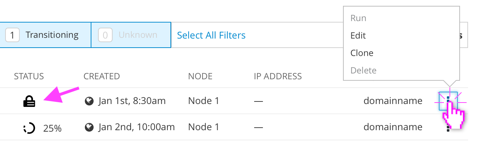
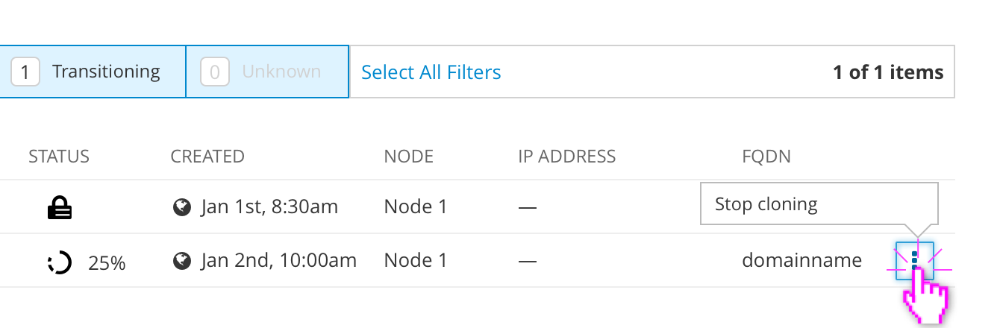

# Clone VM

Cloning a VM allows the user to quickly create an identical copy of a virtual machine while powered off.

Cloning is accessed from the VM List View. all item filters should be turned off by default, ensuring that all VMs are shown to the user.

The Clone option should appear in the kebab menu whether the source is online or offline.

If the VM is powered on, a warning will appear at the top of the Clone Virtual Machine modal. Running VMs will be shut down automatically if the user proceeds with a clone and then turned back on once the clone finishes.

The only required field is the name, which is pre-filled based on the source VM's name and appended with “-clone”. The user can add a description and change the new VM's Namespace (which is the same as the target by default). They can also turn off the option to start the virtual machine after the cloning process finishes.

Because all required fields are filled in by default, the "Clone Virtual Machine” button is active. If the user deletes the Name field this button will become inactive.

Details of the source VM's configuration are displayed for the user’s reference. These options cannot be modified here prior to cloning.

The user would then click “Clone Virtual Machine”.

If the source VM fails to shut down properly, an error toast notification would be displayed. The user would then need to power off the VM manually and re-open the Clone modal to try again.

If the cloning process starts successfully, the newly-cloned VM will appear in the list and a toast notification will confirm that the cloning process has begun.

The clone's status should change to a spinner with a completion percentage next to it. The source VM's status should change to locked while it's being cloned. The clone does not have an IP address until after it boots.

If the “Transitioning” filter is inactive when the user clicks "Clone Virtual Machine", it should be activated automatically to ensure that the newly-cloned VM appears in the list. This filter matches all “in between” states, including powering up, shutting down, or paused.

While the clone is in progress, the source VM's `Run` and `Delete` options are disabled. The user can still Edit the source VM's configuration (which will not be applied to the in-progress clone) or create another clone of the source VM.

The in-progress clone only has one option available: to `Cancel cloning`. This will stop the cloning process and remove the clone from the VM list.