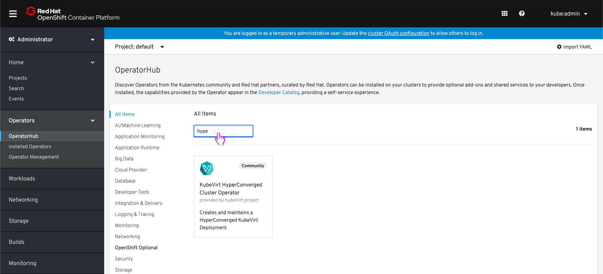
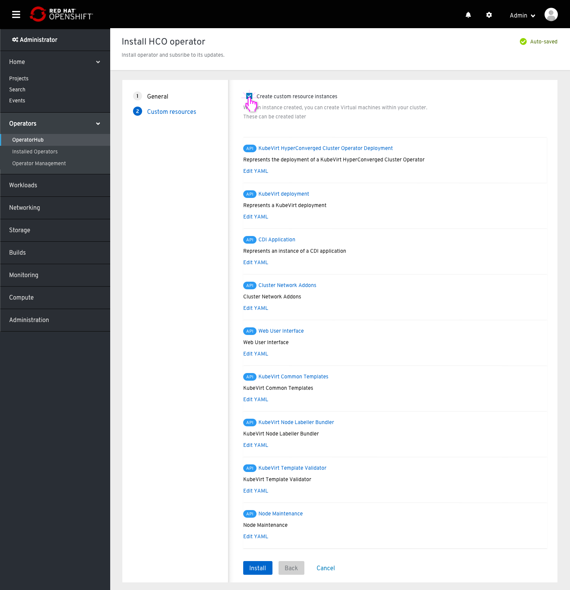
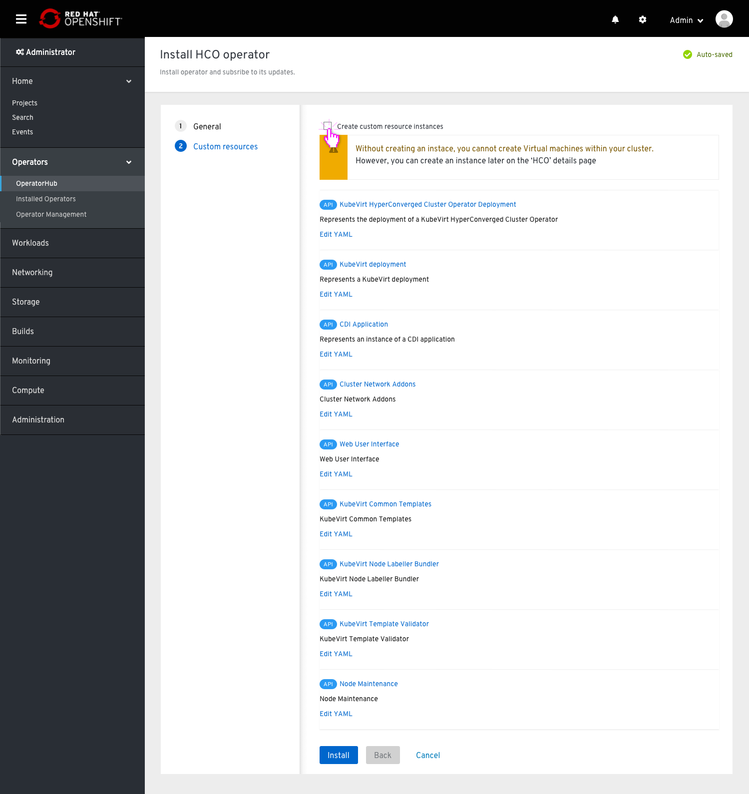
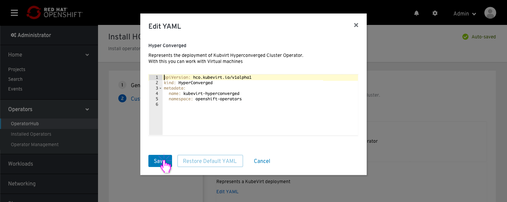
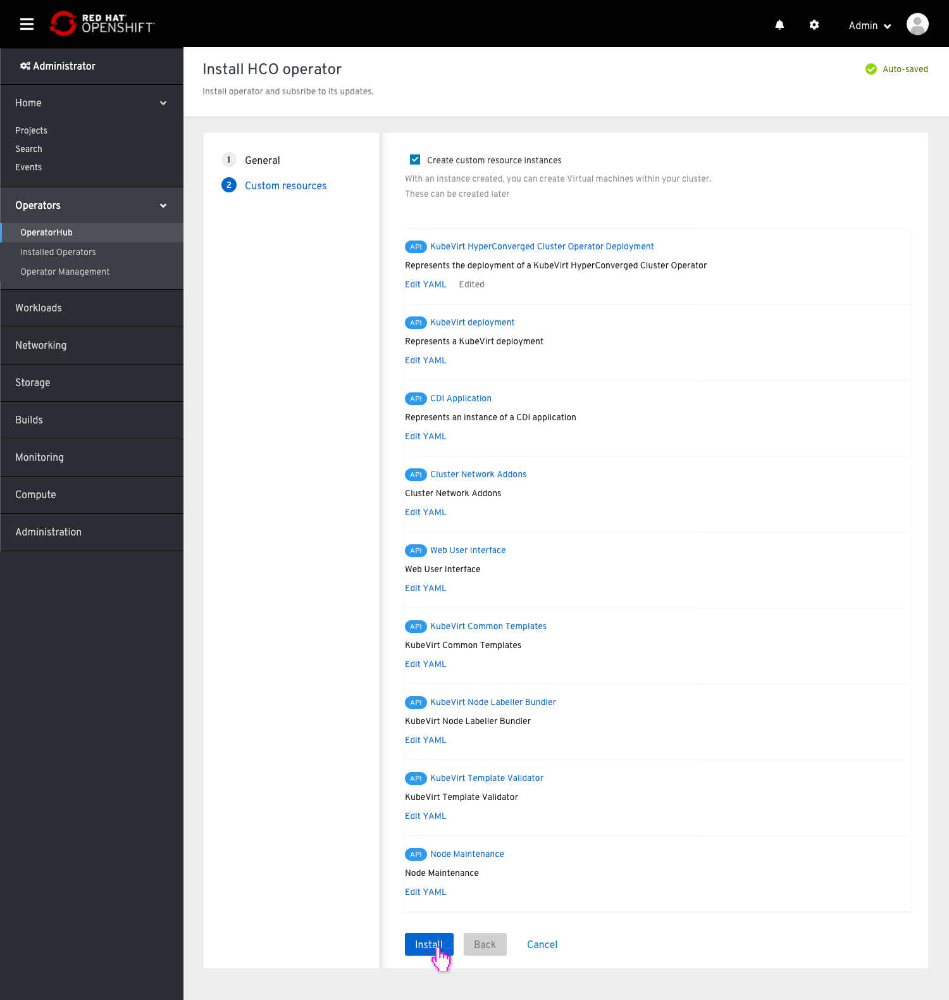

# Deploying Kubevirt on OCP using UI

## Pre-Installation

On the OperatorHub, get a hit for searching any of the following:
 - “KubeVirt
 - "HyperConverged"
 - "CNV"
 - "Virtualization”
 - "Virtual"
 - "Machines"

After viewing details, including a list of the APIs, the user clicks ‘Install’

## Installation

### General

The subscription channel has only one option, therefore it is disabled, but visible in order for the user to know which channel this operator exist on.
The user toggles to “A specific project” on the project field

The user can uncheck the “Create custom resource instances” checkbox.

### Custom resources

This screen offers the user a way to create Custom resources as a part of the Operator installation by default.
The user uncheck the “Create custom resource instances” checkbox

The supporting text below the checkbox changes to alert, notifying the user that the HCO will not be functional until instances will be created and that the user can do it manually later on.
The user decides to check the box again.

The user clicks the ‘Edit Yaml’ button to make some modifications to the first CR.

The user modifies the YAML and clicks “Save” to return to the screen.

The link to edit the YAML changes to indicate that a change has occurred and the user can reset that change (‘Reset’ button available within the modal). 
The user clicks the install button.

### "Success" screen

There is a “Success” phase, letting the user know that she accomplished something and she should be happy.
Also including a popover with a badge to alert the user that a new item appeared on the side menu.
It will be available until the user enters ‘Virtual machines’ for the first time.
This screen suggests to the user the following options: To create VM or to go to the operator page