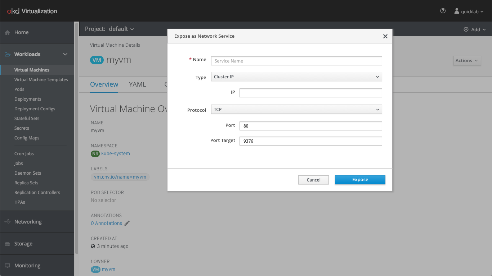
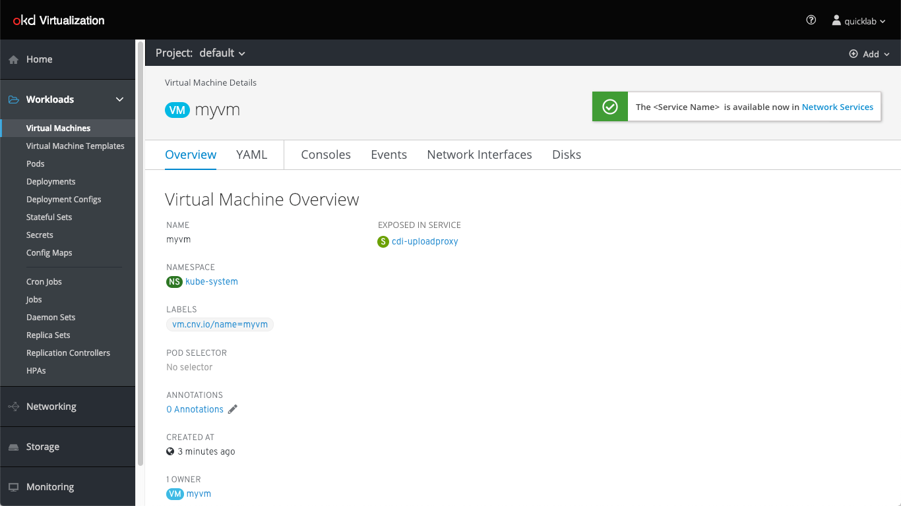

# Expose VM as a Network Service

The user should be able to expose a VM as a network service. This means that they would be exposing some of the ports on its default interface to the cluster internally or to the outside world. In CNV 1.4, if we create a VM and do not identify an L2 network, our VM cannot be reached from the outside world nor it can be reached by other pods. In order for it to be actually useful, we need to bound it to a service and today we have to do it manually.

## Expose From VM List

We added a new action called “Expose VM as Network service”. Clicking on that will open the expose as network popup. 

The user can select between 3 network types:
-  Cluster IP (Default) - Exposing the VM to inside the cluster 
-  Load Balancer - Exposing the VM to the Internet 
-  Node Port - not sure yet what is the purpose for that  

The user can choose between TCP or UDP protocol. 

The name is the only must field in the menu. All other parts can be predefined, meaning they will have “default offer” using kubernetes capabilities. 

The Service is ready for use. The user can see it in the services list

## Expose From VM Page 

We added the same action “Expose as Network service” to the actions menu.

The same menu flows as presented in the VM list.

The Service is ready for use. The user can see it in the services list.

