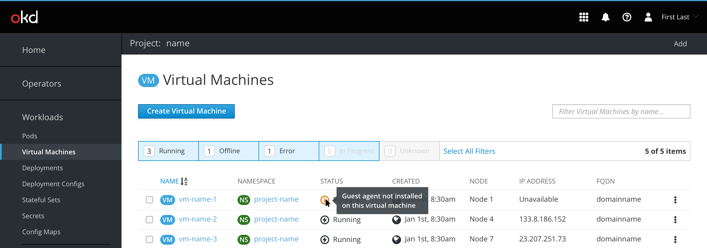
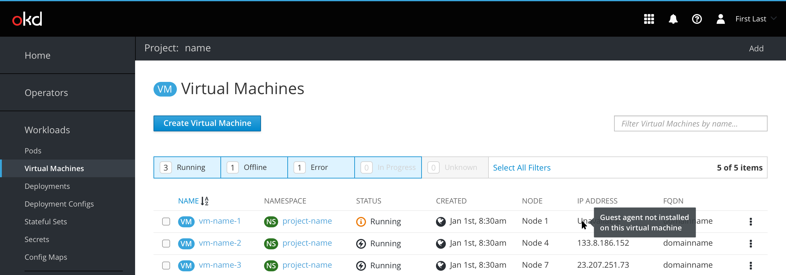

# Guest Agent not installed

The purpose of this document is to show what a VM would look like without the guest agent installed. 

In the list view we show an “info” icon with the status with a tooltip that shows that the guest agent isn't installed. Further information can be provided in a tooltip.

For the IP address, when the guest agent isn't installed, items will get “unavailable” text and a tooltip with more info on hover.

 

