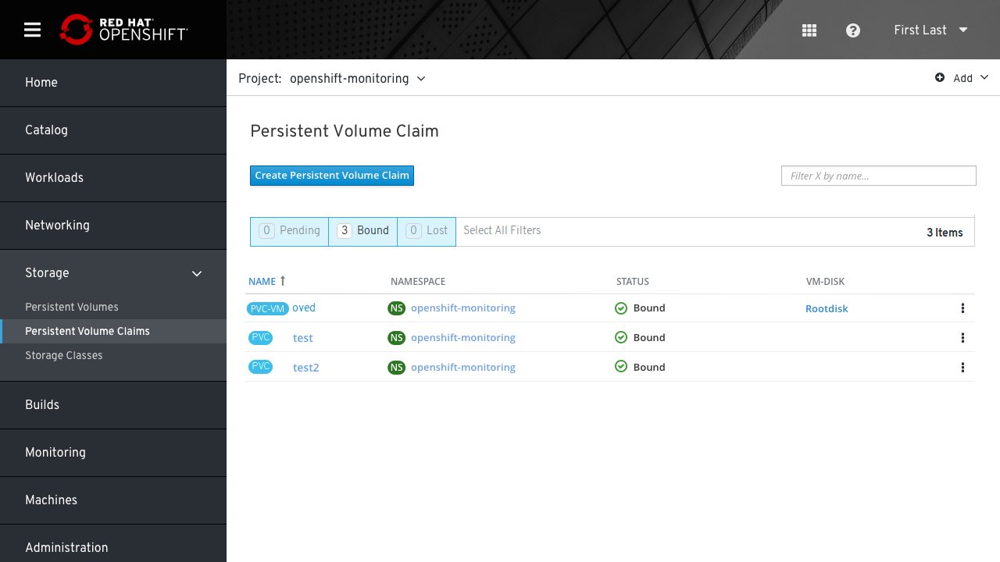
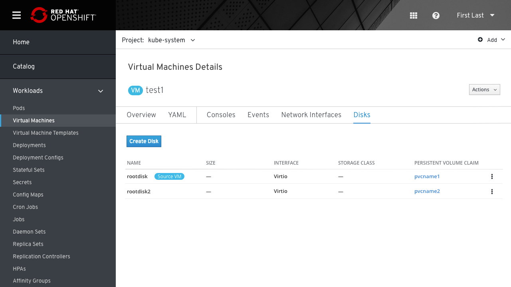

# Link between PVC and VM Disk

In some cases, a disk is being backed by a Kubernetes Persistent Volume Claim (PVC).
In the OpenShift Console UI, we list these PVCs out for the user to view and edit.
In our Virtualization UI, we should consider how we might show that a Disk is backed by a PVC and then link over to that PVC.

Also, we should consider if we want to link the other way: if the user happens to be looking at the PVCs, we would want to link to a VM making use of a PVC.

## Linking from PVC to Disk

From the PVC page, we add a link to the table only if CNV is installed (or maybe even only if there are VMs) that will link to the VM. 
Under the "VM DISKS" column there will be a link to the Disk name.

## The Selected VM Disk

Since we can't link directly to a specific VM disk details and can only link to the disks list page, we can add the PVC details as another column to the table 
We can also highlight (and later fade) the row of the selected VM disk.

## Linking back: from the VM Disk to the PVC backup

A link to the PVC backup is added to the VMs table

