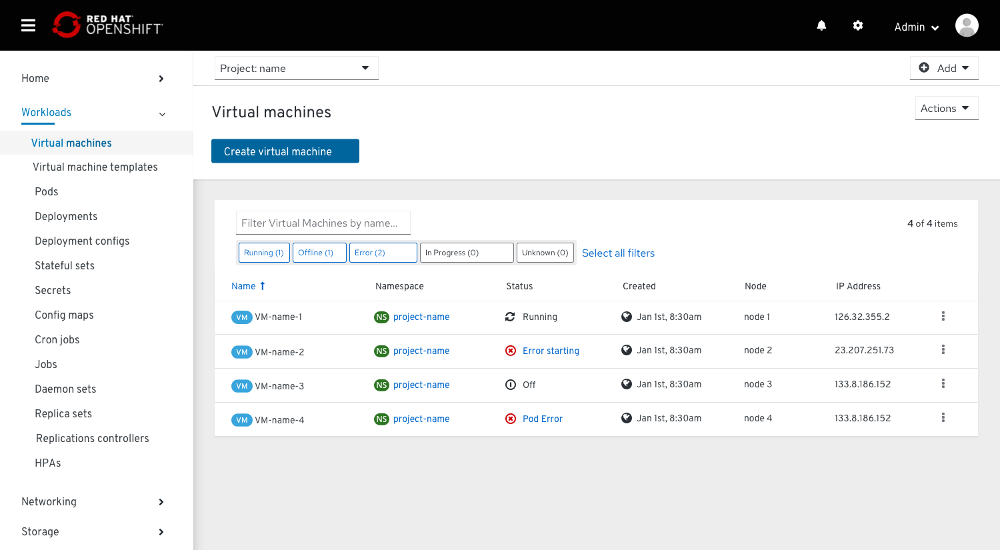
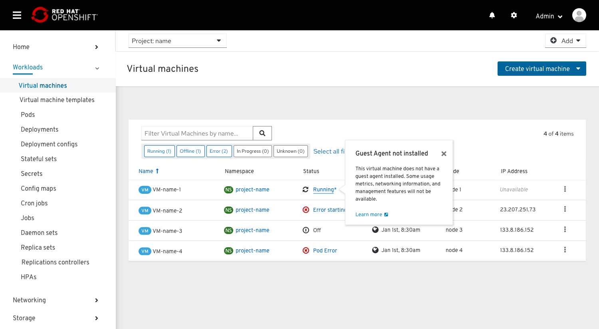
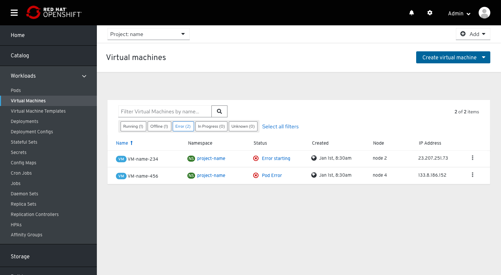
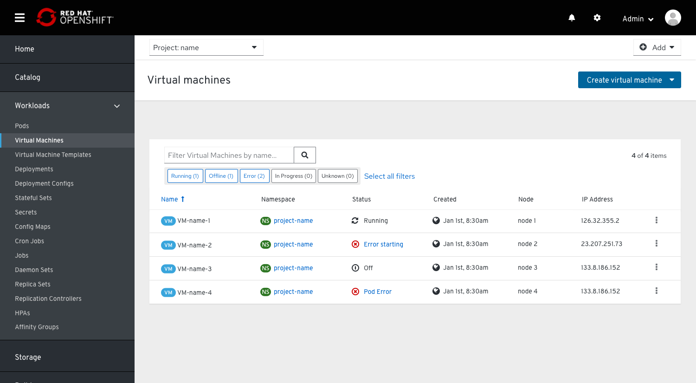
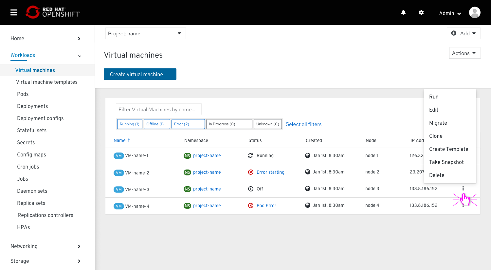
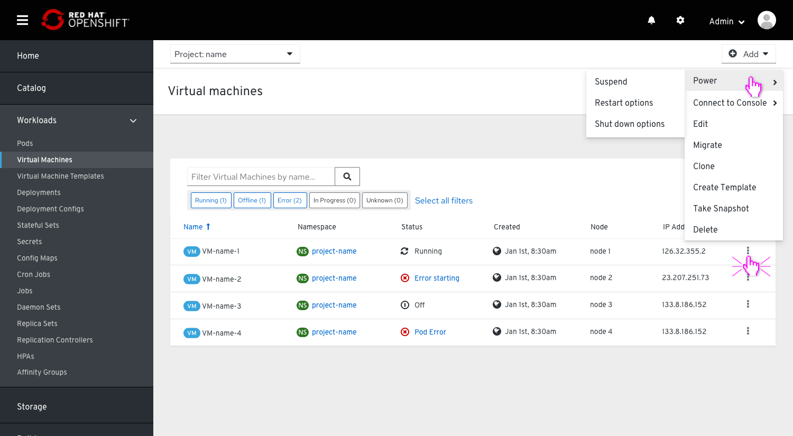
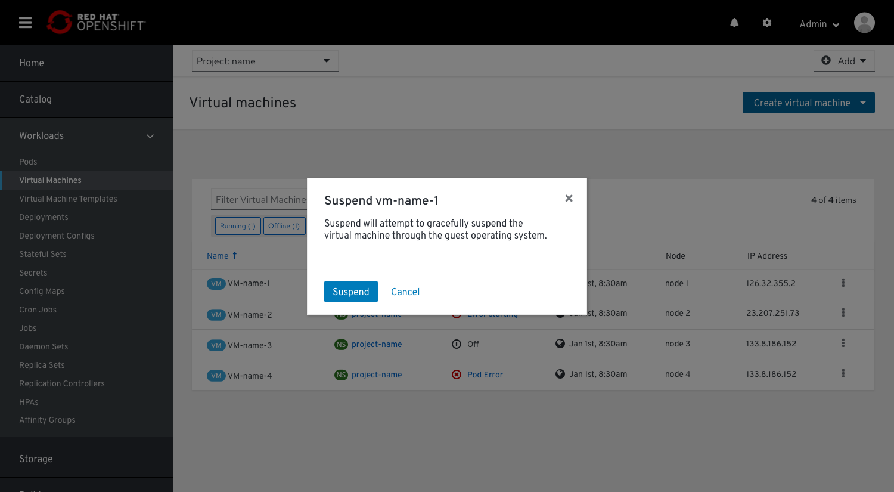
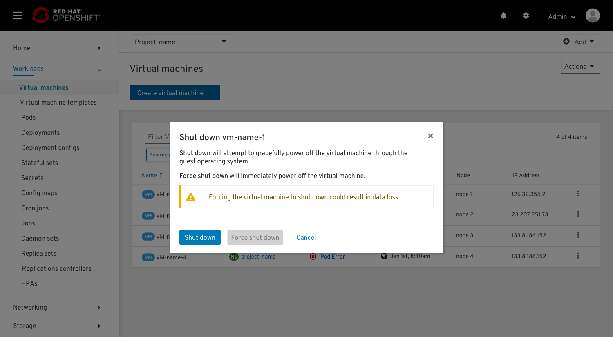
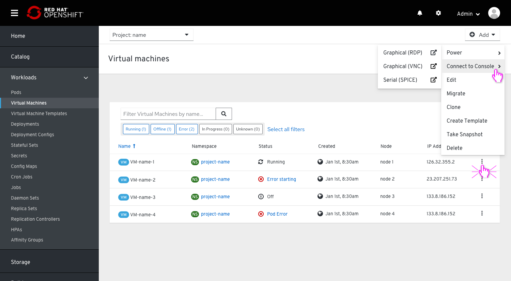
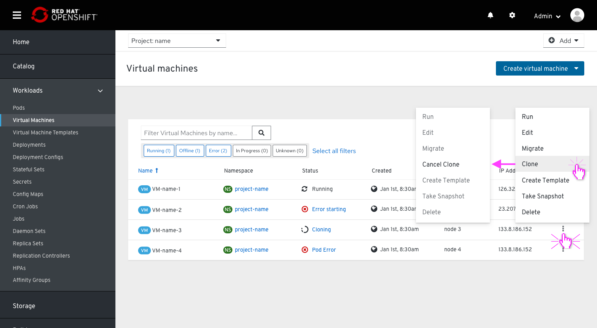

# List View in PF4

This PR describes the changes made in list view in the Virtualization Console when applying them into PF4.

## VM List

The VM list contains columns for the following:

* Name
* Namespace
* Status
  * Running, Off, Error (with custom messages), Cloning, Migrating, Importing, Warning, Pending (with changes that will apply after restart), Unknown
* Created
  * Date formatting should follow OpenShift’s console, viewable here and here
  * If possible, a tooltip should appear on hover with the exact creation date, including year.
* Node
* IP Address

### Max number of columns and prioritization

We set 6 columns to be the max number we will display in list views. We also determined priorities/usefulness of each column and set the priority order from left to right.

### Status Popovers and Icons

Statuses should be colored blue to indicate that they can be hovered and/or clicked.
Hovering over a blue status should display a status popovers with a brief description of the issue or underlying process. Clicking on a ‘Learn more’ link should bring the user to the VM’s Events page for more details.
The status popovers are replacing the status tooltips from PF3 because they're significantly more accessible on mobile and easier to copy/paste from.

We replaced the old lightning bolt icon for ‘Running’ with fa-refresh icon .
When we want the user to pay attention to something that is going on (f.e. when the IP address is unavailable for a long period of time when a guest agent is missing), the ‘Running’ status will get an aestrick at the end of the word Running*. This is done to ensure that the user will know something is going on and doesn't stay confused about the IP being unavailable for very long.

## Filtering

### Item filters

The predefined filters in the filter bar can be used to narrow the VM list by most statuses. The user clicks each filter to toggle it on and off.

### Search filter

The generic search filter allows the user to filter results by any text string in any column. This could enable users to quickly find a VM by IP address or possibly other fields in the future. Multiple filters could be delineated by a comma in the search query.

## Sorting

Sorting by columns is possible for any data table variation. Enabling the component within a table eases the ability to scan and read through the content. This option is favored over adding sorting functionality to the toolbar.

Sorted column: when a column is being sorted by, the column header will turn blue and the sort icon will represent the direction of the sort. Subsequent clicks on the sortable column header will toggle the direction of the sort.
Hovered sort: when a column is sortable, the sort icon will appear to the right of the column header. Upon hover, the icon will change to a darker grey indicating that the icon is actionable.
Sortable column: when a column is sortable, the sort icon will appear to the right of the column header in a light grey color. Sorting will not become active until the user selects the column header. This triggers the arrow to point upwards and the content to be sorted in ascending order.

## States and Actions

When a VM is off, the actions kebab contains options to Run, Edit, Migrate, Clone, Create Template, Take Snapshot, and Delete the VM.

When a VM is running the Run option is replaced with two dropdowns for Power and Connect to Console.

The Power dropdown contains options to Suspend, Restart, or Shut down the VM. Because these are potentially destructive actions, clicking any of these options will display a modal for the user to confirm.

The modals for Restart and Shut down include an additional button to “Force” the action. They also include warnings about the possibility for data loss.

The Connect to Console dropdown contains quick links to the consoles that are enabled for the VM.

When a VM is in a transitional state (cloning, migrating, taking a snapshot, etc.) any unavailable actions in the kebab are disabled and the original action (“Clone”) is replaced with a cancel action (“Cancel Clone”).

