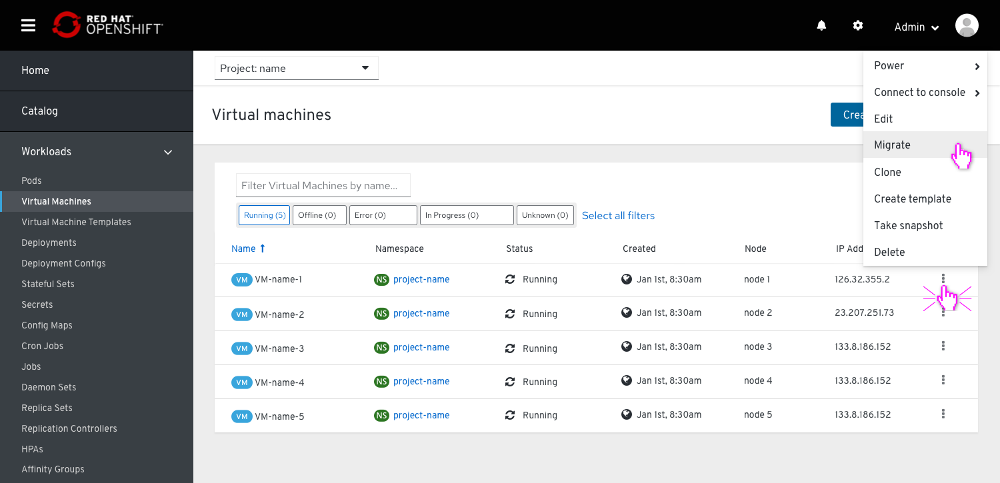
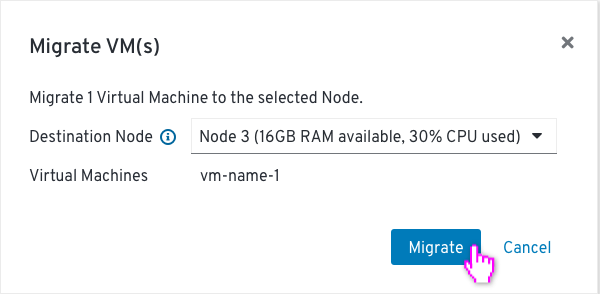
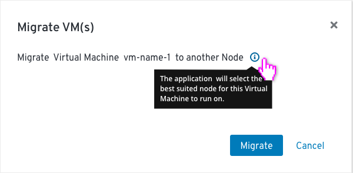

# Migrate VM

Clicking the action button next to any Virtual Machine in the List will present the user with the option to migrate the VM to another node.

A modal will be presented where the user can choose which Node the VM should be migrated to.

After the migration is kicked off, the status of the VM showing that the migration has started will be reflected in the list view.

On error or completion, the user will receive a notification. Again, the status will be updated accordingly.
For a process that is not instantaneous, the user will be notified via notification when it completes. 
