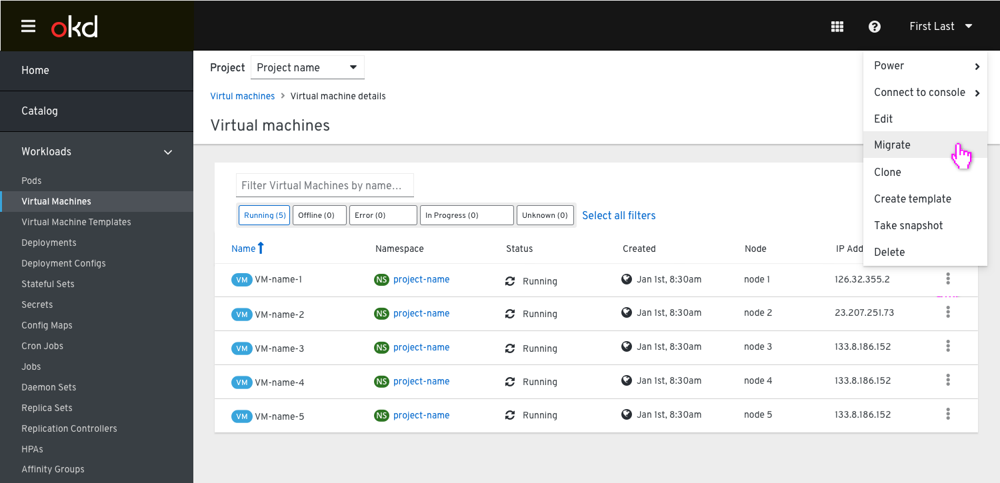
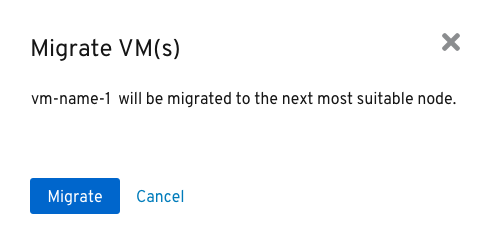
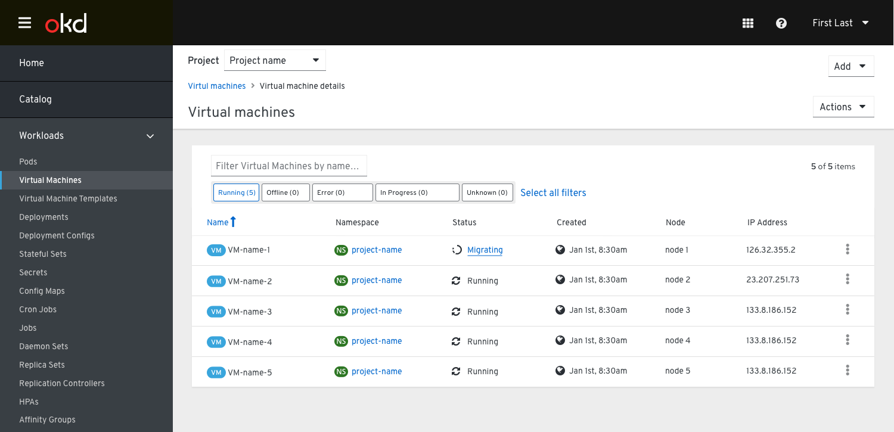

# Migrate VM

Clicking the action button next to any Virtual Machine in the List will present the user with the option to migrate the VM to another host.

A modal will be presented where the user can choose which Node the VM should be migrated to. 

After the migration is kicked off, the user will see a toast notification letting them know it has started. The state for the VM will also be reflected in the list view.

On error or completion, the user will receive another notification with more details. Again, the state will be updated accordingly.

