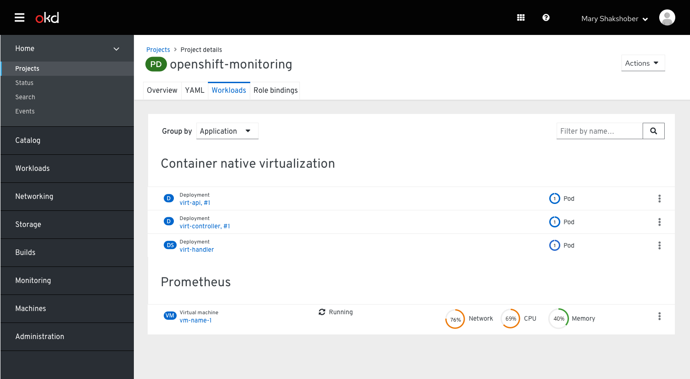
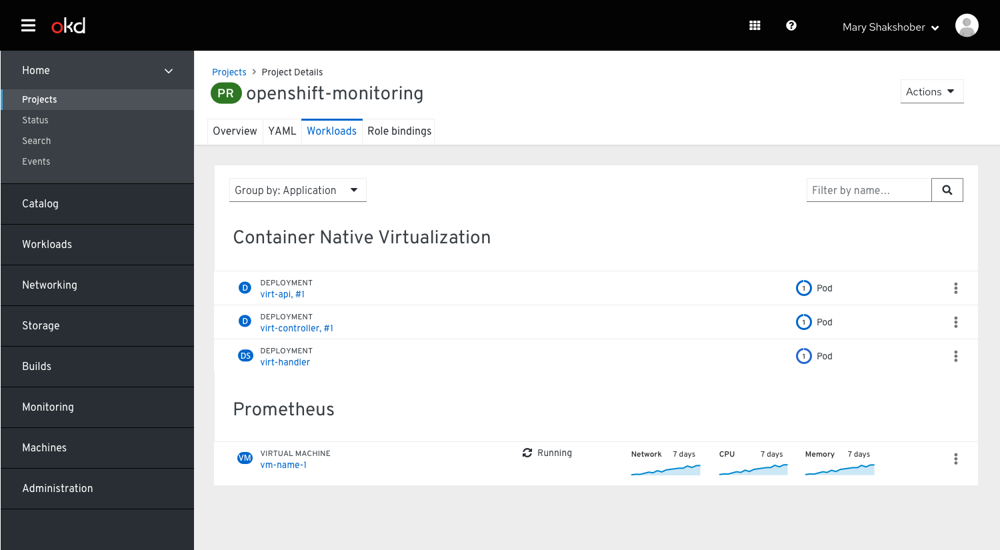
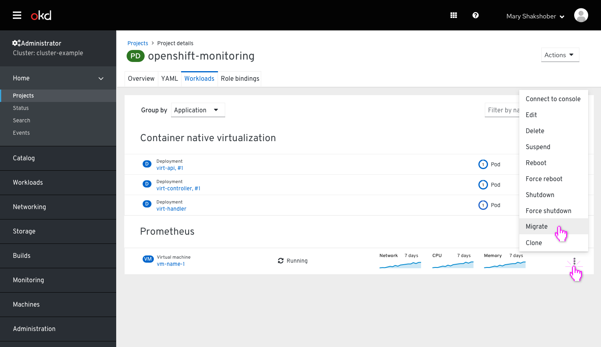
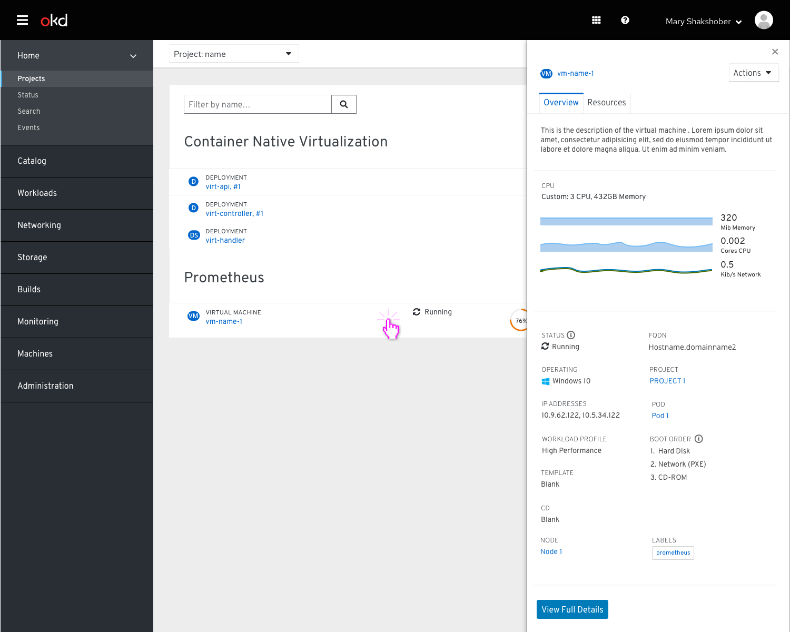
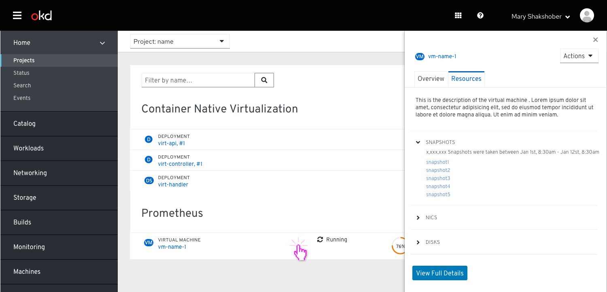

# OpenShift VMs Overview

The purpose of this PR is to explore what Virtual Machines could look like in the Overview and Resources sections of Openshift/CNV.
This is the first pass so really just trying to understand exactly what needs to be surfaced there.

Through the Overview page the user can see the VM’s based on the application it is associated with via it’s label.

An alternative to the above charts could be a sparkline that shows usage for the past 7 days.

Clicking on the Kebab would offer a list of options depending on that state of the VM.

When the user clicks on the virtual machine it displays the side bar with 2 optional tabs: Overview and Resources.

## Overview tab

In the Overview tab the user can see a summary of what is shown in the virtual machine details. There is a call to “View full details” which would take the user to the Virtual machine details full page view.

## Resources tab

The Resources tab wasn't finalized yet, so this is only a very initial idea.
