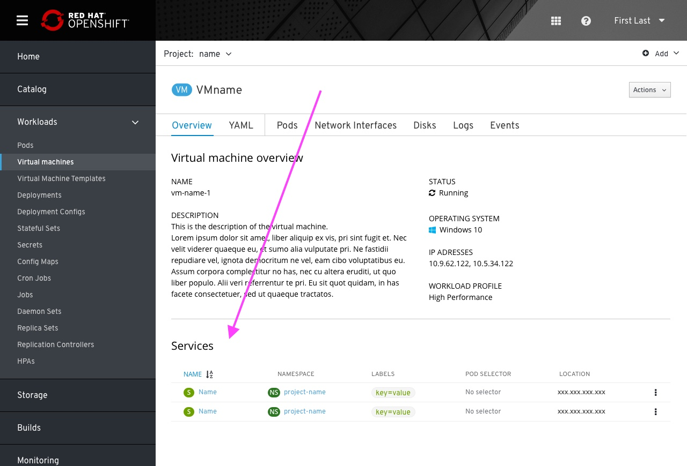

# Services in overview

With this placement the user can view what services are exposing a resource, if any. The user can also take actions with any service or create a new one

## summary

- Services exposing a resource will be displayed in the overview tab of that resource, in a dedicated section.
- Services section will use the same list view as in Services tab on the primary navigation
- Users will be able to create a new service and expose the resource by using the main action button on the top right of the resource page

