# Virtual Machines Snapshots

Snapshots allow users to create a copy of the VM disks and memory, mainly for restore and backup purposes. The snapshots are taken live or offline depending on if the VM is running or not. 
This document describes the snapshot design flow.  

## From VM List 

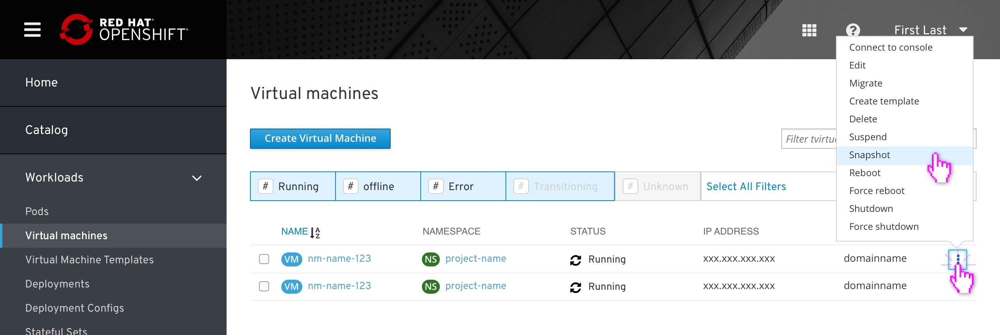
When clicking on the kebab menu in the VM list, the user will be able to take a snapshot of the VM, meaning he will copy the disks, memory content, and metadata for restoring, backup, creating templates and cloning VMs.

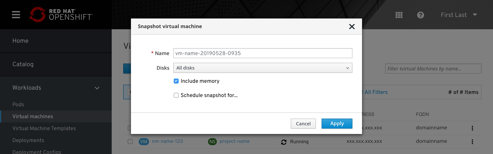
In the basic modal, the snapshot will take all current configuration and selected parameters.
The snapshot name is auto-generated to the current date of creation. The user can add a descriptive name.
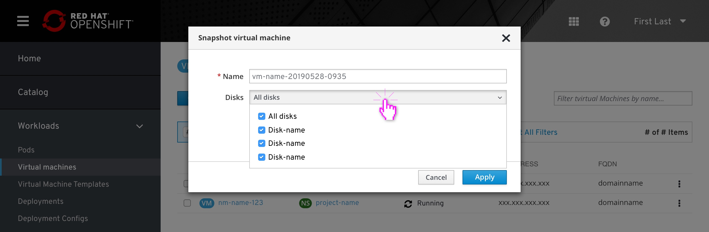
In the disks field, the user will be able to decide if to include all disks or just some of them and if to include memory as part of the snapshot or not.
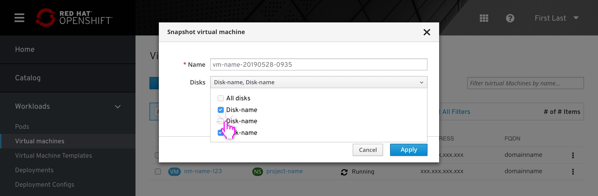
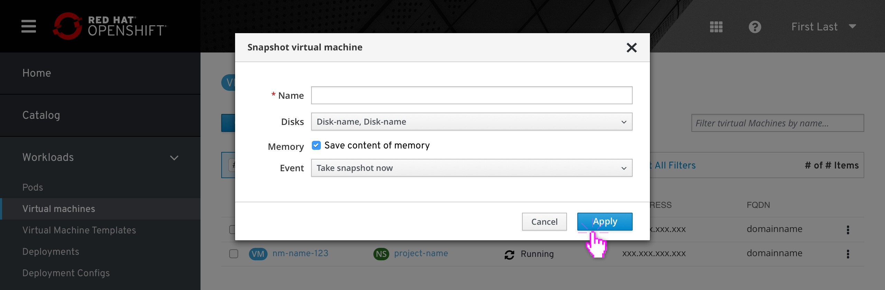

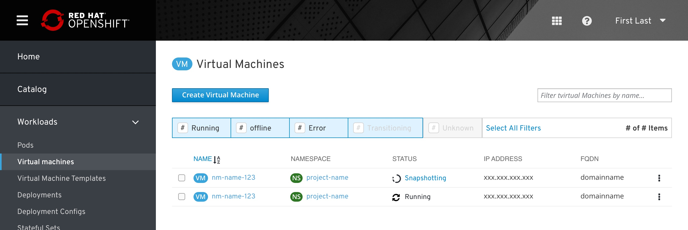
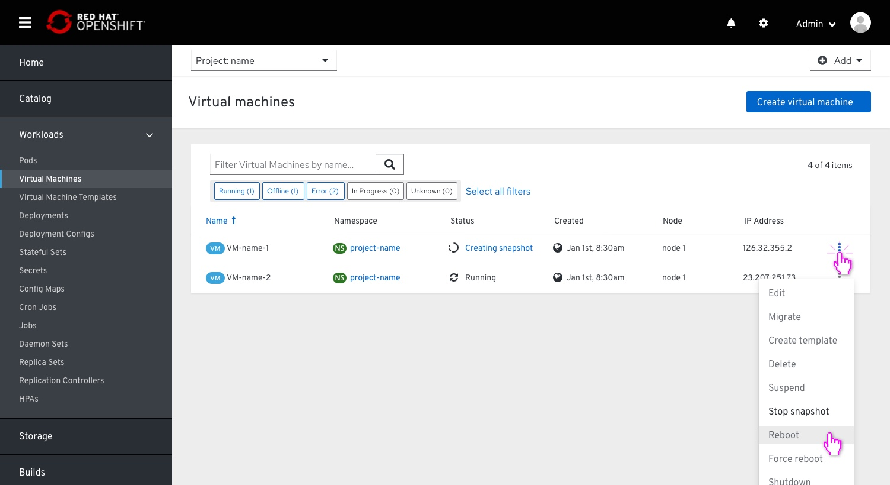
Any virtual machine that has a snapshot in progress will show this in the state:
When in this progress mode all actions would be disabled and the “Stop snapshot” would be available.

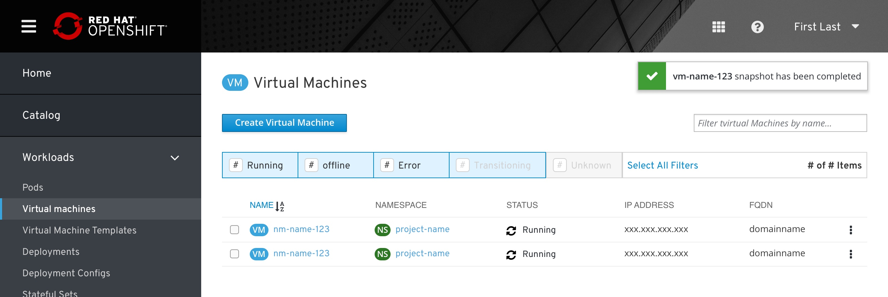
Any virtual machine that is undergoing a restoration process will show a "Restoring" indication on the status, with more details and a "Stop restoring" action on a popover. 

## VM page - snapshots tab

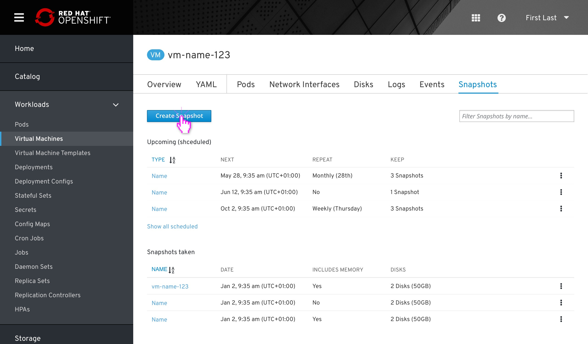
The snapshot list is located under the VM. A tab item in the horizontal navigation will be dedicated for snapshots. The snapshot list is ordered by name as a default.
The user can sort the list by name or date, clicking on the title will allow the user to switch sorting and decide if it's ascending or descending. For shceduled, date will display the next snapshot.
The list itself can be filtered to show "Taken" snapshots, "sheduled" snapshots or both (default).  
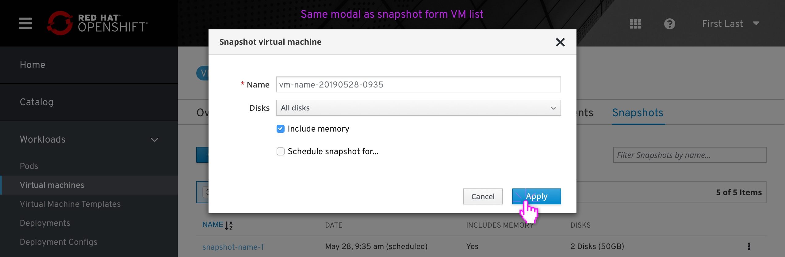
Same modal as in VM list - Snapshot action
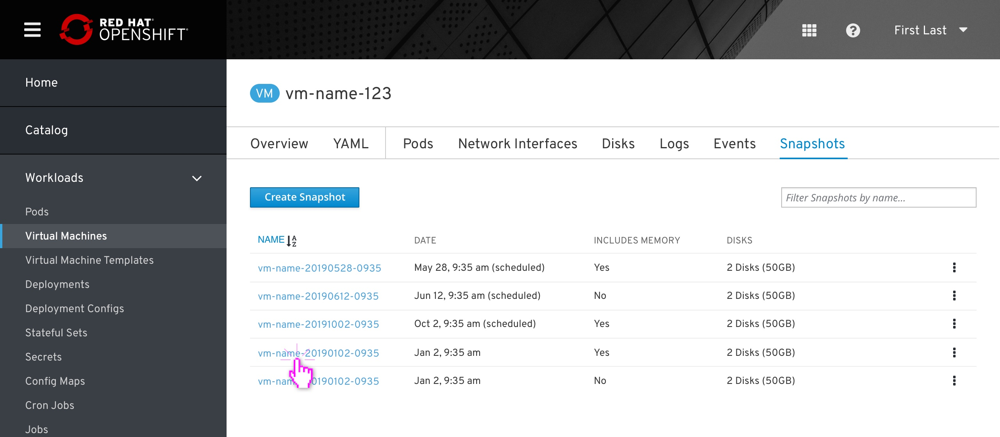
The user clicks the snapshot's name to view more information. 
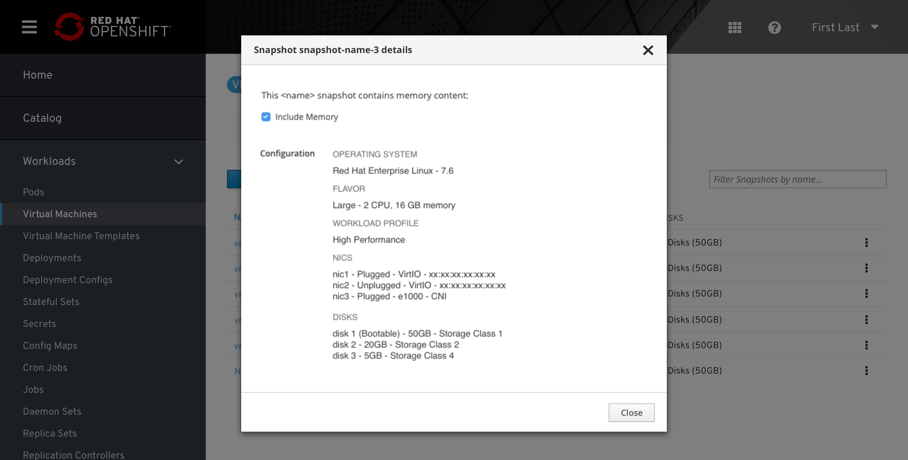
Details view.

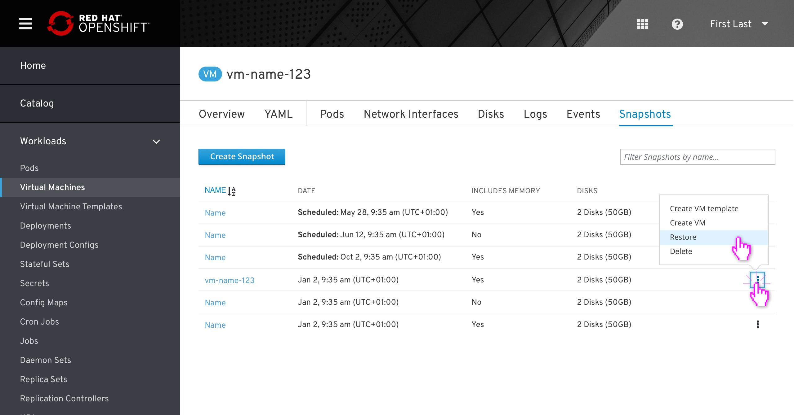
Kebab actions.
Clicking on the kebab menu on each row will open an action menu with several options:
- Create VM Template
- Create VM
- Restore
- Delete
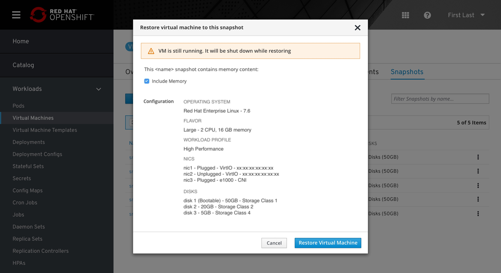
Restoring VM from snapshot modal. When clicking the restore option in the action menu it opens the restore popup. The restore popup aligned to the [cloning](http://openshift.github.io/openshift-origin-design/web-console/knikubevirt/clone-vm/clone-vm) and [template](http://openshift.github.io/openshift-origin-design/web-console/knikubevirt/vm-templates/vm-templates) popups.

## Scheduled snapshots

The scheduled snapshots are located at the top of the list of the taken spanpshots, sharing the same columns.

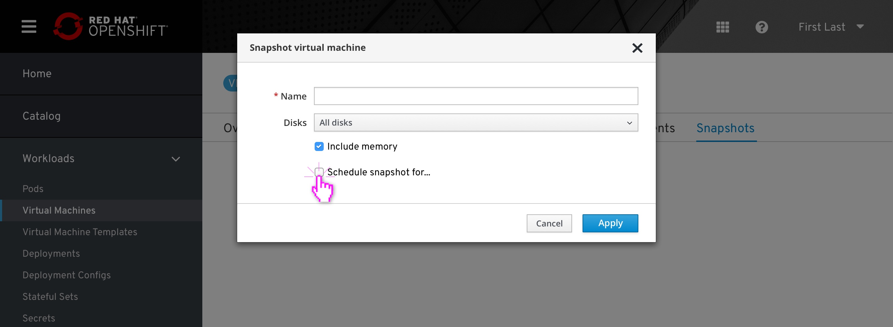
On checking 'Schedule snapshot for...' checkbox, addintional fields will appear for that task.
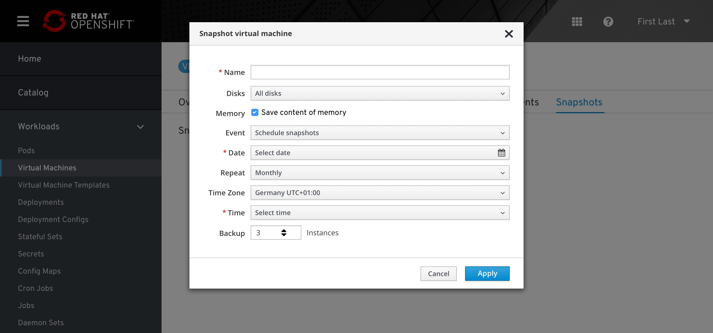
Default mode.
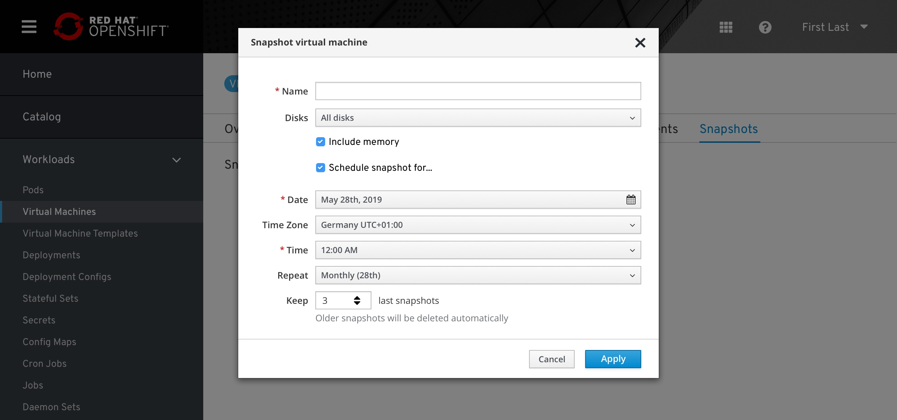
When selecting a date, the 'Repeat' field will update it's selection according to the selected date, mentioning the selected day.
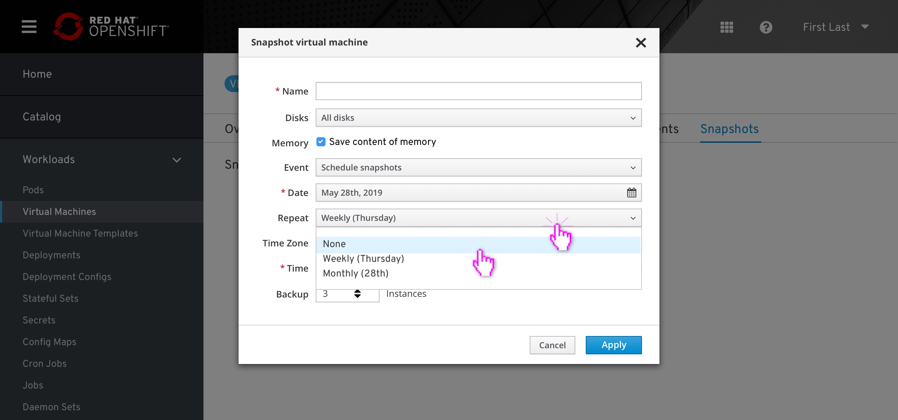
'Repeat' field options
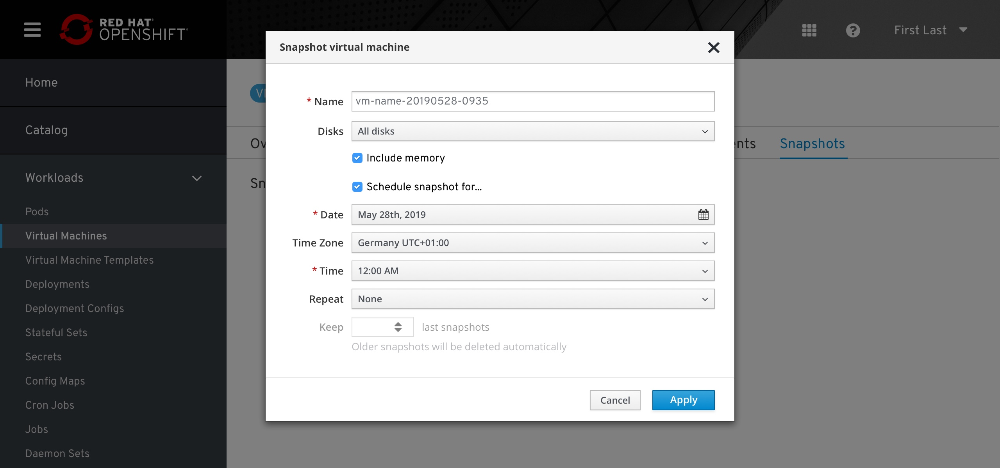
Selecting 'None' for 'Repeat' field will disable the backup instances

## Warning remarks

There are some warning remarks that alert the user about the status of the snapshot he’s going to create. In all cases, the user can still create a snapshot. 
The current alerts are:
- 'No available disk'
- 'Missing guest agent' is still under discussion