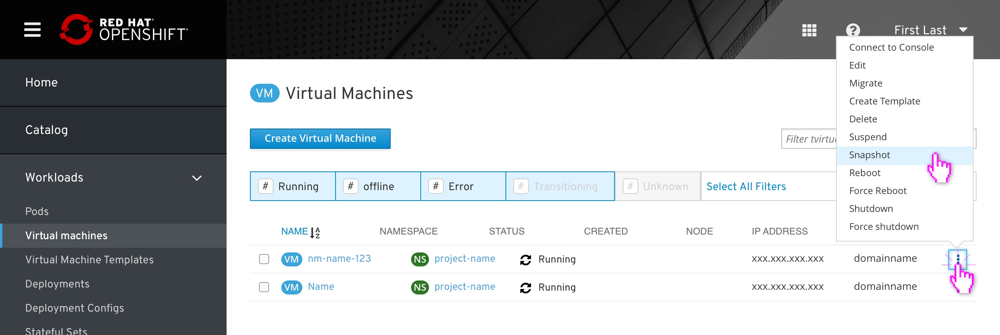
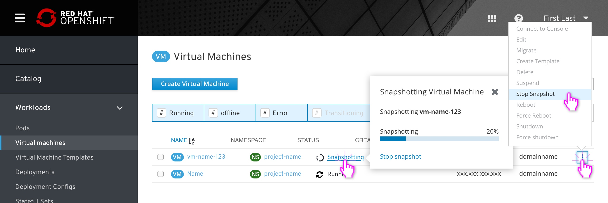
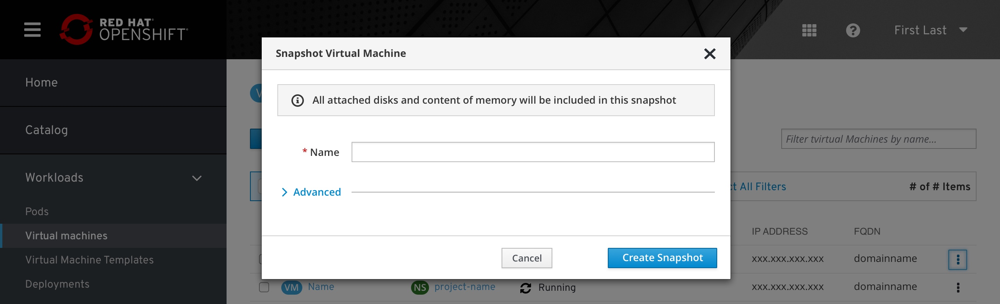
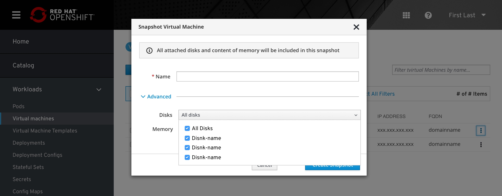
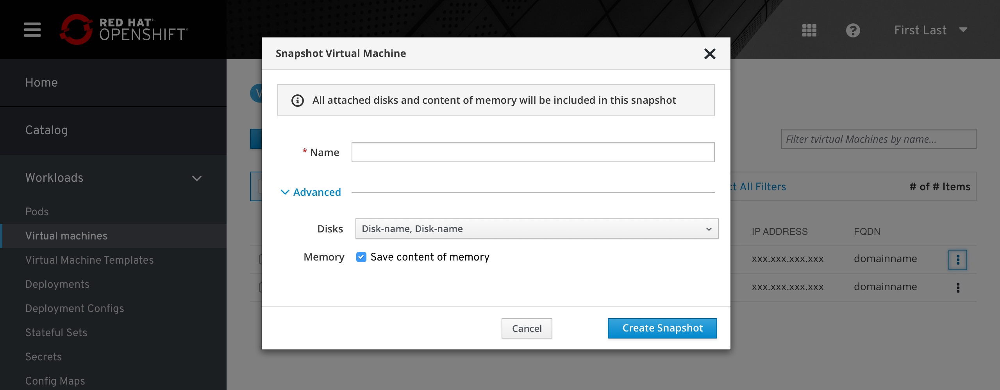
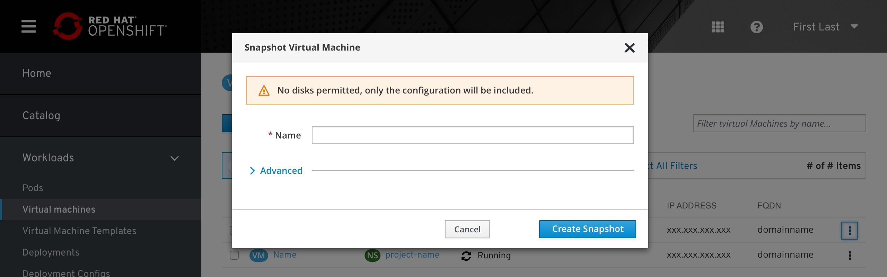
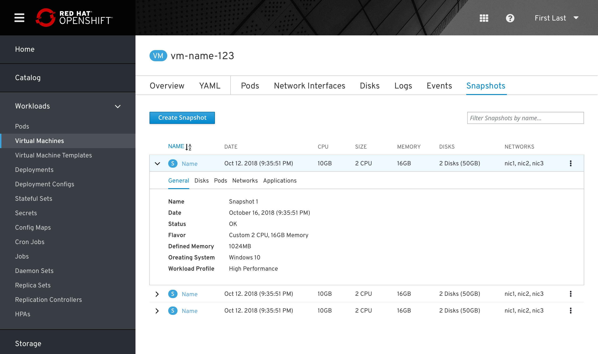
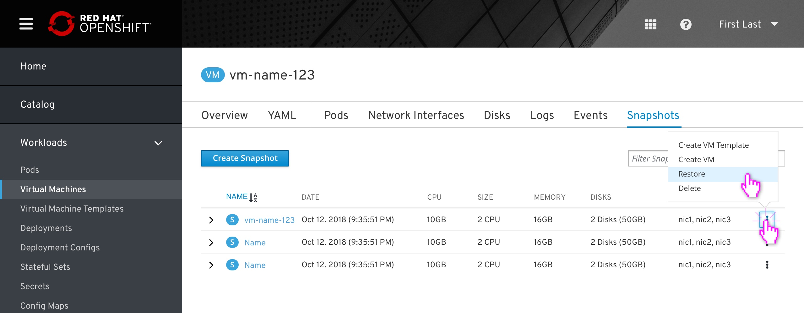
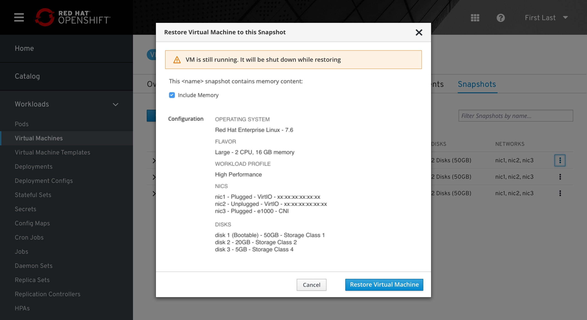

# Virtual Machines Snapshots

Snapshots allow users to create a copy of the VM disks and memory, mainly for restore and backup purposes. The snapshots are taken live or offline depending on if the VM is running or not. 
This document describes the snapshot design flow.  

## From VM List 

When clicking on the kebab menu in the VM list, the user will be able to take a snapshot of the VM, meaning he will copy the disks, memory content, and metadata for restoring, backup, creating templates and cloning VMs.

Any Virtual machine that has a snapshot in progress will show this in the state:
When in this progress mode all actions would be disabled and the “cancel snapshot” would be available.

## Snapshot modal

In the basic modal, the snapshot will take all current configuration and selected parameters.
The user must add a descriptive name.

In the advanced menu, the user will be able to decide if to include all disks or just some of them and if to include memory as part of the snapshot or not.

## Scheduled snapshots

This will be added in the future

## Warning remarks

There are some warning remarks that alert the user about the status of the snapshot he’s going to create. In all cases, the user can still create a snapshot. 
The current alerts are:
- 'No available disk'
- 'Missing guest agent' is still nder discussion

## Snapshot list

The snapshot list is located under the VM. A tab itam in the horizontal navigation will be dedicated for snapshots. The list is ordered by the creation data as a default. 
The user can sort the list by name or date, clicking on the title will allow the user to switch sorting and decide if it's ascending or descending.  

The user clicks any place on the row in order to expand the row for more information. 

## Actions Menu

Clicking on the kebab menu on each row will open an action menu with several options:
- Create VM Template
- Create VM
- Restore
- Delete

## Restore from Snapshot

When clicking the restore option in the action menu it opens the restore popup. I tried keeping the restore popup similar to the cloning and template popups.

After the restore process is finished, a toast notification will appear saying if the restore was finished properly and will offer the user to start or edit the VM.