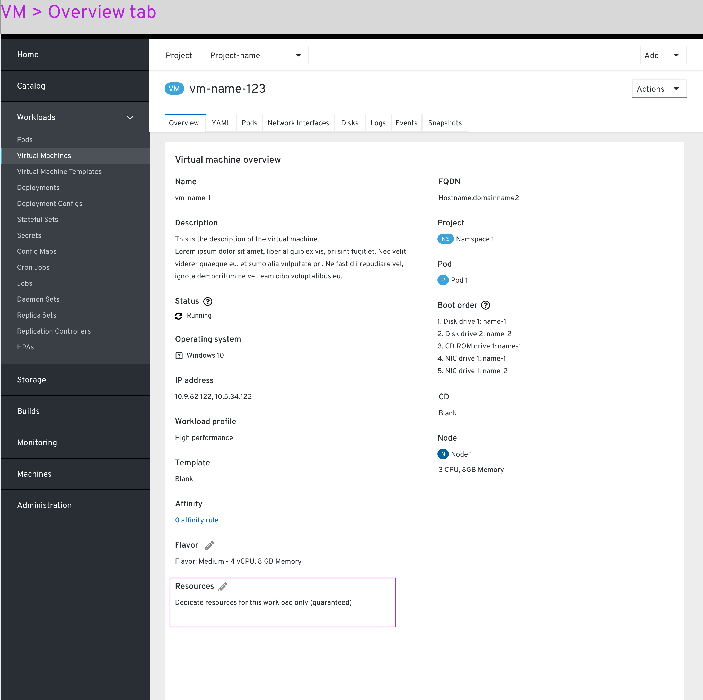
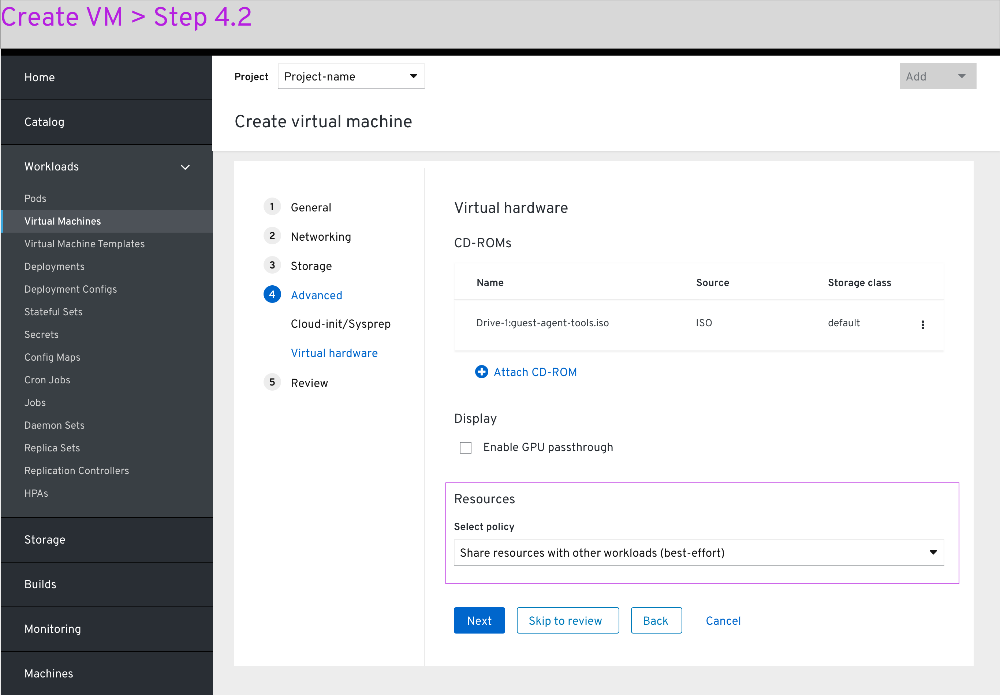
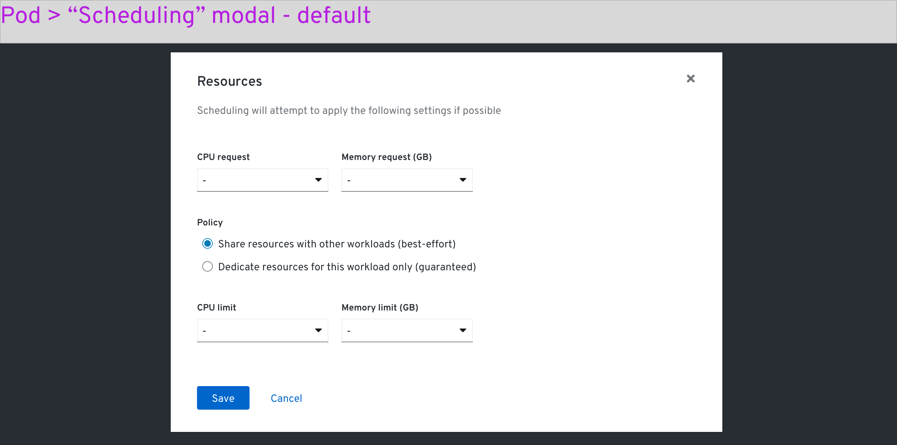

# VM details - Devices-and-resources

### Virtual machine

## From VM details page

Within the VM details > overview tab > overview section, a click on the ‘Resources’ field will pop up the correlated modal.

The ‘Resources’ modal currently contains only the Resources Policy. This may expand in the future. The modal is titled this way, instead of  ‘Workload isolation’, in order to align with the implementation on the pod’s side.

A sub-text below the title mentions that the scheduler will attempt to achieve the following settings. In case it is not possible, the VM will be scheduled in the best way it can (the same thing applies for pods, where this modal has more settings).

The user selects ‘Dedicate resources...’ radiobutton on the policy field.

The preview on the ‘Resources’ us updated to reflect the changes.

## From VM creation wizard

Under ‘Create VM > Advanced step > Virtual hardware, the user can now enable workload isolation. New section titles are added to separate from the CD-ROMs and the Resources section.

## From pod details page

Within the Pod details > overview tab > overview section, a click on the ‘Resources’ field will pop up the correlated modal.

This modal will display a CPU and Memory request, followed by a ‘policy’ field which offers the user a toggle between setting CPU and Memory limit, or workload isolation.

Selecting the workload isolation option will hide the Limit fields.

The limit dropdowns offer values that are higher than the request. 

In case the user enters the ‘Limit’ values first and enters higher ‘Request’ values later, the modal will provide an error message for the limit fields.

Back to the pod page, the field will reflect the settings on the modal.
