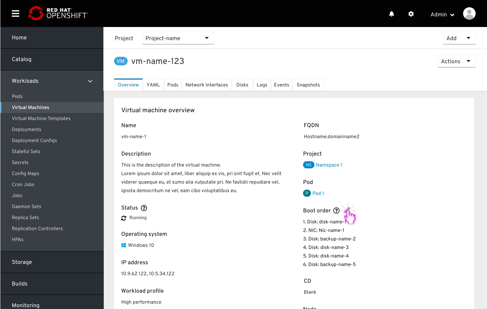
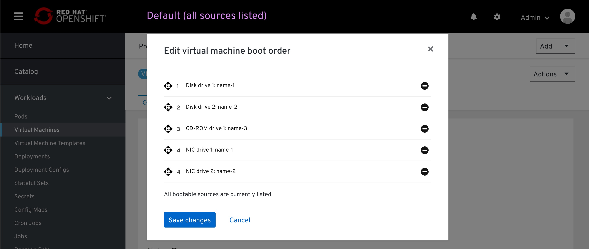
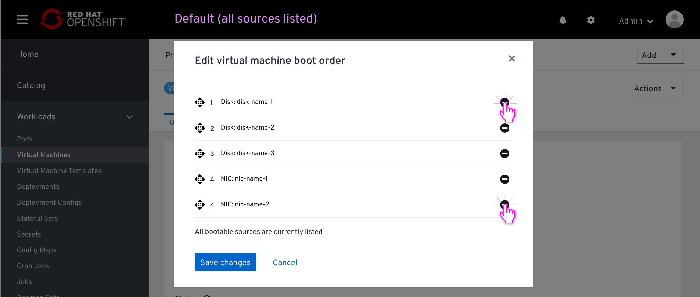
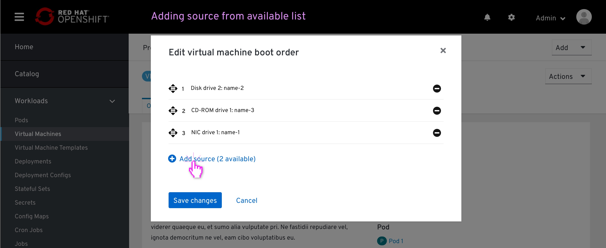
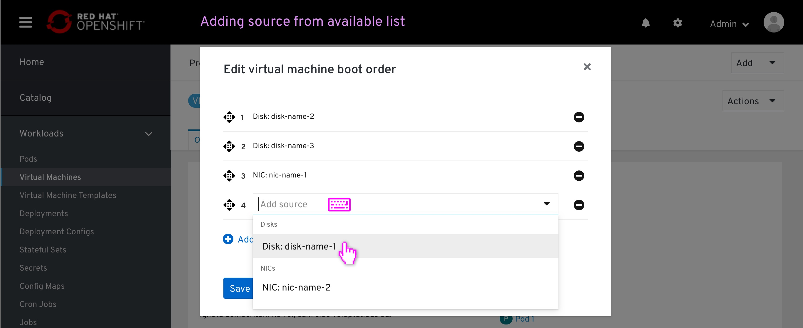
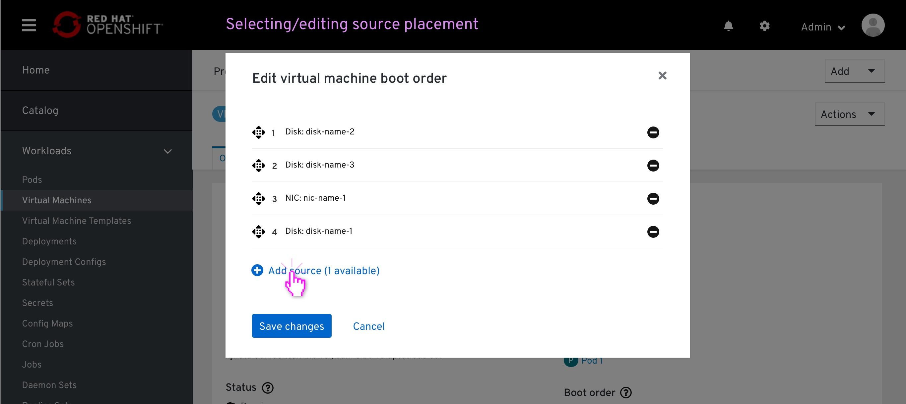
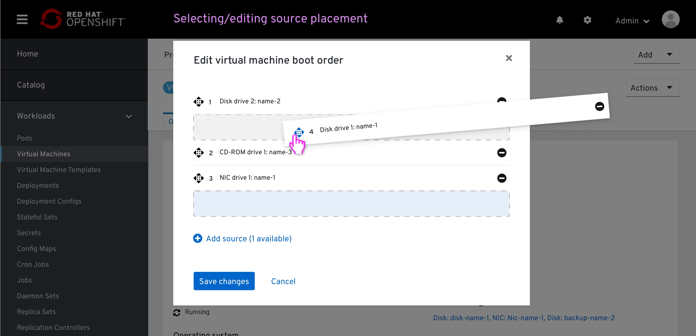
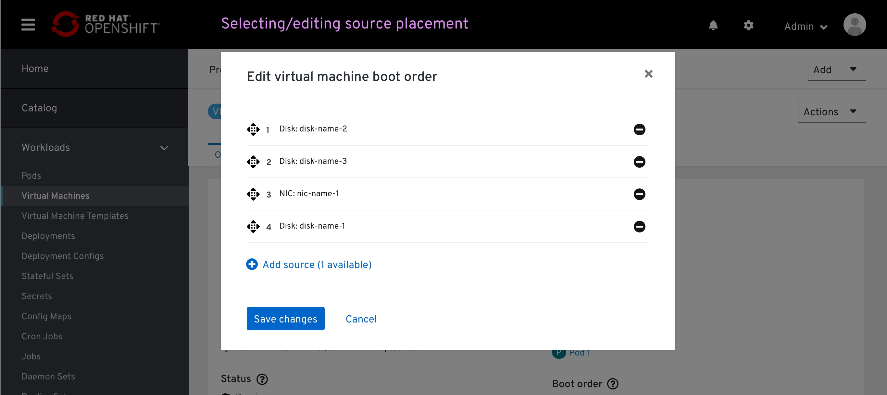
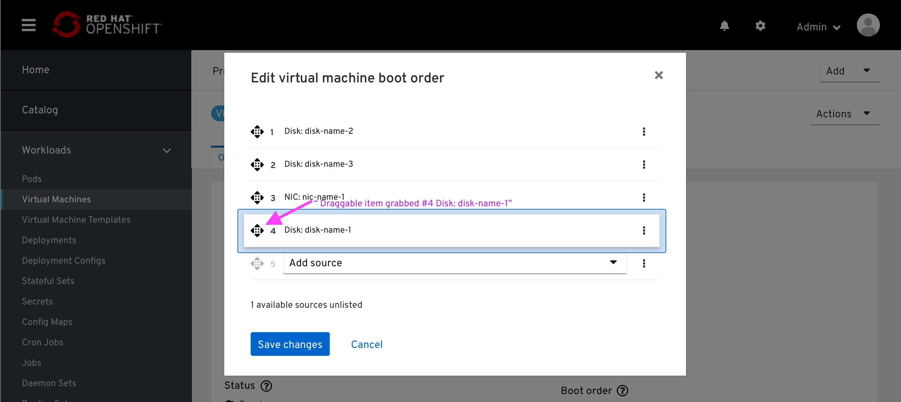
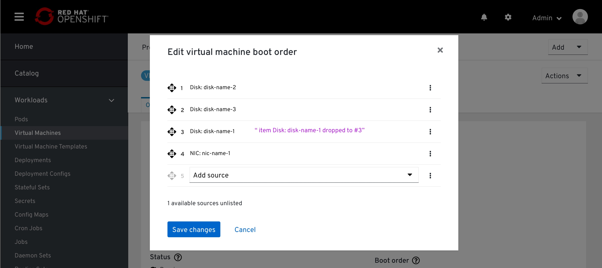

# VM details - boot order

## Entering edit mode

From the VM details page > Overview tab, the user clicks the pencil icon to edit the boot order.

## Default source list

The modal pops up, displaying the currently listed bootable items by order of the boot.
This order was automatically set on the VM creation. This list displays bootable disks and NICS only.

At this point, all the bootable sources are listed and there are no available resources to add to the list.
An available source counter at the bottom of the list highlights that to the user.
CD-ROMs are included in this list.

## Removing source items

The user can remove an item from the list by clicking on the 'remove' icon at the left of each item. By doing so, the user will be adding it to the available sources inventory.

A '+ Add source' button will appear at the bottom of the list, replacing the text indicating that there are no more items to add. The button will contain a counter to how many rows the user can add before it will no longer be available.

## Adding source items

The user clicks the '+ add source' button at the bottom of the list.
A new item at the bottom of the list will appear, marking its location on the list. 

This item will also contain a type-ahead dropdown, which is already in focus, ready for the user to select an available item from the dropdown menu or filter the list by typing.

In case the item added has only one option, that item will be already selected to that option.

## Drag & drop source items

The user grabs an item by clicking and holding the 'drag-drop' icon.

While holding the item between other items on the list, a blue Separator will mark the place where that item will land on the list after releasing it.

# Drag & drop accessibility
This section specifies the drag-drop behavior using a screen-reader. The copy specifies outlines that behaviour, it is not the final copy.

The user scans the page with a screen reader, hover over the drag-drop icon

The user grabs that item

The user moves that item with up/down arrow (the screen reader reads the potential slot)

The user drops that item on the selected spot
