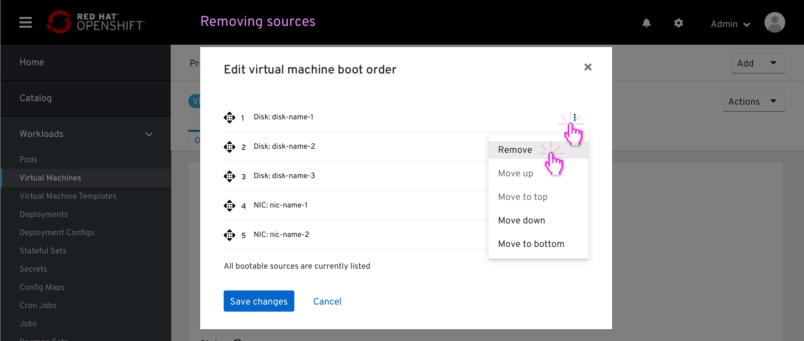

# VM details - boot order

## Entering edit mode

From the VM details page, Overview tab, the user clicks the pencil icon to edit the boot order.

## Removing source items

The modal pops up, displaying the currently listed bootable items by order of boot.
This order was automatically set on the VM creation. This list displays bootable disks and NICS only.

At this point, all the bootable sources are listed and there is no available resources to add to the list.
An available sources counter at the bottom on the list highlights that to the user.

From the action menu of each item, the user can remove an item from the list adding it to the available sources inventory.

An 'Add source' dropdown will appear at the bottom of the list, as the last item.
The available sources counter at the bottom of the list updates to reflect that there are available bootable items. 

## Adding source items

The user clicks the 'add source' dropdown at the bottom of the list.
This item displays a type-ahead dropdown, which is already in focus, ready for the user to select an available item from the dropdown menu or filter the list by typing

The added item is placed at the bottom of the list.
The 'Add source' will move down to the bottom of the list, under the recently added item, in case there are more additional bootable items available to be added.

## Drag & drop source items

The user grabs an item by clicking and holding the 'drag-drop' icon.

While holding the item between other items on the list, a blue Separator will mark the place where that item will land on the list after releasing it.

# Drag & drop accessibility
This section specifies the drag-drop behaviour using a screen-reader. The copy specifies outlines that behaviour, it is not the final copy.

The user scans the page with screen reader, hover over the drag-drop icon

The user grabs that item

The user moves that item with up/down arrow (the screen reader reads the potential slot)

The user drops that item on the selected spot
