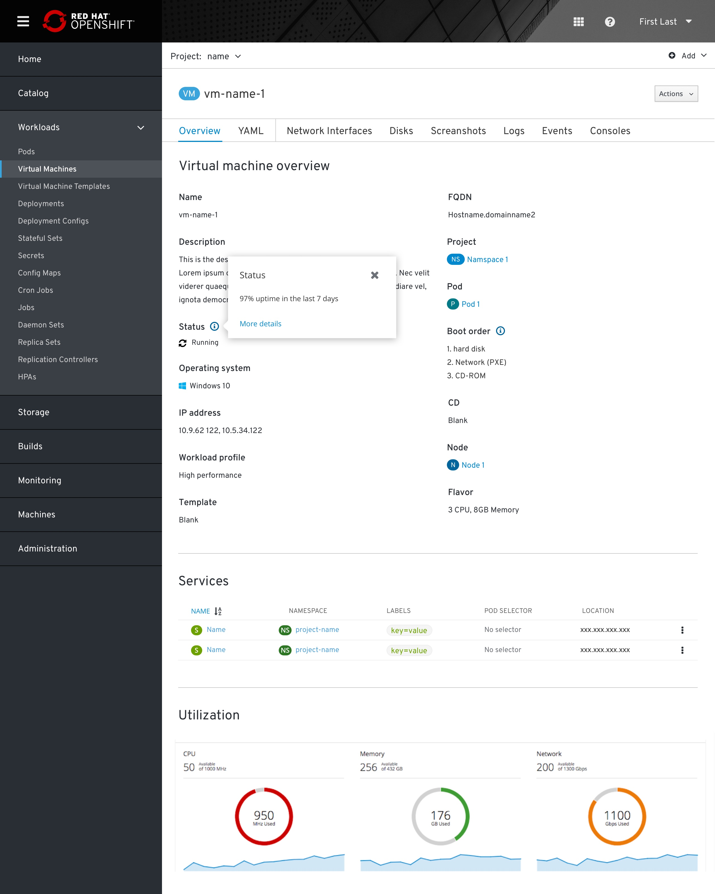
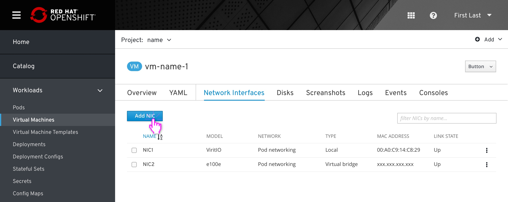
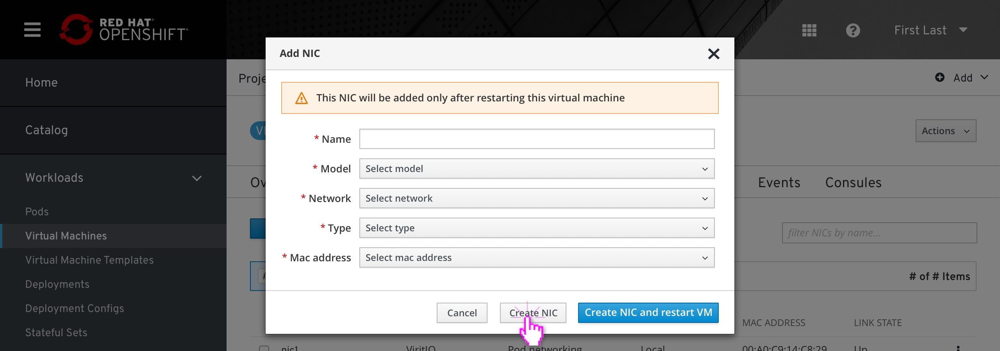
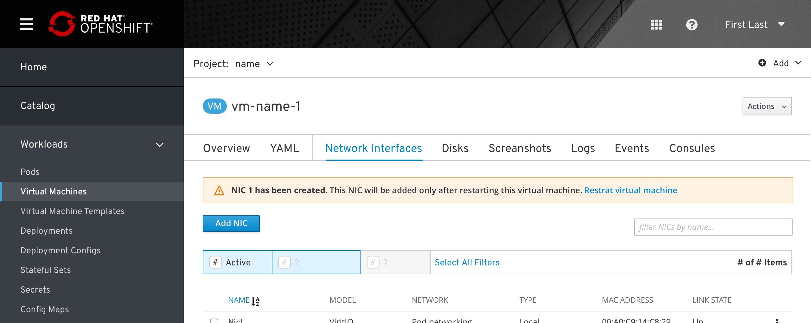
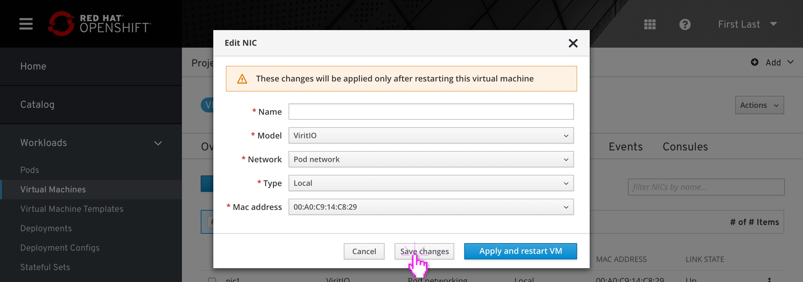
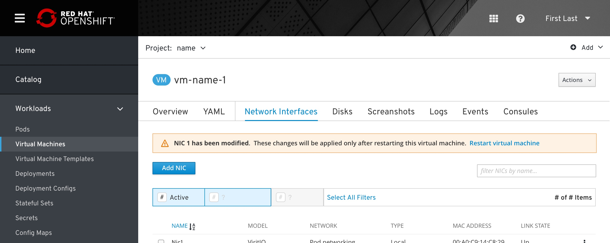

# VM Details

## Overview Tab

The user clicks a VM’s name from the list view and is taken to that VM’s Overview tab.
The user sees detailed information about the VM’s configuration.

## TAML

TBD - should be inline with the rest of Openshift.

## Network Interfaces

This is Network Interfaces tab.

New NICs cannot be saved until the user fills out all required fields/dropdowns (including Name). The new NIC should always appear at the top of the list until the user saves it.

The user can either cancel adding/modifying a NIC or confirm changes by clicking the primary action button.

Whenever a NIC has been added or modified in a way that requires the VM to be restarted, an inline notification should appear below the tab area reminding the user to do so. This notification should persist across all tab views, including the Overview (shown previously).

## Disks

The flow for disks is very similar to NICs.

### Add disk

Note: The create/edit flow of this area and Network Interfaces is still being actively worked on. See Matt Carleton’s Storage Step doc to see current progress within the Create VM flow, which will probably be very similar to what gets designed here.

The user clicks “Add Disk”. Like adding a new NIC, the new disk with blank fields is prepended at the top of the list. The confirm button is disabled.

The user edits each input and clicks the confirm button to finish. The new disk is added to the list and is sorted alphabetically.

### Edit disk

The user clicks the kebab and clicks “Edit Disk”.

They make adjustments and hit the confirm button to save.

## Snapshots

WIP available here

## Events

TBD

## Consoles

The Consoles tab allows the user to connect an in-browser or desktop-based Graphical and/or Serial console to the virtual machine.

The user can change the console type using the dropdown selector. Serial (SPICE) is selected by default and disabled in the dropdown. Graphical (RDP/VNC) open in separate windows, designated by the fa-external-link icon.

Two actions are available on the right-hand side. The “Open in window” action opens a separate browser window dedicated to the console view. The “Expand” action makes the console viewport fill the current window’s full width and height similar to elsewhere in OKD. The “Send Key” dropdown is disabled.

The user can start a console session using either the primary Connect action button in the content area or the secondary Connect button next to the console dropdown selector.

### Connecting from a powered off state

If the virtual machine is powered off, the primary action button will allow the user to both start and connect to the virtual machine with one click. If the user wants to power the virtual machine on without connecting a console (an unlikely use case while in this view) they can use the Actions dropdown in the top-right as usual.

While the virtual machine is powering on, the console selector dropdown should be disabled to “lock in” the intended console. When the virtual machine finishes powering on, the console will be connected.

### Sending keys

The “Send Key” dropdown helps the user send keyboard shortcuts that would ordinarily be captured by the user’s client operating system. The options available will depend on the VM that is running.

For reference: RHEV “Send Key” options

### Remote connection settings

If the user prefers to connect to a VM using their own desktop client or Remote Desktop Viewer, they can find the port and configuration information they need by clicking the “Remote Connection settings” link to reveal a modal.

